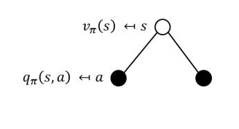
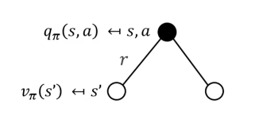

## 马尔可夫决策过程(Markov decision processes, MDP)

- MDP是强化学习问题在数学上的理想化形式
- MDP中的环境是完全可观测的
- 几乎所有的强化学习问题都可以在数学上表示为马尔可夫决策过程

### 涉及的知识点

- 马尔可夫过程: 马尔可夫性质、状态、状态转移矩阵、小节(episode)
- 马尔可夫奖励过程: 奖励、折扣因子、回报、价值函数、贝尔曼方程。
- 马尔可夫决策过程: 动作、策略、状态价值函数、动作价值函数、贝尔曼期望方程、回溯图、最优状态价值函数、最优动作价值函数、最优策略、贝尔曼最优方程。

### 马尔可夫性质

"未来只与现在有关，与过去无关！"

**定义**
$$
状态S_t具有马尔可夫性,当且仅当\mathbb{P}[S_{t+1}|S_t]=\mathbb{P}[S_{t+1}|S_1,\cdots,S_t]
$$

- 给定当前时刻的状态，将来与历史无关

- 状态是对过去的充分统计

  

#### 状态转移矩阵

- 对于马尔可夫状态s与其后继状态s',他们的状态转移概率定义为:
  $$
  P_{ss'}=\mathbb{P}[S_{t+1}=s'|S_t=s]
  \\ss'表示在s状态下转移到s'
  $$

- 状态转移矩阵P定义了马尔可夫状态s到其所有后继状态s'的转移概率
  $$
  P=\begin{bmatrix}
  P_{11} & \cdots & P_{1n} \\
  \vdots & \ddots & \vdots \\
  P_{n1} & \cdots & P_{nn}
  \end{bmatrix}
  $$

- 矩阵的每一行总和为1

### 马尔可夫过程

- 马尔可夫过程是一种无记忆的随机过程
- 马尔可夫过程可以分为三类
  - 时间、状态都离散的马尔可夫过程**(马尔科夫链)**
  - 时间连续、状态离散的马尔可夫过程**(连续时间的马尔科夫链)**
  - 时间、状态都连续的马尔可夫过程。

**定义**
$$
马尔可夫过程(马尔科夫链)由元组(S,P)构成
\\
\\\begin{align}
& S是有限状态的集合 \\
& P是状态转移矩阵P_{ss'}=\mathbb{P}[S_{t+1}=s'|S_t=s]
\end{align}
$$

### 马尔可夫奖励过程

- 马尔可夫奖励过程是具有价值的马尔科夫链
- 获得的分数完全由系统来决定，充满了随机性

**定义**
$$
马尔可夫奖励过程\text{(Markov Reward Process, MRP)}由元组(S,P,R,\gamma)
\\
\\\begin{align}
& S是有限状态集合 \\
& P是状态转移矩阵P_{ss'}=\mathbb{P}[S_{t+1}=s'|S_t=s] \\
& R_s 是奖励函数, R_s=\mathbb{E}[R_{t+1}|S_t=s] \\
& \gamma是折扣因子,\gamma\in [0,1]
\end{align}
$$
数学期望是一种重要的数字特征，它反映随机变量平均取值的大小。

#### 回报

**定义**
$$
在一个马尔可夫奖励过程中,从t时刻的状态S_t开始,直到终止状态时,所有奖励的衰减之和G_t称为回报\text{Reture}
\\G_t=R_{t+1}+\gamma R_{t+2}+\cdots=\sum_{k=0}^\infty \gamma^k R_{t+k+1}
$$

#### 衰减率$\gamma$的作用

- 避免有环马尔可夫过程计算收益时出现无限循环
- 从金融投资回报的角度讲,即时奖励比延时奖励更吸引人
- 动物/人类行为中都表现出对即时奖励的偏好
- 可以表达未来的不确定性
- $\gamma\in[0,1],\gamma=0$只看眼前收益

#### 价值函数

- 价值函数$v(s)$给出状态s的长期价值(long-term value)
- 价值函数输入为某个状态，输出为这个状态的价值

**定义**
$$
在马尔可夫奖励过程中,一个状态的期望回报被称为这个状态的价值函数
\\v(s)=\mathbb{E}[G_t|S_t=s]
\\这个期望\textcolor{red}{去掉了状态转移的随机性和奖励函数的随机性}
$$

#### 马尔可夫奖励过程的贝尔曼方程

- 贝尔曼方程，可以求解价值函数

  $v(s)=\mathbb{E}[R_{t+1}+\gamma v(S_{t+1})|S_t=s]$

**推导过程**
$$
已知贝尔曼方程v(s)=\mathbb{E}[R_{t+1}+\gamma v(S_{t+1})|S_t=s]
\\\text{return}=G_t=R_{t+1}+\gamma R_{t+2}+\gamma^2 R_{t+3}+\cdots=\sum_{k=0}^\infty\gamma^k R_{t+k+1}
\\推导:
\\把G_t=R_{t+1}+\gamma R_{t+2}+\gamma^2 R_{t+3}+\cdots=\sum_{k=0}^\infty\gamma^k R_{t+k+1}代入v(s)
\\\begin{align}
v(s)&=\mathbb{E}[R_{t+1}+\gamma R_{t+2}+\gamma^2 R_{t+3}+\cdots|S_t=s] \\
& =\mathbb{E}[R_{t+1}+\gamma(R_{t+2}+\gamma R_{t+3}+\cdots)|S_t=s] \\
& =\mathbb{E}[R_{t+1}+\gamma G_{t+1}|S_t=s] \\
& =\mathbb{E}[R_{t+1}+\gamma v(S_{t+1})|S_t=s]
\end{align}
$$

- 价值函数可以分解为两部分
  - 即时奖励$R_{t+1}$
  - 后续状态的折扣值$\gamma v(S_{t+1})$

贝尔曼方程还可写为:
$$
v(s)=R_s+\gamma\sum_{s'\in S} P_{ss'}v(s')
$$

#### 贝尔曼方程的解

- 贝尔曼方程是线性方程，可以直接求解
  $$
  \\\begin{align}
  v &= R+\gamma Pv \\
  v-\gamma Pv &= R \\
  (E-\gamma P)v &= R \\
  v &= (E-\gamma P)^{-1} R
  \end{align}
  $$

- 对于S个状态，计算复杂度为$O(S)^3$

- 直接求解仅适用于小型马尔可夫奖励过程

- 对于大型MRP,有很多迭代方法，例如:

  - 动态规划(Dynamic programming)
  - 蒙特卡洛评估(Monte-Carlo evaluation)
  - 时序差分学习(Temporal-Difference learing)

### 马尔可夫决策过程

马尔可夫决策过程(MDP)是具有决策的马尔可夫奖励过程(MRP),其所有状态满足马尔可夫性质

**定义**
$$
马尔可夫决策过程由元组(S,A,P,R,\gamma)构成
\\\begin{align}
&S是有限状态的集合 \\
&A是有限动作的集合 \\
& P是状态转移矩阵P_{ss'}^a=\mathbb{P}[S_{t+1}=s'|S_t=s,A=a](在状态s下做a动作转移到s'的概率) \\
& R_s 是奖励函数, R_s^a=\mathbb{E}[R_{t+1}|S_t=s,A_t=a] \\
& \gamma是折扣因子,\gamma\in [0,1]
\end{align}
$$

#### 策略

**定义**
$$
策略\pi是一个函数,表示输入状态为s的情况下采取的动作a的概率
\\\pi(a|s)=\mathbb{P}[A_t=a|S_t=s]
$$

- 策略完全定义了智能体的行为
- 马尔可夫决策过程中，策略仅取决于当前的状态(而不是历史记录)

- 给定一个马尔可夫决策过程:$M=(S,A,P,R,\gamma)$和一个策略$\pi$

- 状态序列$S_1,S_2,\cdots$是一个马尔可夫随机过程$(S,P^{\pi})$

- 状态和奖励序列$S_1,R_1,S_2,\cdots$是一个马尔可夫奖励过程$(S,P^{\pi},R^{\pi},\gamma)$
  $$
  P^\pi_{ss'}=\sum_{a\in A}\pi(a|s)P_{ss'}^a
  \\R_s^{\pi}\sum_{a\in A}\pi(a|s)R_s^a
  $$

  #### MDP的价值函数

  **定义:**状态价值函数(State-Value)
  $$
  在马尔可夫决策过程中,一个状态的价值函数V_\pi(s)是从状态s出发，遵循策略\pi得到的期望回报
  \\v_\pi(s)=\mathbb{E}_\pi[G_t|s_t=s]
  $$
  **定义:**动作价值函数(Action-Value)
  $$
  在马尔可夫决策过程中,一个动作价值函数q_\pi(s,a)是从状态s开始,遵循策略\pi,对当前状态s执行动作a得到的期望回报
  \\q_\pi(s,a)=\mathbb{E}[G_t|S_t=s,A_t=a]
  $$
  

#### 贝尔曼期望方程

- 状态函数可以分解为: 即时奖励加后继状态的后继状态的折扣值
  $$
  v_\pi(s)=\mathbb{E}_\pi[R_{t+1}+\gamma v_\pi(S_{t+1})|S_t=s]
  $$

- 动作价值函数可进行类似的分解
  $$
  q_\pi(s,a)=\mathbb{E}_\pi[R_{t+1}+\gamma q_\pi(S_{t+1},A_{t+1})|S_t=s,A_t=a]
  $$
  

#### 状态价值函数与动作价值函数之间的关系

$$
v_\pi(s)=\sum_{a\in A}\pi(a|s)q_\pi(s,a)
\\此时不能确定当前状态执行什么操作,所以只能使用期望来衡量当前状态的评分
\\v_\pi(s)=\mathbb{E}_\pi[R_{t+1}+\gamma v_\pi(S_{t+1})|S_t=s]
$$

$$
q_\pi(s,a)=R_s^a+\gamma \sum_{s' \in S}P_{ss'}^av_\pi(s')
\\此时能够确定在状态s下执行的动作a,但是执行动作a有可能转移到别的状态,所以需要求这个动作的期望用来衡量这个动作的好坏
\\q_\pi(s,a)=\mathbb{E}_\pi[R_{t+1}+\gamma q_\pi(S_{t+1},A_{t+1})|S_t=s,A_t=a]
$$
通过上面两个图例的讲解我们也可以进一步看出$\mathbb{E}_\pi[v_\pi(s)|S_t=s]\iff\mathbb{E}_\pi[q_\pi(s,A_t)|S_t=s)]$

#### 贝尔曼期望方程

$$
v_\pi(s)=\sum_{a\in A}\pi(a|s)q_\pi(s,a)\tag{1}
$$

$$
q_\pi(s,a)=R_s^a+\gamma \sum_{s' \in S}P_{ss'}^av_\pi(s')\tag{2}
$$

$$
把式(2)代入式(1)则可以得到:
\\v_\pi(s)=\sum_{a\in A}\pi(a|s)\bigg(R_s^a+\gamma \sum_{s'\in S}P_{ss'}^av_\pi(s')\bigg)\tag{3}

$$

$$
\\再把式(1)代入式(2)则可以得到:
\\q_\pi(s,a)=R_s^a+\gamma\sum_{s'\in S}P_{ss'}^a \sum_{a\in A}\pi(a|s)q_\pi(s,a)\tag{4}
$$

#### 最优价值函数

- 最优状态价值函数是所有策略产生的状态价值函数中,使状态s价值最大的函数:
  $$
  v_*(s)=\max_\pi v_\pi(s)
  $$

- 最优动作价值函数是指所有策略产生的动作价值函数中,使状态-行为(s,a)对价值最大的函数:
  $$
  q_*(s,a)=\max_{\pi}q_\pi(s,a)
  $$

- 最优价值函数明确了MDP的最优可能表示

- 一旦最优价值函数知晓,则认为MDP已完成求解

#### 最优策略

**定义:**策略之间的偏序
$$
当且仅当对于任意的状态s都有v_\pi(s)\geq v_{\pi'}(s)时,记作\pi\geq \pi'
$$
**定义:**最优策略
$$
在有限状态和动作的MDP中,至少存在一个策略不 劣于其他所有策略,即\pi_*\geq\pi \forall\pi,这就是最优策略
$$

- 所有的最优策略具有相同的最优状态价值函数$v_{\pi_*}=v_*(s)$
- 所有的最优策略有相同的动作价值函数$q_{\pi_*}(s,a)=q_*(s,a)$

#### 寻找最优策略

- 可以通过最大化$q_*(s,a)$来找到最佳策略
  $$
  \pi_*(a|s)=\begin{cases}
  1 & 当a=\text{arg}\max_{a\in A}q_*(s,a) \\
  0
  \end{cases} \tag{1}
  $$

- 任何MDP始终都有确定性的最佳策略

- 如果我们知道$q_*(s,a)$,我们将立即获得最优策略

#### 贝尔曼最优方程

$$
我们已知贝尔曼期望方程
\\v_*(s)=\max_\pi v_\pi(s) 
\\q_*(s,a)=\max_{\pi}q_\pi(s,a)
\\根据式(1)寻找的最优策略我们可以把部分随机性消除
\\\textcolor{red}{贝尔曼最优方程}

$$

$$
\\v_*(s)=\max_{a}q_*(s,a)\tag{2}
$$

$$
q_*(s,a)=R_s^a+\gamma \sum_{s'\in S}P_{ss'}^av_*(s')\tag{3}
$$

$$
把式(2)代入式(3)可以得到:
\\q_*(s,a)=R_s^a+\gamma \sum_{s'\in S}P_{ss'}^a\max_{a'}q_*(s',a')
\\把式(3)代入式(2)可以得到:
\\v_*(s)=\max_a\bigg(R_s^a+\gamma\sum_{s'\in S}P_{ss'}^av_*(s')\bigg)
$$

#### 求解贝尔曼最优方程

- 贝尔曼最优方程是非线性的
- 不能使用与策略优化相同的直接求矩阵解析解的方案
- 通过一些迭代方法来解决:
  - 值迭代(Value Iteration)
  - 策略迭代(Policy Iteration)
  - Q学习(Q-learning)
  - Sarsa

 

