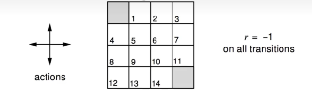
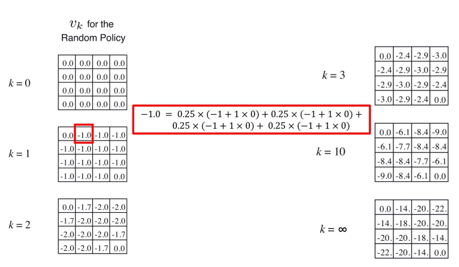
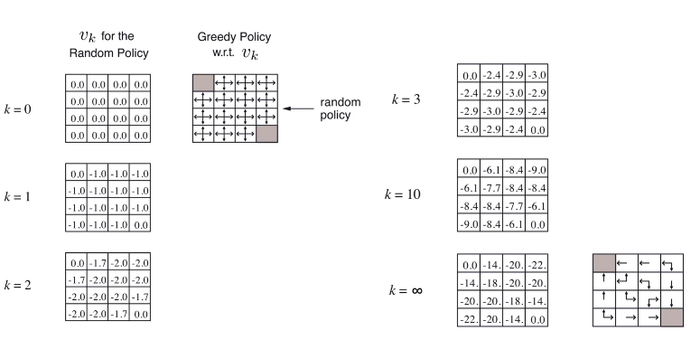

## 动态规划

- 动态规划(Dynamic programming, DP)是一类优化算法
- 动态规划将待求解问题分解成若干子问题，先求子问题，然后从这些子问题的解得到目标问题的解。
- 核心特点:
  - 最优子结构----子问题的最优解是可以得到的
  - 重复子问题----子问题的解决方案可以存储和重用

### 动态规划于强化学习

- 在完备的马尔可夫决策过程中，DP可用于**计算最优策略**
- 对于强化学习问题，传统的DP算法**作用有限**:
  - 完备的环境模型只是一个假设
  - 计算复杂度极高
- 但是，DP提供了必要的基础，所有其他方法都是对DP的近似
  - 降低计算复杂度
  - 减弱对环境模型完备性的假设

### 基于动态规划的强化学习

- 策略迭代(Policy iteration): 使用贝尔曼期望方程，求解最优策略。包含两个核心步骤:
  - 策略评估(Policy evaluation)----输入MDP$(S,A,P,R,\gamma)$和策略$\pi$,输出价值函数$v_\pi$
  - 策略提升(Policy Improvement)----输入MDP$(S,A,P,R,\gamma)$输出最优价值函数$v_*和最优策略\pi$
- 价值迭代(Value iteration): 使用贝尔曼最优方程，求解最优策略

### 迭代策略评估

- **问题:** 评估一个给定策略$\pi$,也称为“预测”问题

- **解决方案:** 迭代应用贝尔曼期望方程进行回溯

- $v_1\rightarrow v_2\rightarrow \cdots \rightarrow v_\pi$
  $$
  \forall s:v_{k+1}(s)\leftarrow\mathbb{E}_\pi[R_{t+1}+\gamma v_k(S_{t+1})|S_t=s]
  $$

- 算法会收敛到$v_\pi$

#### 伪代码

$$
\begin{align}
1,&输入待评估的策略& \\
2,&算法参数:小阈值\theta > 0,用于确定估计量的精度 &\\
3,&对于任意s\in S^+,任意初始化V_(s),其中V(终止状态)=0& \\
4,&循环: &\\
5,& \quad\quad\Delta=0 \\
6,& \quad\quad 对每一个s\in S循环: \\
7,& \quad\quad\quad\quad v= V(s) \\
8,& \quad\quad\quad\quad V(s)= \sum_{a\in A}\pi(a|s)\bigg(R_s^a+\gamma\sum_{s'\in S}P_{ss'}^aV(s')\bigg)\\
9,& \quad\quad\quad\quad \Delta= \max(\Delta,|v-V(s)|) \quad\quad\quad\quad(表示选取v更新前和v更新后差值最大的那个状态的状态值)\\
10,& 直到\Delta<\theta
\end{align}
$$

#### 小型网格世界中的随机策略评估

已知条件: 

- 状态空间$S: S_1-S_{14}$为非终止状态，$S_T$为中止状态(两个灰色正方形所示的两个位置)
- 动作空间A: 对于任何非中止状态可以有东、西、南、北四个移动动作
- 抓鬼难以概率P: 每个动作会导致状态转移，但当动作会导致智能体移除时，状态不变
- 即时奖励R: 任何非中止状态间的转移得到的即时状态奖励均为-1，进入中止状态奖励为0
- 折扣率: $\gamma=1$
- 智能体遵循随机策略: $\pi(n|\cdot)=\pi(e|\cdot)=\pi(s|\cdot)=\pi(w|\cdot)=0.25$

问题: 

- 评估在小型网格世界中的随机策略

##### 求解过程

这里我们只演示了计算$s_1$的状态价值，$s_2$也同理

### 策略改进

**问题:** 如何获取最优策略?

**回答:** 策略迭代方法，交替迭代下述步骤: 

1. 评估给定策略$\pi$,获取价值函数

   $v_\pi(s)=\mathbb{E}_\pi[R_{t+1}+\gamma R_{t+2}+\cdots|S_t=s]$

2. 应用贪婪方法来改进策略，使其后续状态价值增加最多
   $\pi'=\text{greedy}(v_\pi)$

- 在小型网格世界中，改进后的策略就是最佳的策略，$\pi'=\pi^*$
- 但是更多的场合中，我们需要进行多次的评估和改进迭代，才能找到最优策略
- 上述算法一般都能收敛到最优策略$\pi^*$

在这个例子中我们迭代无穷词后，进行一次策略改进都达到了最优策略

### 策略迭代算法

$$
\begin{align}
&1.初始化 \\
&对于任意s\in S，任意初始化V(s)，\pi(s)\in A(s) \\
&2.策略评估 \\
&循环: &\\
& \quad\quad\Delta=0 \\
& \quad\quad 对每一个s\in S循环: \\
& \quad\quad\quad\quad v= V(s) \\
& \quad\quad\quad\quad V(s)= \sum_{a\in A}\pi(a|s)\bigg(R_s^a+\gamma\sum_{s'\in S}P_{ss'}^aV(s')\bigg)\\
& \quad\quad\quad\quad \Delta= \max(\Delta,|v-V(s)|) \quad\quad\quad\quad(表示选取v更新前和v更新后差值最大的那个状态的状态值)\\
& 直到\Delta<\theta \\
&3.策略改进 \\
&\text{Policy stable=ture} \\
& 对每一个s \in S: \\
&\quad\quad\text{old action=}\pi(s) \\
&\quad\quad\pi(s)=\text{arg}\max{a}\bigg(R_s^a+\gamma\sum_{s'\in S }P_{ss'}^aV(s')\bigg) \\
&\quad\quad\text{如果old action}\neq \pi(s)那么\text{Policy stable=false} \\
&如果\text{Policy stable=ture,那么停止并返回}V=v_*,\text{以及}\pi=\pi^* \\
&否则跳转到2
\end{align}
$$

#### 最优策略

- 如果改进停止
  $$
  q_\pi(s,\pi'(s))=\max_{a\in A}q_\pi(s,a)=q_\pi(s,\pi(s))=v_\pi(s)
  $$

- 满足贝尔曼最优方程
  $$
  v_\pi(s)=\max_{a\in A}q_\pi(s,a)
  $$

- 此时，对于所有的$s\in S,v_\pi(s),v_*(s)$

- 所有,$\pi$是最优策略

#### 策略迭代的相关讨论

- 策略评估需要收敛到$v_\pi吗?$在$k次迭代策略评估后停止?$
  - 比如，在小型网格世界中，$k=3$就可以输出最优策略。
- 为什么不每次迭代都更新策略，$即k=1?$
  - 这等效于值迭代

### 值迭代

**问题:** 找到一个最优的策略$\pi$

**方法:** 迭代应用贝尔曼最优方程进行回溯

- $v_1\rightarrow v_2\rightarrow \cdots\rightarrow v_*$

  $\forall s: v_{k+1}(s)\leftarrow \max_a\bigg(R_{s}^a+\gamma\sum_{s'\in S}P_{ss'}^a v_*(s')\bigg)$

- 最终可以收敛于最优价值函数$v_*$

- 迭代过程中得到的价值函数可能不符合任何策略(就是说迭代的过程中不会对策略进行改进)

  

#### 伪代码

$$
\begin{align}
& 算法参数: 小阈值\theta > 0,用于确定估计量的精度 \\
& 对于任意s\in S^+,任意初始化V(s),其中V(终止状态)=0 \\
& 循环: \\
& \quad\quad \Delta=0 \\
& \quad\quad对每一个s \in S循环: \\
& \quad\quad\quad\quad v = V(s) \\
& \quad\quad\quad\quad V(s)=\max_a\bigg(R_s^a+\gamma\sum_{s'\in S}P_{ss'}^aV(s')\bigg) \\
& \quad\quad\quad\quad \Delta=\max(\Delta,|v-V(s)|) \\
& 直到\Delta<0 \\
& 输出一个确定的策略\pi \approx \pi_* ,使得 \\
& \quad \pi(s)=\text{arg}\max_a\bigg(R_s^a+\gamma\sum_{ss'}P_{ss'}^aV(s')\bigg)
\end{align}
$$

