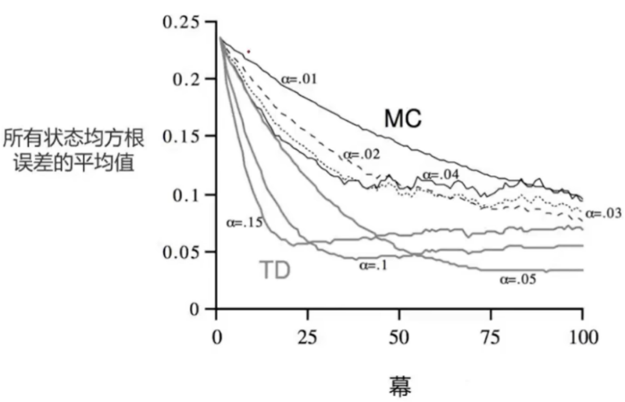
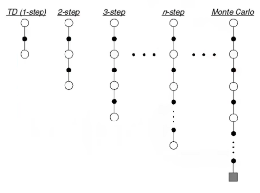
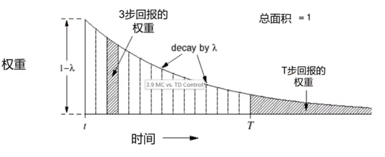

## 无模型(评估)

### 蒙特卡洛强化学习(Monte-Carlo Reinforcement Learning)

- MC方法可直接从episodes的经验中学习
- MC是无模型(model-free)的算法: 不了解MDP转化/奖励
- MC从完整的episodes中学习
- MC使用最简单的想法: 状态价值=平均回报
- 注意: MC只能应用于episodes的MDPs中
  - 所有的episodes必须终止

#### 蒙特卡洛策略评估

- 目标：在给定策略$\pi$下，从一系列episodes经验中学习价值函数$v_\pi$
  $$
  S_1,A_1,R_2,\cdots,S_k\sim\pi
  $$

- 回顾：回报是带折扣的总奖励：
  $$
  G_t=R_{t+1}+\gamma R_{t+2}+\cdots+\gamma^{T-1}R_T
  $$

- 回顾：价值函数是回报的期望：
  $$
  v(s)=\mathbb{E}_\pi[G_t|S_t=s]
  $$

- 蒙特卡洛策略评估使用每个状态的平均回报来代替回报的期望

##### 首次访问型(First-Visit)

- 目标：评估状态s
- 每个episode中，状态s**第一次出现时**，进行如下操作一次
  1. 增加计数个数$N(s)\leftarrow N(s)+1$
  2. 增加回报总和$S(s)\leftarrow S(s)+G_t$
  3. 价值有平均回报估算$V(s)=\frac{S(s)}{N(s)}$
- 根据大数定律：$V(s)\rightarrow V_\pi(s)as\quad N(s)\rightarrow \infty$

##### 每次访问型(Every-Visit)

- 目标：评估状态s
- 每个episode中，状态s**每出现一次时**，进行如下操作一次
  1. 增加计数个数$N(s)\leftarrow N(s)+1$
  2. 增加回报总和$S(s)\leftarrow S(s)+G_t$
  3. 价值有平均回报估算$V(s)=\frac{S(s)}{N(s)}$
- 根据大数定律：$V(s)\rightarrow V_\pi(s)as\quad N(s)\rightarrow \infty$

##### 累进式均值更新

- 序列$x_1,x_2,\cdots的平均值\mu_1,\mu_2,\cdots可以增量计算$
  $$
  \begin{align}
  \mu_k&=\frac{1}{k}\sum_{j=1}^kx_j \\
  &=\frac{1}{k}\bigg(x_k+\sum_{j=1}^{k-1}x_j\bigg) \\
  &=\frac{1}{k}\bigg(x_k+(k-1)\mu_{k-1}\bigg) \\
  & =\mu_{k-1}+\frac{1}{k}(x_k-\mu_{k-1})
  \end{align}
  $$

##### 累进式蒙特卡洛更新

- 在episode $S_1,A_1,R_2,\cdots R_T后逐步更新V(s)$

- 对于每个具有回报G_t的状态$S_t$
  $$
  N(S_t)\leftarrow N(S_t)+1 \\
  V(S_t)\leftarrow V(S_t)+\frac{1}{N(S_t)}(G_t-V(S_t))
  $$

- 在非平稳问题中，跟踪连续平均值(即忘掉旧episodes)可能很有用
  $$
  V(S_t)\leftarrow V(S_t)+\alpha(G_t-V(S_t))
  $$

### 时序差分(Temporal-Difference Learning)

- TD方法可直接从经验中学习
- TD是无模型的：不了解MDP转化/奖励
- TD通过自举(bootstrapping)从不完整的episodes中学习
- 猜测episode的结果，同时持续更新这个猜测

#### TD算法的收敛性

- **表格表示（tabular）+ on-policy**，做的是“策略评估”

  $\text{TD}(0)收敛到真值v_\pi(满足常见步长/遍历条件)。这时是准确的$

- **线性函数逼近+on-policy**

  会收敛到投影贝尔曼固定点$w^*$：也就是你特征所能表达的函数类李，对$v_\pi$最佳近似。这可以理解为“通常不错，但未必等于真值/最优”

- **off-policy+函数逼近+自举**（致命三角）

  纯TD可能发散，不保证“不错”也不保证收敛；需要用GTD/Emphatic-TD、Retrace/V-trace等稳定化方法。

### MC和TD

- 目标：根据策略$\pi$得到的经验学习价值函数$v_\pi$

- 增量式every-visit蒙特卡洛

  - 朝着**实际回报**$G_t$的方向更新价值V(s)
    $$
    V(S_t)\leftarrow V(S_t)+\alpha(G_t-V(S_t))
    $$

- 最简单的时序差分算法：TD(0)

  - 朝着估计回报$R_{t+1}+\gamma V(S_{t+1})$的方向更新$V(S_t)$\
    $$
    V(S_t)\leftarrow V(S_t)+\alpha(R_{t+1}+\gamma V(S_{t+1})-V(S_t))
    $$

  - $R_{t+1}+\gamma V(S_{t+1})$被称为TD target

  - $\delta_t=R_{t+1}+\gamma V(S_{t+1})-V(S_t)$被称为TD error

#### MC和TD的优点和缺点

- TD可以在知道结果之前学习
  - TD可以在每一步之后在线学习
  - MC必须等到episode结束才能知道回报
- TD可以在没有最终结果的情况下学习
  - TD可以从不完整的序列中学习
  - MC只能从完整序列中学习
  - TD在连续（非终止）环境中工作
  - MC仅适用于episode（终止）环境

- MC具有高方差，零偏差
  - 良好的收敛性
  - 对初始值不太敏感
  - 很容易理解和适用
- TD低方差，但存在偏差
  - 通常比MC更高效
  - TD(0)收敛到$v_\pi(S_t)$
  - 对初始值更敏感

#### 偏差和方差的平衡

$$
\begin{align}
& 回报G_t=R_{t+1}+\gamma R_{t+2}+\cdots+\gamma^{T-1}R^{t+2}是v_\pi(S_t)的无偏估计 \\
& 真实的\text{TD target }R_{t+1}+\gamma \textcolor{red}{v_\pi}(S_{t+1})是v_\pi(S_t)的无偏估计 \\
& \text{TD target }R_{t+1}+\gamma \textcolor{red}V(S_{t+1})是v_\pi(S_t)的有偏估计 \\
& \text{TD target }R_{t+1}+\gamma V(S_{t+1})的方差比回报G_t低得多 \\
\\
\\& 回报取决于一个序列随机的动作、转移与奖励 \\
& \text{TD target }取决于一个动作及其对应的转移与奖励
\end{align}
$$

#### 例子: 随机游走

$$
\text{end}\stackrel{0}{\longleftarrow}\text{A}\stackrel{0}{\longleftrightarrow}\text{B}\stackrel{0}{\longleftrightarrow}C_\text{start}\stackrel{0}{\longleftrightarrow}D \stackrel{0}{\longleftrightarrow} E\stackrel{1}\longrightarrow \text{end}
$$

**已知：**

- 状态空间：A-E，end为终止状态
- 动作空间：左右
- 奖励：右侧终止状态即时奖励为1，其他均为0
- 状态转移：100%按照行为进行转移，直至进入终止状态
- 衰减系数：1
- 给定策略：随机选择左、右两个行为

**求解**：

- 当前策略下的价值函数

这里图片说明了$\alpha$会影响MC和TD算法的收敛速度。另外$\alpha$也不可以设置的太大，太大会导致模型震荡无法收敛。

#### Batch MC and TD

- MC和TD收敛：$V(s)\rightarrow V_\pi(s)$当$\text{experience}\rightarrow \infty$

- 但对于有限经验，比如K条经验，如何计算呢？
  $$
  \begin{array}{}
   s_1^1 & a_1^1 & r_2^1 & \cdots &s_{T_1}^1 \\
  \vdots & \vdots & \vdots & \ddots & \vdots \\
   s_1^K & a_1^K & r_2^K & \cdots &s_{T_1}^K \\
  \end{array}
  $$

- 重复采用$\text{episode k}\in [1,K]$

- 对episode 应用MC和TD(0)

### MC和TD的差异

#### 例子：AB状态

- 两种状态A，B；没有折扣；8个episode的经验，求V(A)，V(B)?

  A,0,B,0

  B,1

  B,1

  B,1

  B,1

  B,1

  B,1

  B,1

  B,0

- **应用MC算法**，由于需要完整的Episode，因此仅第一个Episode可以用来计算A的状态值，很明显是0；同时B的价值是$\frac{6}{8}$

  $v(A)=r_A+r_B=0$

- **应用TD算法**，TD算法试图利用现有的Episode经验构建一个MDP

- TD则得出$V(A)=V(B)=\frac{6}{8}$

#### MC和TD的优点和缺点

- TD利用了马尔可夫性
  - 通常在马尔可夫环境中效率较高
- MC没有利用马尔可夫性
  - 通常在非马尔可夫环境中更有效

#### MC、TD、DP的比较

- Bootstrapping：更新涉及估计
  - MC不自举
  - DP自举
  - TD自举
- Sampling：更新采样
  - MC采样
  - DP不采样
  - TD采样

### n-step TD

- 考虑n步回报，其中$n=1,2,\infty$：
  $$
  \begin{align}
  & n=1 &(TD) & \quad G_1^{(1)}=R_{t+1}+\gamma V(S_{t+1}) \\
  & n=2 & \quad & \quad G_t^{(2)}=R_{t+1}+\gamma R_{t+2}+\gamma^2 V(S_{t+2}) \\
  & \vdots & \quad & \quad\vdots \\
  & n=\infty & (MC) & \quad G_{t}^{(\infty)}=R_{t+1}+\gamma R_{t+2}+\cdots + \gamma^{T-1}R_T
  \end{align}
  $$

- 定义n step回报为：
  $$
  G_t^{(n)}=R_{t+1}+\gamma R_{t+2}+\cdots+\gamma^{n-1}R_{t+n}+\gamma^nV(S_{t+n})
  $$

- n step时时序差分算法：
  $$
  V(S_t)\leftarrow V(S_t)+\alpha\bigg(G_{t}^{n}-V(S_t)\bigg)
  $$
  

- $G_t^\lambda整合了所以的\text{n step}回报G_t^{(n)}$

- 当$\lambda=0时$是TD(0)，当$\lambda=1时$是MC

- 加和时，使用权重$(1-\lambda)\lambda^{n-1}$
  $$
  G_t^\lambda=(1-\lambda)\sum_{n=1}^{\infty}\lambda^{n-1}G_t^{(n)}
  \\这种写法\lambda需要取极限来说明它等于MC
  \\\\对于回合式任务,\lambda回报通常写成截断版:
  \\G_t^{(\lambda)}=(1-\lambda)\sum_{n=1}^{T-t-1}\lambda^{n-1}G_t^{(n)}+\lambda^{T-t-1}G_t^{(T-t)}
  \\T:该\text{episode}终止的时间索引
  \\t:当前需要更新的那一步的时间索引
  $$

- 得到$TD(\lambda)$
  $$
  V(S_t)\leftarrow V(S_t)+\alpha(G_t^\lambda-V(S_t))
  $$
  

#### 权重可视化

