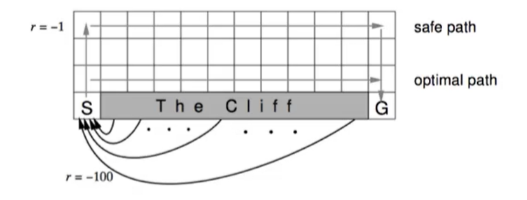
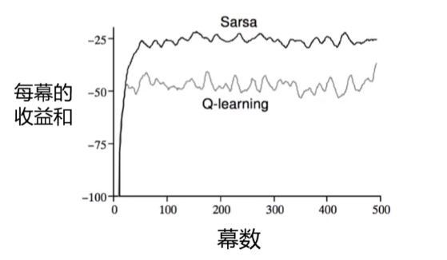

## 无模型控制(优化)

### 在轨/离轨学习

- 在轨(On-policy)学习
  - 在工作中学习
  - 从$\pi中得到的经验学习策略\pi$
- 离轨(Off-policy)学习
  - 站在巨人的肩膀上
  - 从$\mu中得到的经验学习策略\pi$

### 基于动作价值函数的无模型策略迭代

$$
\begin{align}
&1.初始化 \\
&对于任意s\in S，任意初始化V(s)，\pi(s)\in A(s) \\
&2.策略评估 \\
&循环: &\\
& \quad\quad\Delta=0 \\
& \quad\quad 对每一个s\in S循环: \\
& \quad\quad\quad\quad v= V(s) \\
& \quad\quad\quad\quad V(s)= \sum_{a\in A}\pi(a|s)\bigg(R_s^a+\gamma\sum_{s'\in S}P_{ss'}^aV(s')\bigg)\\
& \quad\quad\quad\quad \Delta= \max(\Delta,|v-V(s)|) \quad\quad\quad\quad(表示选取v更新前和v更新后差值最大的那个状态的状态值)\\
& 直到\Delta<\theta \\
&3.策略改进 \\
&\text{Policy stable=ture} \\
& 对每一个s \in S: \\
&\quad\quad\text{old action=}\pi(s) \\
&\quad\quad\pi(s)=\text{arg}\max{a}\bigg(R_s^a+\gamma\sum_{s'\in S }P_{ss'}^aV(s')\bigg) \\
&\quad\quad\text{如果old action}\neq \pi(s)那么\text{Policy stable=false} \\
&如果\text{Policy stable=ture,那么停止并返回}V=v_*,\text{以及}\pi=\pi^* \\
&否则跳转到2
\end{align}
$$

这是我们策略迭代的伪代码，我们发现在策略改进阶段需要知道状态转移矩阵才能对策略进行更新，而在model free的情况下我们是不知道状态转移矩阵的

所以引出了无模型的策略迭代

- 对$V(s)$的贪婪策略优化需要MDP模型
  $$
  \pi'(s)=\text{arg}\max_{a\in A} R_s^a+P_{ss'}^aV(s')
  $$

- 对Q(s,a)的贪婪策略优化是无模型的
  $$
  \pi'(s)=\text{arg}\max_{a\in A}Q(s,a)
  $$

#### 蒙特卡洛的动作价值评估

- 采样策略$\pi的第$k轮episode:$\{S_1,A_1,R_2,\cdots,S_T\}\sim \pi$

- 对于episode中的每个状态$S_t$和动作$A_t$
  $$
  N(S_t,A_t)\leftarrow N(S_t,A_t)+1\\
  Q(S_t,A_t)\leftarrow Q(S_t,A_t)+\frac{1}{N(S_t,A_t)}(G_t-Q(S_t,A_t))
  $$

#### $\epsilon-Greedy$探索

- 确保持续探索的最简单想法

- 所以m个动作都以非零概率进行尝试

- 以$1-\epsilon$的概率选择贪婪动作

- 以$\epsilon$的概率随机选择动作
  $$
  \\\pi(a|s)=
  \begin{cases}1-\frac{\epsilon}{|A(s)|}(|A(s)|-1) & \text{for the greedy action}\\ 
  \frac{\epsilon}{|A(s)|} & \text{for the other } |A(s)|-1 \text{ action}
  \end{cases}
  $$
  

#### GLIE(greedy in the Limit with Infinite Exploration)

- 有限时间里进行无限可能的探索(GLIE)

  - 所有的状态-动作对都被探索了无数次
    $$
    \lim_{k\to \infty}N_k(s,a)=\infty
    $$

  - 策略趋同于贪婪的策略
    $$
    \lim_{k\to \infty}\pi_k(a|s)=1(a=\text{arg}\max_{a'\in A}Q_k(s,a'))
    $$

  - 例如，如果$\epsilon_k=\frac{1}{k}$(k为探索的episode数目)，则$\epsilon-Greedy$为GLIE
    $$
    \\\pi(a|s)=
    \begin{cases}1-\frac{\epsilon}{|A(s)|}(|A(s)|-1) & \text{for the greedy action}\\ 
    \frac{\epsilon}{|A(s)|} & \text{for the other } |A(s)|-1 \text{ action}
    \end{cases}
    $$
    

#### GLIE蒙特卡洛控制

- 采样策略$\pi$的第k轮episode:$\{S_1,A_1,R_2,\cdots,S_T\}\sim\pi$

- 对于episode中的每个状态$S_t$和动作$A_t$
  $$
  N(S_t,A_t)\leftarrow N(S_t,A_t)+1\\
  Q(S_t,A_t)\leftarrow Q(S_t,A_t)+\frac{1}{N(S_t,A_t)}(G_t-Q(S_t,A_t))
  $$

- 基于新的动作价值函数优化策略
  $$
  \epsilon\leftarrow \frac{1}{k}
  \\\pi\leftarrow \epsilon-greedy(Q)
  $$
  

#### MC vs TD控制

- 与MC相比，TD学习有几个优点
  - 更低的方差
  - 在线
  - 不完整的序列
- 自然的想法是：在我们的控制循环中使用TD而不是MC
  - 将TD应用于Q(S,A)
  - 使用$\epsilon-greedy$策略改进
  - 更新每一个时间步

##### 使用Sarsa更新动作价值函数

$$
Q(S,A)\leftarrow Q(S,A)+\alpha(R+\gamma Q(S',A')-Q(S,A))
$$

###### 伪代码

**在轨策略控制中的Sarsa算法**
$$
\begin{align}
&1:随机初始化Q(s,a),\forall s\in S,a\in A(s),将Q=0 \\
&2:\text{REPEAT}(对于每一个episode) \\
&3:\quad\quad初始化S\\
&4:\quad\quad使用从Q得到的策略(e.g.,\epsilon-greedy)在状态S时选择动作A \\
&5:\quad\quad\text{REPEAT}(对于\text{episode}中的每一步): \\
&6:\quad\quad\quad\quad执行动作A,观察R,S'\\
&7:\quad\quad\quad\quad根据从Q得到的策略(e.g.,\epsilon-greedy)在状态S'时选择动作A'\\
&8:\quad\quad\quad\quad Q(S,A)\leftarrow Q(S,A)+\alpha[R+\gamma Q(S',A')-Q(S,A)]\\
&9:\quad\quad\quad\quad S\leftarrow S';A\leftarrow A' \\
&10: \quad\quad 直到S为终止状态
\end{align}
$$

##### TD和Sarsa的区别

- TD算法使用状态价值$V_\pi(s)$只看到"在当前策略$\pi$下从s出发的平均**期望**回报"，**看不到各个动作分别有多好**
- Sarsa算法使用动作价值$Q_\pi(s,a)$才能对每个动作打分，直接比较$\text{arg}\max_a Q_\pi(s,a)$去做策略改进。这就是SARSA学习Q的原因。

**数值例子**
$$
\begin{align}
&Q_\pi(s,a_1)=10,Q_\pi(s,a_2)=-100 \\
&当前策略\pi(a_1|s)=\pi(a_2|s)=0.5 \\
&则V_\pi(s)=-45 \\
& 但v^*(s)=\max(10,-100)=10(这个状态的最优潜力其实很高)\\
& 这说明: V_\pi低可能时策略差,不是状态差.要想把策略变好,你必须知道\text{"那个动作好"},因此要学Q

\end{align}
$$
**结论**

- **用V学(TD评估)**：学到的是$V_\pi(s)$"在**当前策略$\pi$下**，这个状态的期望回报"。它**不区分动作**，所有**单靠**$V$无法直接做哪一个动作更好的比较；想用V来改进策略，要么有环境模型去算$Q_\pi(s,a)=\mathbb{E}[r+\gamma V_\pi(S')|s,a]$，要么走**Actor-Critic**用优势函数更新策略。
- **用$Q$学(Sarsa/Q-learning)**：直接学B，在**无模型**的情况下也能**贪婪**/$\epsilon$**-贪婪**：$\pi(s)\leftarrow \text{arg}\max_a Q(s,a)$。这就具备了"**可以直接选取最优动作来更新策略**"

##### Sarsa的收敛性

- Sarsa收敛于最优动作价值函数，$Q(s,a)\rightarrow q_*(s,a)$，满足以下条件：

  - 任何时候的策略$\pi_t(a|s)$符号GLIE特性

  - 步长系数$\alpha_t$满足：
    $$
    \sum_{t=1}^\infty \alpha_t=\infty\\
    \sum_{t=1}^\infty \alpha_t^2<\infty
    $$

### 离轨学习

- **目标策略**：用来学习的策略

- **行为策略**：生成行动样本的策略

- 评估目标策略$\pi(a|s)以计算V_\pi(s)或q_\pi(s,a)$

- 同时遵循行为策略$\mu(a|s)$
  $$
  \{S_1,A_1,R_2,\cdots,S_T\}\sim \mu
  $$

- 为什么这很重要

  - 通过观察人类或其他智能体来学习
  - 重用旧的策略$\pi_1,\pi_2,\cdots,\pi_{t-1}$生成的经验
  - 在遵循**探索性**策略的同时学习**最优**策略

#### Q-learning

- 现在考虑基于动作价值$Q(s,a)$的离轨学习

- 使用行为策略$A_t\sim\mu(\cdot|S_t)$选择下一个动作，产生$R_{t+1}$与$S_{t+1}$

- 考虑基于替代策略$\pi$的后续动作$A'\sim\pi(\cdot|S_t)$

- 并将$Q(S_t,A_t)$更新为替代策略动作的价值
  $$
  Q(S_t,A_t)\leftarrow Q(S_t,A_t)+\alpha(\textcolor{red}{R_{t+1}+\gamma Q(S_{t+1},A')}-Q(S_t,A_t))
  $$[^1]

[^1]: 这不是Q-Learning的最终形式，只是为了方便我们和Sarsa衔接而写成了这种形式，下文会对最终形式进行推导

##### 使用Q-学习离轨控制

- 现在允许行为和目标策略都得到优化

- **目标策略**$\pi$是贪婪的w.r.t.$Q(s,a)$
  $$
  \pi(S_{t+1})=\text{arg}\max_{a'} Q(S_{t+1},a')
  $$

- **行为策略**$\mu$是$\epsilon$-greedy的w.r.t. Q(s,a)

- 然后，Q-Learning目标简化为：
  $$
  \begin{align}
  R_{t+1}&+\gamma Q(S_{t+1},A') \\
  &=R_{t+1}+\gamma Q(S_{t+1},\text{arg}\max_{a'} Q(S_{t+1},a')) \\
  &=R_{t+1}+\max_{a'}\gamma Q(S_{t+1},a')
  \end{align}
  $$

这里我们有两个策略，首先使用$行为策略\mu来获取R_{t+1}与S_{t+1}$。

而$A’$是**目标策略**$\pi$选取出来的。也就是说$A'$是根据$\pi(S_{t+1})=\text{arg}\max_{a'} Q(S_{t+1},a')$得到的

所以我们可以把$\pi(S_{t+1})=\text{arg}\max_{a'} Q(S_{t+1},a')$代入$\gamma Q(S_{t+1},A')$因此可以得到$Q(S_{t+1},\text{arg}\max_{a'} Q(S_{t+1},a'))$

最终的到Q-Learning的最终形式
$$
Q(S_t,A_t)\leftarrow Q(S_t,A_t)+\alpha(\textcolor{red}{R_{t+1}+\max_{a'}\gamma Q(S_{t+1},a')}-Q(S_t,A_t))
$$

##### 伪代码

**Q-Learning离轨控制算法**
$$
\begin{align}
1:&随机初始化Q(s,a),\forall s\in S,a\in A(s),将Q=0 \\
2:&\text{REPEAT}(对于每一个\text{episode}) \\
3:&\quad\quad初始化S \\
4:&\quad\quad\text{REPEAT}(对于\text{episode}中的每一步): \\
5:&\quad\quad\quad\quad根据从Q得到的策略(e.g.,\epsilon-greedy)在状态S时选择动作A\\
6:&\quad\quad\quad\quad执行动作A,观察到R,S'\\ 
7:&\quad\quad\quad\quad Q(S,A)\leftarrow Q(S,A)+\alpha\bigg[R+\gamma \max_{\alpha}Q(S',A')-Q(S,A)\bigg]\\
8:&\quad\quad\quad\quad S\leftarrow S' \\
9:&\quad\quad直到S为终止状态
\end{align}
$$
**小结**

Q-learning用**行为策略**$\mu$采样环境；用**同一份**$Q$构造**贪婪目标**(max)，等价于"好像遵循$\pi=\text{arg}\max_aQ(S',A')$"的前提下更新$Q$；随着$Q$改善，再把$\mu$设成$\epsilon$-greedy(Q)并让$\epsilon\to 0$，就完成了策略改进并收敛到最优.

##### 悬崖行走案例

- 到达G结束episode
- 每走一步-1
- 掉入悬崖-100

这张图中safe path为Sarsa的轨迹，optimal path为Q-learning的轨迹

**存在两个现象**

- 训练过程中Sarsa收益和高、Q-Learning收益和低
- Q-Learning走近路，Sarsa走安全的远路

**为什么会这样?**

- **Q-learning的目标**

  $y=r+\gamma\max_{a'}Q(s',a')$。它假设**下一步**会选**最优动作**，等价于沿着"贴着悬崖的最短路"学习；但实际行为策略是$\mu(入\epsilon-greedy)$，在悬崖边每一步都有$\epsilon$的概率掉下去(-100)。于是**学习的值对真实训练回报是过于乐观的**，训练过程中就会时不时坠崖，导致每个episode**回报偏低**

- **SARSA的目标**

  $y=r+\gamma Q(s', A_{t+1})$，其中$A_{t+1}\sim \mu(\cdot|s')$。目标**包含了探索会走错的概率**，于是把''贴边走''的动作学成"不划算"，策略自然**学成更远但更安全的路径**，训练期每个episode回报更高更稳

### 对比动态规划和TD算法中的区别

$$
\\\begin{array}{c|c}
完全回溯(DP) & 采样回溯(TD) \\
\hline 
迭代的策略评估 & 时序差分学习 \\
V(s)\leftarrow \mathbb{E}[r+\gamma V(S')|s] & V(s)\stackrel{\alpha}{\leftarrow} r+\gamma V(s') \\\\
\hline 
Q-策略迭代 & \text{SARSA} \\
Q(s,a)\leftarrow \mathbb{E}[r+\gamma Q(s',a')|s,a] & Q(s,a)\stackrel{\alpha}{\leftarrow} r+\gamma Q(s',a') \\\\
\hline 
Q-价值迭代 & \text{Q-Learning} \\
Q(s,a)\leftarrow\mathbb{E}[r+\gamma \max_{a'}Q(s',a')|s,a] & Q(s,a)\stackrel{\alpha}{\leftarrow}r+\gamma\max_{a'}Q(s',a')\\
\end{array}
\\其中 x\stackrel{\alpha}{\leftarrow}y\equiv x\leftarrow x+\alpha(y-x),y为\text{TD target}
$$

