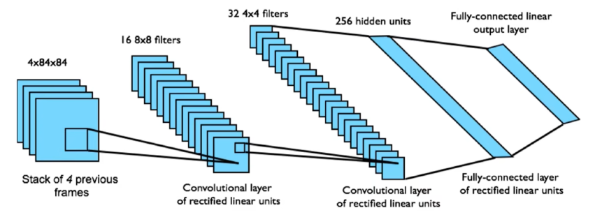

## 价值函数近似

- 到目前为止，我们都是通过一个查找表来存储价值函数

  - 每个状态s都有一个对应的$V(s)$
  - 或者每个state-action 对(s,a)都有一个对应的Q(s,a)

- 大型MDPs的问题：

  - 状态或者行动太多，无法全部存储在内存中
  - 针对每一个状态学习得到价值也是一个很慢的过程

- 解决大型MDPs的方法：

  - 用函数逼近来评估每个价值函数
    $$
    \hat{v}(s,w)\approx v_\pi(s)
    \\或者\hat{q}(s,a,w)\approx q_\pi(s,a)
    $$

  - 可以用已知状态学到的价值函数差值出未见过的状态的价值

  - 用MC或TD学习来更新函数参数w

### 价值函数逼近的类型

1. $s\stackrel{w}{\rightarrow}\hat{v}(s,w)$.输入一个状态经过一个权重可以得到状态价值
2. $\begin{cases}s\rightarrow\\a\rightarrow\end{cases}\quad w\rightarrow\hat{q}(s,a,w)$.输入状态和动作经过一个权重可以得到动作价值(连续)
3. $s\stackrel{w}{\rightarrow}\begin{cases}\rightarrow \hat{q}(s,a,w)\\\rightarrow\vdots \\\rightarrow \hat{q}(s,a_m,w)\end{cases}$输入一个状态，给出所有可能的动作价值，AlphaGo使用的就是这种

#### 函数逼近器

- 考虑**可微分**函数逼近器，例如：
  - **特征的线性组合**
  - **神经网络**
  - 决策树
  - 最近邻法
  - 傅里叶基/小波基
- 此外，我们需要一种适用于**非平稳、非独立同分布**数据的训练方法

### 线性最小二乘拟合

**线性最小二乘**

- 数据：$(x_1,y_1),\cdots,(x_n,y_n)$
- 线性关系：$y_i=mx_i+b$
- 求解(m,b)以最小化：$L=\sum_{i=1}^n(y_i-(mx_i+b))^2$

**解法：**
$$
我们首先需要判断这个函数的二阶导数,是否大于0(是否存在极小值点)
\\要使L最小化,需要使\begin{cases}\frac{\partial L}{\partial w}=0\\\frac{\partial L}{\partial b}=0\end{cases}(导数为零的点是极值点)
\\Y=\begin{bmatrix}
y_1\\
\vdots \\
y_n
\end{bmatrix}\quad X=\begin{bmatrix}
x_1 & 1 \\
\vdots & \vdots \\
x_n & 1
\end{bmatrix}\quad W=\begin{bmatrix}m\\b\end{bmatrix}
\\\begin{align}
L&=(Y-XW)^T(Y-XW) \\
&=Y^TY-Y^TXW-((XW)^TY)^T+(XW)^TXW \\
&=Y^TY-Y^TXW-Y^TXW+(XW)^TXW \\
&=Y^TY-2Y^TXW+(XW)^TXW
\end{align}
\\\nabla_wL=\frac{\partial L}{\partial W}=-2Y^TX+2X^TXW=0
\\X^TXW=Y^TX
\\W=(X^TX)^{-1}Y^TX
$$

### 非线性最小二乘拟合

- 数据：$(x_1,y_1),\cdots,(x_n,y_n)$
- 非线性关系：$y_i=f(x_i,W)$
- 求解$W以最小化:L=\sum_{i=1}^n(y_i-f(x_i,w))^2$

#### 使用梯度下降法求解

**梯度下降法**
$$
\begin{align}
&\text{while True} \\
&\quad\quad 权重的梯度\leftarrow 计算梯度(损失,训练数据,权重) \\
&\quad\quad权重\leftarrow权重-学习率\times权重的梯度
\end{align}
$$
**已知：**

- 数据：$(x_1,y_1),\cdots(x_N,y_N)$
- 其中，$y_i=f(x_i,W)$

**求解：**

- W以最小化$L(W)=\frac{1}{N}\sum_{i}L_i(f(x_i,W),y_i)$

  
  $$
  两种方式,另外一种是增量的形式,但本质上是一样的
  \\\begin{align}
  &\text{while True} \\
  &\quad\quad\nabla_WL(W)=\nabla_W\frac{1}{N}\sum_iL_i(f(x_i,W),y_i) \\
  &\quad\quad W\leftarrow W-\alpha\nabla_WL(W)
  \end{align}
  $$

  $$
  \\方式二:
  \\\begin{align}
  &\text{while True} \\
  &\quad\quad\nabla_WL(W)=\nabla_W\frac{1}{N}\sum_iL_i(f(x_i,W),y_i) \\
  &\quad\quad\Delta W\stackrel{\cdot}{=}-\alpha\nabla_WL(W)\\
  &\quad\quad W\leftarrow W+\Delta W
  \end{align}
  $$

- 最小二乘中
  $$
  L_i=(y_i-f(x_i,W))^2
  \\\nabla_WL(W)=-2(y_i-f(x_i,W))\frac{\partial f}{\partial W}
  \\\Delta W=\frac{1}{2}\alpha\nabla_WL(W)
  \\\Delta W=\alpha(y_i-f(x_i,W))\frac{\partial f}{\partial W}
  $$
  

但是使用梯度下降算法会出现一个问题

当N很大时，权重的梯度计算量很大

所以引出了随机梯度下降算法和小批量梯度下降算法

这里不做详细的展开，因为在神经网络的学习中已经讲过了

### 梯度下降

- 假定J(w)是一个关于参数w的可微函数

- 定义J(w)的梯度如下：(不止一个权重)
  $$
  \nabla_wJ(w)=\begin{pmatrix}
  \frac{\partial J(w)}{\partial w_1} \\
  \vdots \\
  \frac{\partial J(w)}{\partial w_n}
  \end{pmatrix}
  $$

- 为寻找J(w)的局部最小值

- 朝着负梯度方向调整参数w
  $$
  \Delta w=-\frac{1}{2}\alpha\nabla_wJ(w)
  \\\alpha是一个步长参数用随机梯度下降进行价值函数逼近
  $$

#### 用随机梯度下降进行价值函数逼近

- 目标：找到参数向量w，最小化近似价值函数$\hat{v}(S,w)$与真实价值函数$v_\pi(s)$的均方差
  $$
  J(w)=\mathbb{E}_\pi[(v_\pi(S)-\hat{v}(S,w))^2]
  $$

- 通过梯度下降能够找到局部最小值
  $$
  \begin{align}
  \Delta w&=-\frac{1}{2}\alpha\nabla_wJ(w) \\
  &=\alpha\mathbb{E}_\pi[(v_\pi(S)-\hat{v}(S,w))\nabla_w\hat{v}(S,w)]
  \end{align}
  $$

- 使用随机梯度下降对梯度进行采样
  $$
  \Delta w=\alpha(v_\pi(S)-\hat{v}(S,w))\nabla_w\hat{v}(S,w)
  $$

- 期望更新等于全部梯度更新

#### 特征向量

- 用特征向量表示向量
  $$
  x(S)=\begin{pmatrix}
  x_1(S)\\
  \vdots \\
  x_n(S)
  \end{pmatrix}
  \\可以理解为x_1(S)\sim x_n(S)是在当前状态S下各个特征函数的取值(不同特征)
  \\例如:
  
  \\\begin{align}
  1.&状态:当前位置s=(r,c),例如在第r=2,c=4个格子.\\
  &用\text{one-hot}特征:把25个格子各自对应一个分量 \\
  &x(S)=(x_1(S),\cdots,x_{25}(S))^T,\quad x_k(S)=\begin{cases}1, & S是第k个格子\\0,&\text{otherwise}\end{cases}\\
  &若S是第k=(r-1)\times5+c=9个格子,则\\
  &x(S)=[0,0,\cdots,1,\cdots,0](第9位为1)\\
  &这里每个x_i(S)不是一个状态,而是在这个状态上第i个特征的值\\
  \\\\
  2.&倒立摆 \\
  &状态四元组:S=(s,\stackrel{\cdot}{x},\theta,\stackrel{\cdot}{\theta}) \\
  &取一组多项式/标准化特征(含偏置)\\
  &x(S)=[1,\frac{x}{2.4},\frac{\stackrel{\cdot}{x}}{1.0},\frac{\theta}{12^\circ},\frac{\stackrel{\cdot}{\theta}}{2.0},(\frac{\theta}{12^\circ})^2,\frac{x}{2.4}\cdot\frac{\theta}{12^\circ}]6T\\
  &这时:\\
  &x_1(S)=1(偏置),x_2(S)=\frac{x}{2.4},\cdots\\
  &线性近似\hat{V}(S,w)=w^Tx(S)或者\hat{Q}(S,a,w)=w^Tx(S,a)就用这些分量加权求和
  \end{align}
  $$

- 以直升机控制问题为例：

  - 3D位置
  - 3D速度(位置的变化量
  - 3D加速度(速度的变化)

#### 线性价值函数逼近

- 通过特征的线性组合表示价值函数
  $$
  \hat{v}(S,w)=x(S)^Tw=\sum_{j=i}^nx_j(S)w_j
  $$

- 参数为w的目标函数是二次函数
  $$
  J(w)=\mathbb{E}_\pi\bigg[(v_\pi(S)-x(S)^Tw)^2\bigg]
  $$

- 随机梯度下降收敛于全局最优

- 更行规则
  $$
  \begin{align}
  \nabla_w\hat{v}(S,w)&=x(S)\\
  \Delta w&=\alpha(v_\pi(S)-\hat{v}(S,w))x(S)\\
  更新&=步长\times预测误差\times特征
  \end{align}
  $$

### 增量式预测算法

- 给定了真正的值函数$V_\pi(s)$，该问题可建模为一个经典的有监督学习问题

- 但是在RL中没有监督，只有奖励

- 实际计算时，使用target代替$V_\pi(s)$\

  - 在MC中，target是回报$G_t$
    $$
    \Delta w=\alpha(\textcolor{red}{G_t}-\hat{v}(S_t,w))\nabla_w \hat{v}(S_t,w)
    $$

  - 在TD(0)中，target是TD target
    $$
    \Delta w=\alpha(\textcolor{red}{R_{t+1}+\gamma\hat{v}(S_{t+1,w})}-\hat{v}(S_t,w))\nabla_w\hat{v}(S_t,w)
    $$

#### 半梯度(semi-gradient)

**什么叫半梯度?**

很多强化学习（RL）目标里，**训练目标本身依赖当前模型参数**。以状态价值近似为例，单步TD(0)的目标是：
$$
y_t\stackrel{\Delta}{=}r_{t+1}+\gamma\hat{v}(s_{t+1},w_t)
$$
而我们要拟合的是$\hat{v}(s_t,w)$。如果按”**全梯度**“去最小化
$$
\frac{1}{2}(y_t-\hat{v}(s_t,w))^2
$$
就会对$y_t$里的$\hat{v}(s_{t+1},w)$也求导，更新含有$\nabla_w\hat{v}(s_t,w)$。

半梯度（semi-gradient）的做法是：**把目标$y_t$当常数（停止梯度/stop-grad）**，只对$\hat{v}(s_t,w)$求求导。

于是单步随机梯度就是：
$$
\nabla_w\frac{1}{2}(y_t-\hat{v}(s_t,w))^2\approx -(y_t-\hat{v}(s_t,w))\nabla_w\hat{v}(s_t,w)
$$
直觉：先把下一步当脚手架固定住，**仅拉动当前状态的预测去贴近它**----这就是RL里的自举

**为什么要用半梯度而不是全梯度**

1. **避免”目标在动“导致的不稳定性**

   若对$\hat{v}(s_{t+1},w)$反向传播，目标与被拟合量会互相牵扯，数值上更易震荡，尤其$\gamma$大、函数逼近复杂时。

2. **规避”双采样问题“（double sampling）**

   如果直接最小化
   $$
   \text{MSBE}(w)=\mathbb{E}[(\mathbb{E}[r+\gamma\hat{v}(S')|S]-\hat{v}(S))^2]
   $$
   其**梯度**含有”**期望的平方**“**里两个独立的下一状态样本**（$一个在T\hat{v},一个在梯度顶$），**单样本**无法无偏估计，理论与实践都麻烦。

   半梯度TD则等价于在解**投影贝尔曼方程**$v=\Pi T_h$，避开了直接对$MEBE$求梯度，从而**稳定可行**

**小结：**半梯度用”把目标函数当常数“的近似，换来了**稳定、样本效率和工程可实现**的更新

### 蒙特卡洛学习的价值函数逼近

- 回报$G_t$是对真实价值$V_\pi(S_t)$的无偏估计

- 因此，可以采用监督学习的方式使用”训练数据“：
  $$
  (S_1,G_1),(S_2,G_2),\cdots,(S_T,G_T)
  $$

- 例如，使用**线性**蒙特卡洛策略评估
  $$
  \begin{align}
  \Delta w&=\alpha(\textcolor{red}{G_t}-\hat{v}(S_t,w))\nabla_w\hat{v}(S_t,w) \\
  &=\alpha(G_t-\hat{v}(S_t,w))x(S_t)
  \end{align}
  $$

- 蒙特卡洛评估收敛到**局部最优**[^1]（即使使用非线性的值函数逼近）

[^1]: 因为$G_t$是价值函数的近似，方差比较大，MC朝一个方差高的值进行更新，会出现来回的震荡，所以是局部最优

### TD学习的价值函数逼近

- TD-target$R_{t+1}+\gamma\hat{V}(S_{t+1},w)$是对真实价值$V_\pi(S_t)$的有偏采样

- 仍然可以将监督学习应用于”训练数据“
  $$
  (S_1,R_2+\gamma\hat{v}(S_2,w)),(S_2,R_3+\gamma\hat{v}(S_3,w)),\cdots,(S_{T-1},R_T)
  $$

- 例如，使用线性TD(0)
  $$
  \begin{align}
  \Delta w&=\alpha(\underbrace{\textcolor{red}{R+\gamma\hat{v}(S',w)}-\hat{v}(S,w)}_{\text{TD-error}})\nabla_w\hat{v}(S,w) \\
  &=\alpha \delta x(S)
  \end{align}
  $$

- 线性TD(0)收敛到全局最优

### Action-value函数逼近

- 近似action-value函数
  $$
  \hat{q}(S,A,w)\approx q_\pi(S,A)
  $$

- 最小化估计的动作价值函数$\hat{q}(S,A,w)$与真实的动作价值函数$q_\pi(S,A)$之间的均方误差
  $$
  J(w)=\mathbb{E}[(q_\pi(S,A)-\hat{q}(S,A,w))^2]
  $$

- 用随机梯度下降法找到局部最小值：
  $$
  \begin{align}
  \Delta w=-\frac{1}{2}\nabla_wJ(w)&=(q_\pi(S,A)-\hat{q}(S,A,w))\nabla_w\hat{q}(S,A,w)\\
  \Delta w&=\alpha(q_\pi(S,A)-\hat{q}(S,A,w))\nabla_w\hat{q}(S,A,w)\\
  w&=w+\Delta w
  \end{align}
  $$

#### 线性Action-Value函数逼近

- 状态行为可以用特征向量表示
  $$
  x(S,A)=\begin{pmatrix}
  x_1(S,A)\\
  \vdots \\
  x_n(S,A)
  \end{pmatrix}
  $$

- 通过特征的线性组合表示动作价值函数
  $$
  \hat{q}(S,A,w)=x(S,A)^Tw=\sum_{j=1}^nx_j(S,A)w_j
  $$

- 用随机梯度下降方法进行更新
  $$
  \begin{align}
  \nabla_w\hat{q}(S,A,w)&=x(S,A)\\
  \Delta w&=\alpha(q_\pi(S,A)-\hat{q}(S,A,w))x(S,A)
  \end{align}
  $$

### 增量式控制算法

- 与预测算法类似，我们找到一个替代动作价值$q_\pi(S,A)$的target

  - 对于MC，target是回报$G_t$
    $$
    \Delta w=\alpha(\textcolor{red}{G_t}-\hat{q}(S_t,A_t,w))\nabla_w\hat{q}(S_t,A_t,w)
    $$

  - 对于TD(0)(这里也可以说是Sarsa算法，因为是对q进行估计)，target是TD target$R_{t+1}+\gamma Q(S_{t+1},A_{t+1})$
    $$
    \Delta w=\alpha(\underbrace{\textcolor{red}{R_{t+1}+\gamma\hat{q}(S_{t+1},A_{t+1},w)}}_{\text{semi-gradient}}-\hat{q}(S_t,A_t,w))
    $$

### 批量强化学习

- 梯度下降很简单而且很吸引人
- 但是样本使用效率不高
- 批量方法寻找满足这批数据的最佳价值函数
- 根据智能体的经验”训练数据“

#### 最小二乘预测

- 假设存在一个价值函数的近似$\hat{v}(s,w)\approx v_\pi$

- 以及一段时期包含<状态、价值>的经验D
  $$
  \mathcal{D}=\{(s_1,v_1^\pi),(s_2,v_2^\pi),\cdots,(s_T,v_T^\pi)\}
  $$

- 最小二乘算法要去找到参数w，使得目标值为$v_t^\pi$和近似值$\hat{v}(s,w)$之间的平方和误差最小：
  $$
  \begin{align}
  LS(w)&=\sum_{t=1}^{T}(v_t^\pi-\hat{v}(s_t,w))^2 \\
  &=\mathbb{E}_D[(v^\pi-\hat{v}(s,w))^2]
  \end{align}
  $$

#### 带有经验回放的随机梯度下降

- 给出包含<状态、价值>的经验D：
  $$
  \mathcal{D}=\{(s_1,v_1^\pi),(s_2,v_2^\pi),\cdots,(s_T,v_T^\pi)\}
  $$

- Repeat：

  - 从经验中采样状态、价值
    $$
    (s,v^\pi)\sim \mathcal{D}
    $$

  - 应用随机梯度下降更新
    $$
    \Delta w=\alpha(v^\pi-\hat{v}(s,w))\Delta_w\hat{v}(s,w)
    $$

- 收敛至针对这段经历最小方差的参数：
  $$
  w^\pi=\text{arg}\min_w LS(w)
  $$

### Deep Q-Networks(DQN)经验回放

DQN采用**经验回放**和**固定的Q-targets**

- 根据$\epsilon-$greedy执行行为$a_t$

- 将经验以$(s_t,a_t,r_{t+1},s_{t+1})$的形式存储到replay memory D

- 从D中随机抽样一个mini-batch的经验$s,a,r,s'$

- 用旧的、**固定的参数**$w^-$计算Q-learning target

- 在Q-network和Q-learning targets之间优化MSE
  $$
  \mathcal{L}_i(w_i)=\mathbb{E}_{s,a,r,s'\sim \mathcal{D_i}}\bigg[\bigg(r+\gamma\max_{a'}Q(s',a',w_i^-)-Q(s,a,w_i)\bigg)^2\bigg]
  $$

- 使用随机梯度下降的方式更新参数。

**为什么需要经验回放**

**打破相关性**：连续时间步样本强相关，直接用会让梯度高方差、易震荡；随机打乱近似 IID，更符合 SGD 假设。

**复用与均衡**：回放让稀有但重要的转移也被反复利用、提高样本效率。

**平滑非平稳性**：策略在学、数据分布在变；混合老/新样本能稳住训练。

**为什么需要固定参数**$w^-$ 

**如果用同一套权重 w 同时“评估当前状态的 Q”又去“生成下一步的自举目标”**，那么目标会随着每一次梯度更新而抖动——典型的“追着自己影子跑”（moving target）问题。这在**自举 + 非线性函数逼近**里极易引起震荡甚至发散。DQN 用一套**固定/缓慢更新的目标网络**$w^-$来稳住这个目标

#### 目标漂移

**问题：目标随着更新而漂移** **（moving target）**

Q-learning的目标是
$$
y_t=r_{t+1}+\gamma \max_{a'}Q(s_{t+1},a',\textcolor{red}{w^-})
$$
若直接用在线网络参数w来生成目标：
$$
y_t=r_{t+1}+\gamma \max_{a'}Q(s_{t+1},a',\textcolor{red}{w})
$$
那么你一更新w去逼近$y_t$，$y_t$也立刻改变（因为它依赖同一个w），导致损失面不断形变。直观上就是你一边移动目的地、一边朝它走----很容易震旦、发散。

**解决：冻结（或缓慢更新）目标网络**$w^-$

DQN把目标改为
$$
y_t=r_{t+1}+\gamma \max_{a'}Q(s_{t+1},a',w^-)
$$
并在训练中**只用在线网络**w**反向传播**，不对$w^-$求导。这样在一段时间内（或连续小步）**目标是”准静态“的**，你就把问题变成了更像监督学习的回归：用当前w去拟合一个暂时固定的标签$y_t$

- **硬更新（periodic update）**：每C步把$w^-\leftarrow w$（例如C=1000）
- **软更新（Polyak/EMA）**：每步$w^-\leftarrow \tau w+(1-\tau)w^-比如\tau=0.005$

好处：

- 目标平稳$\Rightarrow$**损失面平稳**$\Rightarrow$更容易收敛
- 与**经验回放**一起，打破样本相关性与目标漂移的“共振”
- 让“自举”更像用一个稍微落后的老师打标签

#### DQN应用于Atari

- 从像素s**端到端**学习值函数$Q(s,a)$

- 输入状态s是最后4帧的原始像素堆栈

- 输入为$Q(s,a)$，用于18个操纵杆/按钮的控制

- 奖励是该步骤的分数变化

  

- 所有游戏的网络架构和超参数都是固定的

$$
\\\begin{array}{|c|c|}
\hline 
& \text{Replay and Fixed-Q} & \text{Replay and Q-learning} & \text{No Replay and Fixed-Q} & \text{No Replay and Q-learning} \\
\hline
\text{Breakout} & 316.81 & 240.73 & 10.16 & 3.17 \\
\hline
\text{Enduro} & 1006.3 & 831.25 & 141.89 & 29.1 \\
\hline
\text{River Raid} & 7446.62 & 4102.81 & 2867.66 & 1453.02\\
\hline
\text{Seaquest} & 2894.4 & 822.55 & 1003 & 275.81 \\
\hline
\text{Space Invaders} & 1088.94 & 826.33 & 373.22 & 301.99 \\
\hline
\end{array}
\\\begin{align}
&\text{Replay and Fixed-Q}:使用经验回放+固定参数 \\
& \text{Replay and Q-learning}:使用经验回放但是不固定参数 \\
& \text{No Replay and Fixed-Q} :不使用经验回放但是使用固定参数\\
& \text{No Replay and Q-learning}:不使用经验回放不固定参数
\end{align}
$$

### 线性最小二乘预测的解析解

- 经验回放能够找到最小二乘解决方法
- 但可能需要很多次的迭代
- 使用线性价值函数逼近器$\hat{v}(s,w)=x(s)^Tw$
- 可以直接求解最小二乘问题

在LS(w)的最小值下，期望的更新必须为零
$$
\begin{align}
\mathbb{E}_{\mathcal{D}}[\Delta w]&=0 \\
\alpha\sum_{t=1}^Tx(s_t)(v_t^\pi-x(s_t)^Tw)&=0\\
\sum_{t=1}^Tx(s_t)v_t^\pi&=\sum_{t=1}^Tx(s_t)x(s_t)^Tw\\
w&=\bigg(\sum_{t=1}^Tx(s_t)x(s_t)^T\bigg)^{-1}\sum_{t=1}^Tx(s_t)v_t^\pi
\end{align}
$$

- t表示第t个样本或者说是t时刻的采样
- 这种方法直接求解的时间复杂度是$O(N^3)$，N是特征数量
- 使用Shermann-Morrison法求解复杂度是$O(N^2)$

#### 线性最小二乘预测

-  我们不知道真正的价值$v_t^\pi$

- 实际上，我们的“训练数据”必须使用$v_t^\pi$的噪声样本或偏差样本

- **LSMC**最小二乘蒙特卡洛使用回报

  $v_t^\pi\approx G_t$

- **LSTD**最小二乘TD使用TD-target**(再次强调使用的是半梯度)**

  $v_t^\pi\approx R_{t+1}+\gamma\hat{v}(S_{t+1},w)$

- 在每种情况下，直接求解MC/TD的固定点

$$
\begin{align}
\text{LSMC}\quad\quad 0&=\sum_{t=1}^T\alpha(G_t-\hat{v}(S_t,w))x(S_t) \\
w&=\bigg(\sum_{t=1}^Tx(S_t)x(S_t)^T\bigg)^{-1}\sum_{t=1}^Tx(S_t)G_t \\
\text{LSTD}\quad\quad0&=\sum_{t=1}^T\alpha(R_{t+1}+\gamma\hat{v}(S_{t+1},w)-\hat{v}(S_t,w))x(S_t) \\
w&=\bigg(\sum_{t=1}^Tx(S_t)(x(S_t)-\gamma x(S_{t+1}))^T\bigg)^{-1}\sum_{t=1}^Tx(S_t)R_{t+1}
\end{align}
$$

  ### 线性最小二乘动作价值函数逼近

- 近似action-value 函数$q_\pi(s,a)$

- 使用特征的线性组合$x(s,a)$
  $$
  \hat{q}(s,a,w)=x(s,a)^Tw\approx q_\pi(s,a)
  $$

- 最小化$\hat{q}(s,a,w)$和$q_\pi(s,a)$的最小二乘误差

- 使用策略$\pi$生成包含<state,value>对的经验
  $$
  \mathcal{D}=\{[(s_1,a_1),v_1^\pi],[(s_2,a_2),v_2^\pi],\cdots,[(s_T,a_T),v_T^\pi]\}
  $$

#### 最小二乘Q-Learning

- 考虑以下线性Q学习更新
  $$
  \begin{align}
  \delta&=R_{t+1}+\gamma\hat{q}(S_{t+1},\pi(S_{t+1}),w)-\hat{q}(S_t,A_t,w)\\
  \Delta w&=\alpha\delta x(S_t,A_t)
  \end{align}
  $$

- LSTDQ[^2]算法：
  $$
  \begin{align}
  0&=\sum_{t=1}^T\alpha(R_{t+1}+\gamma \hat{q}(S_{t+1},\textcolor{red}{\pi(S_{t+1})},w)-\hat{q}(S_t,A_t,w))x(S_t,A_t) \\
  w&=\bigg(\sum_{t=1}^Tx(S_t,A_t)(x(S_t,A_t)-\gamma x(S_{t+1},\pi(S_{t+1})))^T\bigg)^{-1}\sum_{t=1}^Tx(S_t,A_t)R_{t+1}
  \end{align}
  $$

[^2]: **LSTDQ** 是 **Least-Squares Temporal Difference for Q-value** 的缩写，直译为“**用于动作价值函数的最小二乘时序差分**”

#### 最小二乘策略迭代算法

- 以下伪代码使用LSTDQ进行策略评估

- 它反复评估不同策略的经验D
  $$
  \begin{align}
  1:&\text{function LSPI-TD}(\mathcal{D},\pi_0) \\
  2:&\quad\quad \pi'\leftarrow\pi_0 \\
  3:&\quad\quad \text{repeat} \\
  4:&\quad\quad\quad\quad \pi\leftarrow \pi' \\
  5:&\quad\quad\quad\quad Q\leftarrow \text{LSTDQ}(\pi,\mathcal{D}) \\
  6:&\quad\quad\quad\quad\text{for all} s\in S \text{ do}\\
  7:&\quad\quad\quad\quad\quad\quad \pi'(s)\leftarrow \text{arg}\max_{a\in \mathcal{A}} Q(s,a)\\
  8:&\quad\quad\quad\quad\text{end for} \\
  9:&\quad\quad\text{until}(\pi\approx \pi')\\
  10:&\quad\quad \text{return }\pi\\
  11:& \text{end fuction}
  \end{align}
  $$