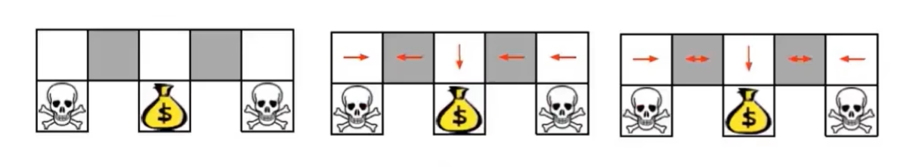
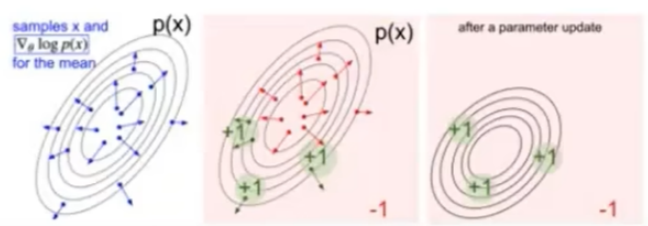

## 基于策略的强化学习

### 基于价值的强化学习vs基于策略的强化学习

**基于价值的强化学习**

- 确定性策略直接采用贪心算法从价值函数获得动作$\alpha_t=\text{arg}\max_\alpha Q(\alpha,s_t)$
- 学习价值函数
- 从价值函数中获得隐式的策略

**基于策略的强化学习**

- 我们也可以将策略函数参数化为$\pi_\theta(\alpha|s)$，其中$\theta$是可学习的策略参数，输出是动作集合的概率
- 没有价值函数
- 直接学习策略

**Actor-Critic框架**

- 同时学习策略和价值函数

#### 基于策略的强化学习的优势

- 优势
  - 更好的收敛性：保证收敛于**局部最优**(最坏情况)或全局最优(最好情况)
  - 在高维的行动空间中，策略梯度具有更强的效果
  - 策略梯度可以学习随机政策，而价值函数不能
- 劣势
  - 通常会收敛到局部最优
  - 评估策略存在很高的方差

### 两类策略

- 确定性策略：给定一个状态，策略返回要采取的特定操作
- 随机策略：给定一种状态，该策略返回动作的概率分布（例如，40%的可能性向左拐，60%的可能性向右拐）或连续动作的某种高斯分布

#### 例子：随机策略

- 智能体能看见附件格子的信息，如果智能体在灰色格子上，两个方块状态是一样的
- 采用确定性策略，可能学到在灰色方块上左走。如果agent在左边的灰色方块上，它永远不可能通关游戏
- 采用随机策略便可以在任意格子上有概率的通关游戏

### 策略优化目标

- 目的：给出带参数$\theta$的策略近似函数$\pi_\theta(s,a)$求出最佳$\theta$

- 如何衡量策略$\pi_\theta$的质量?

- 在独立环境中，我们可以使用开始值$s_1$ 
  $$
  J_1(\theta)=V^{\pi_\theta}(s_1)=\mathbb{E}_{\pi_\theta}[v_1]
  \\若起始状态不是唯一,而是从固定分布d_0采样,则
  \\J(\theta)=\mathbb{E}_{S_0\sim d_0}[V^{\pi_\theta}(S_0)]
  $$
  之所以可以用来“衡量策略好坏”，前提是：**任务是回合式（episodic），且每一幕都从同一个起始状态 **$s_1$（或从一个固定的起始分布）开始。在这种设定里，我们关心的正是“从起点出发的期望回报”，所以最大化 $V^\pi(s_1)$ 就等价于让策略在这个任务上表现最好。
  
- 在连续的环境中：

  - 我们可以使用平均值
    $$
    J_{avV}(\theta)=\sum_{s}d^{\pi_\theta}(s)V^{\pi_\theta}(s)
    \\d^{\pi_\theta}(s)表示在策略\pi_\theta的情况下发生状态s的概率
    $$

  - 或者说每个时间步的平均奖励
    $$
    J_{avR}(\theta)=\sum_{s}d^{\pi_\theta}(s)\sum_{a}\pi_\theta(s,a)R(s,a)
    $$

  其中，$d^{\pi\theta}$为$\pi_\theta$马尔科夫链的随机分布

#### 优化策略目标

- 策略的价值定义为：
  $$
  \begin{align}
  J(\theta)&=\mathbb{E}_{\tau\sim \pi_\theta}[\sum_{t} R(s_t^\tau,a_t^\tau)]\\
  &\approx \frac{1}{m}\sum_m\sum_t R(s_t^m,a_t^m)
  \end{align}
  $$
  它与我们在基于价值的强化学习中定义的价值函数相同

  - $\tau$是从策略函数$\pi_\theta$采样的轨迹
  - 这里我们先忽略折扣的影响

- 基于策略的强化学习目标：
  $$
  \theta^*=\text{arg}\max_\theta\mathbb{E}_{\tau\sim\pi_\theta}[\sum_t R(s_t^\tau,a_t^\tau)]
  $$

#### 优化策略方法

- 基于策略的强化学习是一个寻找$\theta$使得$J(\theta)$最大的优化问题。

- 如果$J(\theta)$是可微的，可以使用基于梯度的方法：

  - 梯度上升法
  - 共轭梯度法
  - 拟牛顿法
- 当$J(\theta)$不可微或导数难以计算时，无导数黑河优化方法如下：
  - 熵方法(CEM)
  - 爬上法
  - 进化算法

##### 利用导数优化策略

- 考虑一个函数$J(\theta)$为策略目标函数

- 目标是找到一个参数$\theta^*$通过梯度上升得方式最大化$J(\theta)$
  $$
  \Delta \theta=\alpha\nabla_\theta J(\theta)
  $$

- 沿梯度方向调整$\theta$，其中$\alpha$为步长

- 定义$J(w)$的梯度为
  $$
  \nabla_\theta J(\theta)=\bigg(\frac{\partial J(\theta)}{\partial \theta_1},\frac{\partial J(\theta)}{\partial \theta_2},\cdots,\frac{\partial J(\theta)}{\partial \theta_n}\bigg)^T
  \\\theta^{t+1}=\theta+\alpha\nabla_\theta J(\theta)
  \\这里为什么是个向量呢？
  \\简单来说就是\theta是一个向量如最基本的线性回归的参数\theta=\begin{bmatrix}w\\b\end{bmatrix}
  \\这里对每个维度求偏导,再对\theta进行更新(所以\nabla_\theta J(\theta)跟\theta的形状是一样的)
  $$
  

##### 无导数法：交叉熵法

- $\theta^*=\text{arg}\max_\theta J(\theta)$
- 将$J(\theta)$视为一个黑盒函数(不可微)

$$
\begin{align}
1:&\text{for iter } i=1 \text{ to } N \text{ do} \\
2:&\quad\quad\mathcal{C}=\{\} \\
3:&\quad\quad\text{for paramenter set }e=1 \text{ to }N\text{ do}\\
4:&\quad\quad\quad\quad\text{sample }\theta^{(e)}\sim P_{\mu^{(i)}}(\theta)\\
5:&\quad\quad\quad\quad\text{execute roll-outs under }\theta^{(e)}\text{ to evaluate }J(\theta^{(e)})\\
6:&\quad\quad\quad\quad\text{store }(\theta^e,J(\theta^{(e)}))\text{ in } \mathcal{C}\\
7:&\quad\quad\text{end for}\\
8:&\quad\quad\mu^{i+1}=\text{arg}\max_{\mu}\sum_{k\in\mathcal{C}}\log P_\mu(\theta^{(e)})\\
&\quad\quad\text{where } \hat{\mathcal{C}}\text{ the top 10\% of }\mathcal{C}\text{ ranked by }J(\theta^{(e)})\\
9:&\text{end for}
\end{align}
$$

一句话：可以把 CEM 理解成“**先大范围撒网，再逐步把概率云收紧到好解**”

##### 有限差分近似梯度

- 评估$\pi_\theta(s,a)$得策略梯度

- 对于每个维度$k\in[1,n]$

  - 在第k维上对$\theta$进行微小得扰动$\epsilon$[^1]，估计目标函数的第k个偏导数
    $$
    \frac{\partial J(\theta)}{\partial \theta_k}\approx\frac{J(\theta+\epsilon u_k)-J(\theta)}{\epsilon}
    $$

  - 其中，$u_k$是单位向量，它的第k个分量为1，其他为0
    $$
    当k=2时
    \\\frac{\partial J(\theta)}{\partial \theta_2}\approx\frac{J(\theta+\epsilon u_2)-J(\theta)}{\epsilon}
    \\u_2=\begin{bmatrix}
    0\\1\\\vdots \\0
    
    \end{bmatrix}
    $$
    

- 通过n次计算可得n个维度的策略梯度

- 虽然噪声大，效率低，但适用于任意策略，即使策略是不可微的

[^1]: $\epsilon$是一个很小的数可以是0.000001，但是不能趋于0，这部分可以去看看导数相关的定义。

##### 策略梯度的解析计算

- 假设策略$\pi_\theta$在非零时是可微的
- 计算梯度$\nabla_\theta\pi_\theta(s,a)$的一个技巧

$$
\begin{align}
\nabla_\theta\pi_\theta(s,a)&=\pi_\theta(s,a)\frac{\nabla_\theta\pi_\theta(s,a)}{\pi_\theta(s,a)}\\
&=\pi_\theta(s,a)\nabla_\theta\log{\pi_\theta(s,a)}\\
\\\log' f(x)&=\frac{1}{f(x)}\cdot f(x)'(链式法则)\\
\\\therefore  \log'f(x)&=\frac{f'(x)}{f(x)}
\end{align}
$$

##### 策略示例:Softmax策略

- 简单的策略模型：利用特征$\phi(s,a)^T\theta$线性组合的权重动作

- 动作的概率与指数权重成正比
  $$
  \pi_\theta(s,a)=\frac{\exp^{\phi(s,a)^T\theta}}{\sum_{a'}\exp^{\phi(s,a')^T\theta}}
  $$

- 可以获得：
  $$
  \nabla_\theta\log{\pi_\theta(s,a)}=\phi(s,a)-\mathbb{E}_{\pi_\theta}[\phi(s,\cdot)]
  \\\pi_\theta(s,a)是在状态s下采取动作a的概率
  \\\phi(s,a)是特征向量
  \\\mathbb{E}_{\pi_\theta}[\phi(s,\cdot)]表示在策略\pi_\theta下特征向量的期望值
  \\\\如何推导出来的呢?
  \\\begin{align}
  \pi_\theta(s,a)&=\frac{\exp^{\phi(s,a)^T\theta}}{\sum_{a'}\exp^{\phi(s,a')^T\theta}}\\
  \because \log_a(\frac{M}{N})&=\log_aM-\log_aN\\
  \therefore \log\frac{\exp^{\phi(s,a)^T\theta}}{\sum_{a'}\exp^{\phi(s,a')^T\theta}}&=\log{\exp^{\phi(s,a)^T\theta}}-\log{\sum_{a'}\exp^{\phi(s,a')^T\theta}}\\
  
  &=\phi(s,a)^T\theta-\log\sum_{a'}\exp^{\phi(s,a’)^T\theta}
  \end{align}
  $$

  $$
  对\theta求梯度\nabla_\theta\log \pi_\theta(s,a):
  \\1.第一项
  \\\nabla_\theta[\phi(s,a)^T\theta]=\phi(s,a)
  \\2.第二项
  \\\nabla_\theta\log\sum_{a'}\exp^{\phi(s,a')^T\theta}=\frac{1}{\sum_{a'}\exp^{\phi(s,a')^T\theta}}\cdot\sum_{a'}\exp^{\phi(s,a')^T\theta}\cdot\phi(s,a')
  \\=\underbrace{\sum_{a''}\frac{\exp^{\phi(s,a'')^T\theta}}{\sum_{a'}\exp^{\phi(s,a')^T\theta}}}_{\sum_{a'}\pi_\theta(s,a')}\cdot\phi(s,a')
  \\合并并化简:
  \\\nabla_\theta\log{\pi_\theta(s,a)}=\phi(s,a)-\mathbb{E}_{\pi_\theta}[\phi(s,\cdot)]
  $$

  

$\theta$是已知的，那么我们通过这个式子就可以知道在每个状态执行动作$\mathbb{A}$的概率， 这时可以进行梯度上升

##### 策略示例:高斯策略

- 在连续动作空间中，可以很自然地定义高斯策略

- 均值是状态特征$\mu(s)=\phi(s)^T\theta$地线性组合

- 方差可以是固定地$\sigma^2$，也可以参数化

- 策略服从高斯分布，连续的动作$a\sim N(\mu(s),\sigma^2)$

- 可以得到：
  $$
  \nabla_\theta\log{\pi_\theta}(s,a)=\frac{(a-\mu(s))\phi(s)}{\sigma^2}
  \\推导:
  \\策略服从高斯分布,也就是说\pi_\theta(a|s)=\frac{1}{\sqrt{2\pi}\sigma}\exp\bigg({-\frac{(a-\mu(s))^2}{2\sigma^2}}\bigg)
  \\则\nabla_\theta\log\frac{1}{\sqrt{2\pi}\sigma}\exp\bigg({-\frac{(a-\mu(s))^2}{2\sigma^2}}\bigg)
  \\\begin{align}
  &=(\frac{1}{\sqrt{2\pi}\sigma})'+\nabla_\theta \log\exp\bigg(-\frac{(a-\mu(s))^2}{2\sigma^2}\bigg) \\
  &=\frac{1}{\exp\bigg(-\frac{(a-\mu(s))^2}{2\sigma^2}\bigg)}\cdot\exp\bigg(-\frac{(a-\mu(s))^2}{2\sigma^2}\bigg)'\cdot\bigg(-\frac{1}{2\sigma^2}(a-\mu(s))^2\bigg)' \cdot (-\mu(s))'\\
  &=\frac{a-\mu(s)}{\sigma^2}\cdot\mu(s)'\\
  &把\mu(s)=\phi(s)^{T}\theta代入\\
  &=\frac{(a-\phi(s)^T\theta)\phi(s)}{\sigma^2}
  \end{align}
  $$
  

### 补充:蒙特卡洛采样

目标：求下面期望
$$
\mathbb{E}_{p(x)}[f(x)]=\int_a^bf(x)p(x)\ dx
$$
从分布$p(x)$采样大量样本点$x_1,x_2,\cdots,x_n$
$$
\mathbb{E}_{p(x)}[f(x)]=\frac{1}{n}f(x_i)
$$
将求期望问题转换为了求均值问题

### 单步MDPs的策略梯度

- 考虑1步的马尔可夫过程

  - 开始于状态$s\sim d(s)$
  - 完成一个时间步骤后游戏终止，获得奖励$r=R(s,a)$

- 定义策略目标函数
  $$
  J(\theta)=\mathbb{E}_{\pi_\theta}[r]
  \\=\sum_{s\in S}d(s)\sum_{a\in \mathcal{A}}\pi_\theta(s,a)r(s,a)
  $$

- 策略的梯度计算如下：
  $$
  \nabla_\theta J(\theta)=\sum_{s\in S}d(s)\sum_{a\in\mathcal{A}}\pi_\theta(s,a)\nabla_\theta\log{\pi_\theta}(s,a)r(s,a)
  \\=\mathbb{E}_{\pi_\theta}[r(s,a)\nabla_\theta\log{\pi_\theta}(s,a)]
  $$
  

### 多步MDPs的策略梯度

- 将1episode的state-action轨迹表示为：
  $$
  \tau=(s_0,a_0,r_1,\cdots,s_{T-1},a_{T-1},r_{T},s_{T})\sim(\pi_\theta,P(s_{t+1}|s_t,a_t))
  $$

- 定义$R(\tau)=\sum_{t=0}^{T-1}R(s_t,a_t)$为轨迹$\tau$的奖励总和

- 定义策略目标函数：
  $$
  J(\theta)=\mathbb{E}_{\pi_\theta}[\sum_{t=0}^{T-1}R(s_t,a_t)]=\sum_\tau P(\tau;\theta)R(\tau)
  $$
  
- 其中,$P(\tau;\theta)=\mu(s_0)\Pi_{t=0}^{T-1}\pi_\theta(a_t|s_t)p(s_{t+1}|s_t,a_t)$表示$\pi_\theta$交互时获得该轨迹的概率($\mu(s_0)$表示第一个状态发生的概率)

- 我们最终的目标是找到最优策略参数$\theta$：
  $$
  \theta^*=\text{arg}\max_\theta J(\theta)=\text{arg}\max_{\theta}\sum_{\tau}P(\tau;\theta)R(\tau)
  $$

- 目标函数是关于$\theta$的梯度
  $$
  \begin{align}
  \nabla_\theta J(\theta)&=\nabla_\theta\sum_{\tau}P(\tau;\theta)R(\tau)\\
  &=\sum_\tau\nabla_\theta P(\tau;\theta)R(\tau)\\
  &=\sum_\tau\frac{P(\tau;\theta)}{P(\tau;\theta)}\nabla_\theta P(\tau;\theta)R(\tau)\\
  &=\sum_\tau P(\tau;\theta)R(\tau)\frac{\nabla_\theta P(\tau;\theta)}{P(\tau;\theta)}\\
  &=\sum_\tau P(\tau;\theta)R(\tau)\nabla_\theta \log{P(\tau;\theta)}
  \end{align}
  $$
  

现在我们已知目标函数的梯度
$$
\nabla_\theta J(\theta)=\sum_\tau P(\tau;\theta)R(\tau)\nabla_\theta \log{P(\tau;\theta)}
$$
这里我们使用采样对$\sum_\tau P(\tau;\theta)$进行近似

m个样本轨迹在策略$\pi_\theta$下的经验估计近似：
$$
\nabla_\theta J(\theta)\approx\frac{1}{m}\sum_{i=1}^mR(\tau_i)\textcolor{red}{\nabla_\theta\log{P(\tau_i;\theta)}}
$$
**将轨迹分解为状态和行动**
$$
\begin{align}
\nabla_\theta\log{P(\tau;\theta)} &=\nabla_\theta\log\bigg[{\mu(s_0)\Pi_{t=0}^{T-1}\pi_\theta(a_t|s_t)p(s_{t+1}|s_t,a_t)}\bigg]\\
&=\nabla_\theta \log\mu(s_0)+\nabla_\theta[\sum_{t=0}^{T-1}\log\pi_\theta(a_t|s_t)+\log p(s_{t+1}|s_t,a_t)]\\
&=\sum_{t=0}^{T-1}\nabla_\theta \log\pi_\theta(a_t|s_t)
\end{align}
$$

### 策略梯度

- 目标：找到最优策略参数$\theta$
  $$
  \theta^*=\text{arg}\max_\theta J(\theta)=\text{arg}\max_\theta\sum_{\tau}P(\tau;\theta)R(\tau)
  $$

- 在策略$\pi_\theta下m$个样本轨迹的经验估计近似
  $$
  使用采样对期望进行近似
  \\ \nabla_\theta J(\theta)\approx \frac{1}{m}\sum_{i=1}^mR(\tau_i)\nabla_\theta\log{P(\tau_i;\theta)}
  \\其中\nabla_\theta\log P(\tau_i;\theta)=\sum_{t=0}^{T-1}\nabla_\theta\log \pi_\theta(a_t|s_t)
  $$

- 最终：
  $$
  \nabla_\theta J(\theta)\approx\frac{1}{m}\sum_{i=1}^mR(\tau_i)\sum_{t=0}^{T-1}\nabla_\theta \log\pi_\theta(a_t^i|s_t^i)
  \\
  \\详细参数讲解:
  \\\frac{1}{m}\sum_{i=1}^m R(\tau_i):表示一共采样了m个轨迹,轨迹i的奖励总和求平均
  \\\sum_{t=0}^{T-1}:轨迹i有T-1个时间步
  \\ \pi_\theta(a_t^i|s_t^i):第i个轨迹第t时间时的状态s经过策略\pi_\theta转移到a_i^i的概率

  $$

### 策略更新

$$
\theta=\theta+\Delta \theta
\\\Delta\theta=\alpha \pi(a|s)\sum_{t=0}^{T-1}\nabla_\theta\log\pi_\theta(a_t|s_t)
\\假设策略为\text{softmax},则:
\\\Delta\theta=\alpha\pi(a|s)\sum_{t=0}^{T-1}\bigg[\phi(s_t,a_t)-\mathbb{E}_{\pi_\theta}[\phi(s_t,\cdot)]\bigg]
\\假设策略为高斯策略,则:
\\\Delta\theta=\alpha\pi(a|s)\sum_{t=0}^{T-1}\bigg[\frac{(a_t-\phi(s_t)^T\theta)\phi(s_t)}{\sigma^2}\bigg]
$$

### 直观理解策略梯度

#### 与最大似然比较

- 策略梯度估计量：
  $$
  \nabla_\theta J(\theta)\approx\frac{1}{M}\sum_{m=1}^M\bigg(\sum_{t=1}^T\nabla_\theta\log \pi_\theta(a_{t,m}|s_{t,m})\bigg)\bigg(\sum_{t=1}^Tr(s_{t,m},a_{t,m})\bigg)
  $$

- 极大似然估计量：
  $$
  \nabla_\theta J_{ML}(\theta)\approx\frac{1}{M}\sum_{m=1}^M\bigg(\sum_{t=1}^T\nabla_\theta\log 
  \pi_\theta(a_{t,m}|s_{t,m})\bigg)
  \\这个可以理解为执行动作a_{t,m}的概率/权重
  \\这个通常用于模仿学习,并不会考虑这个动作的好坏
  \\乘上\bigg(\sum_{t=1}^Tr(s_{t,m},a_{t,m})\bigg)之后就会考虑这个动作的好坏
  \\好的行为更可能发生,坏的行为更不可能发生
  $$

#### 从梯度理解

- 考虑$\mathbb{E}_{\tau\sim \pi_\theta}[R(\tau)]$的一般形式为：
  $$
  \begin{align}
  \nabla_\theta\mathbb{E}_{p(x;\theta)}[f(x)]&=\mathbb{E}_{p(x;\theta)}[f(x)\nabla_\theta\log p(x;\theta)]\\
  &\approx \frac{1}{S}\sum_{s=1}^Sf(x_s)\nabla_\theta\log p(x_s;\theta),\text{where }x_s\sim p(x;\theta)\\
  这里使用&f(x)代替R(\tau)
  \end{align}
  $$
  计算函数$f(x)$期望的梯度

- 上述梯度可以理解为：

  - 将分布$p$通过其他参数$\theta$移动，使其未来样本$x$获得由$f(x)$判断的更高分数

  - 沿着$f(x)\nabla_\theta\log p(x;\theta)$的方向推高样本的对数似然

    

### 策略梯度方差大

- 我们得到了如下近似更新函数
  $$
  \nabla_\theta J(\theta)\approx\frac{1}{m}\sum_{i=1}^m R(\tau_i)\sum_{t=0}^{T-1}\nabla_\theta\log{\pi_\theta(a_t^i|s_t^i)}
  $$

- **无偏估计，但方差大**

- 两个优化方法：

  - 使用时序因果关系
  - 加入基线

#### !利用因果关系减少策略梯度的方差

- 最初：$\nabla_\theta\mathbb{E}_\tau[R]=\mathbb{E}_{\tau}\bigg[\bigg(\sum_{t=0}^{T-1}r_t\bigg)\bigg(\sum_{t=0}^{T-1}\nabla_\theta\log\pi_\theta(a_t|s_t)\bigg)\bigg]$

- 我们可以推导出单个奖励项$r_t'$的梯度估计量为
  $$
  \nabla_\theta\mathbb{E}_\tau[r_{t'}]=\mathbb{E}_\tau\bigg[r_{t'}\sum_{t=0}^{t'}\nabla_\theta\log\pi_\theta(a_t|s_t)\bigg]
  \\r_{t'}\sum_{t=0}^{t'}表示:只把从起点到t'之前(含t')的决策对r_{t'}的影响计入梯度
  $$
  
- 把这个公式按$t$求和，可以得到
  $$
  \\\begin{align}
  \nabla_\theta J(\theta)=\nabla_\theta\mathbb{E}_{\tau\sim \pi_\theta}[R]&=\mathbb{E}_\tau\Big[\sum_{t'=0}^{T-1}r_{t'}\sum_{t=0}^{t'}\nabla_\theta\log\pi_\theta(a_t|s_t)\Big]\\
  &=\mathbb{E}_\tau\bigg[\sum_{t=0}^{T-1}\nabla_\theta\log\pi_\theta(a_t|s_t)\sum_{t'=t}^{T-1}r_{t'}\bigg]\\
  &=\mathbb{E}\bigg[\sum_{t=0}^{T-1}G_t\cdot\nabla_\theta\log\pi_\theta(a_t|s_t)\bigg]\\
  \end{align}\\
  理解\mathbb{E}_\tau\bigg[\sum_{t=0}^{T-1}\nabla_\theta\log\pi_\theta(a_t|s_t)\sum_{t'=t}^{T-1}r_{t'}\bigg]
  \\当t=0时刻,做了动作a_t,就会考虑之后所有的价值
  \\如果当t=5时刻,做了动作a_t,就之后考虑t=5之后的价值,于前面的价值无关
  $$
  

**利用因果关系降低策略梯度的差异性**

- 因此，通过
  $$
  \nabla_\theta\mathbb{E}_{\tau\sim\pi_\theta}[R]=\mathbb{E}_\tau\bigg[\sum_{t=0}^{T-1}G_t\cdot\nabla_\theta\log\pi_\theta(a_t|s_t)\bigg]
  $$

- $G_t=\sum_{t'=t}^{T-1}r_{t'}$是步骤t的轨迹的回报

- **因果关系：当$t<t'$时，时间$t'$的策略不能影响时间t的奖励** 。不太理解这里，需要进一步研究

- 然后我们可以有一下的估计更新
  $$
  \nabla_\theta \mathbb{E}[R]\approx\frac{1}{m}\sum_{i=1}^m\sum_{t=0}^{T-1}G_t^{(i)}\cdot\nabla_\theta\log\pi_\theta(a_t^i|s_t^i)
  $$

##### REINFORCE:一种蒙特卡洛策略梯度算法

该算法简单的按照策略$\pi_\theta$采样多调轨迹，同时使用估计的梯度更新$\theta$
$$
\begin{align}
1:&\text{Input: adefferentiable policy parameterization } \pi(a|s,\theta)\\
2:&\text{Initialize policy paramenter }\theta\in \mathbb{R}^{d'}\\
3:&\text{Repeat forever:}\\
4:&\quad\quad \text{Generate an spisode }S_0,A_0,R_1,\cdots,S_{T-1},A_{T-1},R_T,\text{ following }\pi(\cdot|\cdot,\theta)\\
5:&\quad\quad\text{For each step of the spisode }t=0,\cdots,T-1\\
6:&\quad\quad\quad\quad G\leftarrow \text{return from step }t\\
7:&\quad\quad\quad\quad \theta\leftarrow \theta+\alpha\gamma^tG\nabla_\theta\ln\pi(A_t|S_t,\theta)
\end{align}
$$
详细可以看看这篇文章：[Simple statistical gradient-following algorithms for connectionist reinforcement learning](https://link.springer.com/article/10.1007/bf00992696)

#### 基线

##### 减基线后的期望

$$
\nabla_\theta J(\theta)\approx\frac{1}{N}\sum_{i=1}^{N}\nabla_\theta\log p_\theta(\tau)[r(\tau)-b]
\\我们猜测,当我们把r(\tau)减去一个b,b为他们的公共部分
\\直观上,b把与动作无关的、对所有动作都差不多的回报部分去掉
\\只让平均水平的偏差来驱动梯度,噪声小还很多
\\b=\frac{1}{N}\sum_{i=1}^{N}r(\tau)\quad\quad减去基线后是否会改变期望的值?
\\证明:
\\\frac{1}{N}\sum_{i=1}^{N}\nabla_\theta\log p_\theta(\tau)[r(\tau)-b]=\frac{1}{N}\sum_{i=1}^{N}\nabla_\theta\log p_\theta(\tau)r(\tau)-\frac{1}{N}\sum_{i=1}^{N}\nabla_\theta\log p_\theta(\tau)b
\\我们只需要证明\frac{1}{N}\sum_{i=1}^{N}\nabla_\theta\log p_\theta(\tau)b=0就可以了
\\\mathbb{E}[\nabla_\theta\log p_\theta(\tau)b]=\int p_\theta(\tau)\nabla_\theta\log p_\theta(\tau)b\ d\tau
\\根据p_\theta(\tau)\nabla_\theta\log p_\theta(\tau)=\nabla_\theta p_\theta(\tau)
\\=\int\nabla_\theta p_\theta(\tau)b\ d\tau
\\=b\nabla_\theta\int p_\theta(\tau)\ d\tau(先求导后积分和先积分后求导直接一般只会差一个常数)
\\=b\nabla_\theta1=0
$$

- 不改变期望的值,减基线是无偏的
- 将b定义成上述形式很好用，但不是最优的

##### 减基线后的方差

$$
\begin{align}
&\text{Var}[X]=\mathbb{E}[(X-\mu)^2] \\
&=\mathbb{E}[X^2-2\mu X-\mu^2]\\
&=\mathbb{E}[X^2]-2\mu \mathbb{E}[X]+\mu^2\\
&=\mathbb{E}[X^2]-2\mu^2+\mu^2 \\
&=\mathbb{E}[X^2]-\mu^2\\

&=\mathbb{E}[X^2]-\mathbb{E}[X]^2\\
&\nabla_\theta J(\theta)=\mathbb{E}_{\tau\sim p_\theta(\tau)}[\nabla_\theta\log p_\theta(\tau)(r(\tau)-b)]\\
&\text{Var}=\mathbb{E}_{\tau\sim p_\theta(\tau)}[(\nabla_\theta\log p_\theta(\tau)(r(\tau)-b))^2]-\underbrace{\mathbb{E}_{\tau\sim p_\theta(\tau)}[\nabla_\theta\log p_\theta(\tau)(r(\tau)-b)]^2}_{这一项实际上就是\mathbb{E}_{\tau\sim p_\theta(\tau)}[\nabla_\theta\log p_\theta(\tau)(r(\tau))]^2}\\
&第一项变小,第二项没变.那么它的方差理所当然的变小
\\
\\&\text{tips:为什么第一项不等于我们前面证明的,是因为这里是先对里面开平方了,肯定是不满足我们在《减基线后的期望》证明的}
\end{align}
$$

**b取何值时使得方差最小**
$$
\\为了方便书写,我们令\nabla_\theta\log p_\theta(\tau)=g(\tau)
\\
\begin{align}
\frac{d\text{Var}}{db}=\frac{d}{db}\mathbb{E}[g(\tau)^2(r(\tau)-b)^2]&=\frac{d}{db}(\mathbb{E}[g(\tau)^2r(\tau)^2]-2\mathbb{E}[g(\tau)^2r(\tau)b]+\mathbb{E}[g(\tau)^2b^2])\\
&=-2\mathbb{E}[g(\tau)^2r(\tau)]+2b\mathbb{E}[g(\tau)^2]=0\\
b&=\frac{\mathbb{E}[g(\tau)^2r(\tau)]}{\mathbb{E}[g(\tau)^2]}\longleftarrow梯度平方加权后的奖励的期望
\end{align}
$$

#### 使用基线降低差异

$$
\nabla_\theta J(\theta)=\mathbb{E}_{\tau}\bigg[\sum_{t=0}^{T-1}\textcolor{red}{(G_t-b_w(s_t))}\cdot\nabla_\theta\log\pi_\theta(a_t|s_t)\bigg]
$$

- 基线$b(s)$可以减小方差，而不改变期望值

- $b_w(s)$也可以使用神经网络进行近似，也有一个参数w需要学习，因此我们有两组参数$w和\theta$

- 解释：增加动作的对数概率$a_t$与收益$G_t$高于期望收益的程度成正比

- 可以证明，基线$b(s)$可以减少方差，而不改变期望值。
  $$
  \begin{align}
  \mathbb{E}_\tau[\nabla_\theta\log\pi_\theta(a_t|s_t)b(s_t)]&=0 \\
  \mathbb{E}_\tau[\nabla_\theta\log\pi_\theta(a_t|s_t)(G_t-b(s_t))]&=\mathbb{E}_\tau[\nabla_\theta\log\pi_\theta(a_t|s_t)G_t]\\
  \text{Var}_\tau[\nabla_\theta\log\pi_\theta(a_t|s_t)(G_{t}-b(s_t))]&<\text{Var}[\nabla_\theta\log\pi_\theta(a_t|s_t)G_t]
  \end{align}
  $$

- 因此，减去基线依然是无偏的，但方差会降低

#### 含有基线的标注版策略梯度算法

$$
\begin{align}
1:&\text{procedure Policy Gradient }(\alpha) \\
2:&\quad\quad\text{Initialize policy parameters }\theta\text{ and baseline value }b(s)\text{ for all s, e.g. to 0}\\
3:&\quad\quad \text{for iteration=}1,2,\cdots, \text{do}\\
4:&\quad\quad\quad\quad\text{Collect a set of }m\text{ trajectories by executing the current policy }\pi_\theta \\
5:&\quad\quad\quad\quad\text{for each time step } t \text{ of each trajectory }\tau^{(i)}\text{ do}\\
6:&\quad\quad\quad\quad\quad\quad\text{Compute the reture }G_t^{(i)}=\sum_{t'=t}^{T-1}r_{t'}\\
7:&\quad\quad\quad\quad\quad\quad\text{Compute the advantage estimate }\hat{A}_t^{(i)}=G_t^{(i)}-b(s_t)\\
8:&\quad\quad\quad\quad\text{Re-fit the baseline to the empirical returns by updating }w\text{ to minimize}\\
9:&\quad\quad\quad\quad\quad\quad\quad\quad\quad\quad\quad\quad\sum_{i=1}^m\sum_{t=0}^{T-1}\|b(s_t)-G_t^{(i)}\|^2\\
10:&\quad\quad\quad\quad\text{Update policy parameters }\theta \text{ using the policy gradient estimate }\hat{g}\\
11:&\quad\quad\quad\quad\quad\quad\quad\quad\quad\quad\quad\quad\hat{g}=\sum_{i=1}^m\sum_{t=0}^{T-1}\hat{A}_t^{(i)}\nabla_\theta\log\pi_\theta(a_t^{(i)}|s_t^{(i)})\\
12:&\quad\quad\quad\quad \text{with an optimizer like SGD }(\theta\leftarrow\theta+\alpha \hat{g})\text{ to Adam}\\
13:&\quad\quad\text{return }\theta \text{ and baseline values }b(s)
\end{align}
$$

[Policy Gradient Methods for Reinforcement Learning with Function Approximation](https://proceedings.neurips.cc/paper_files/paper/1999/hash/464d828b85b0bed98e80ade0a5c43b0f-Abstract.html)

