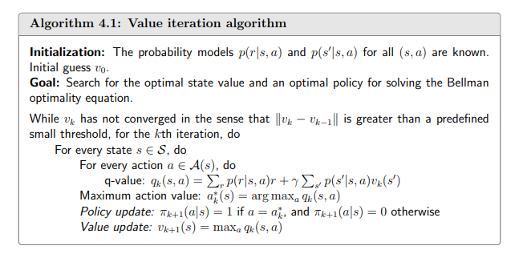

## 强化学习

$$
R_t:t时刻的奖励函数值
\\S_t:t时刻的状态
\\A_t:t时刻的行为
$$

### 三个假设

$$
1.马尔可夫假设:
\\P(S_{t+1}|S_t)=P(S_{t+1}|S_1,S_2,\cdots,S_t).表示下一个状态仅仅与当前状态有关，与历史状态无关
\\2.下一个时刻的状态只与这一个时刻的状态以及这一时刻的行为有关:
\\P_{ss'}^{a}=P(S_{t+1}=s'|S_t=s,A_t=a)
\\3.下一个时刻的奖励函数值只与这一时刻的状态以及这一时刻的行为有关:
\\R_s^a=E(R_t|S_t=s,A_t=a)
$$

### 强化学习过程

$$
(1)在t=0时刻,环境给出一个初始状态s_0 \sim p(s_0)
\\(2)\text{for t=0 :end}
\\\text{--智能体(Agent)根据}\pi(s,a)=P(A_t=a|S_t = s)选择行为a_t
\\\text{--环境采样奖励函数}:r_t\sim R(.|s_t,a_t)
\\\text{--环境产生下一个状态}: s_{t+1}\sim P({.|s_t, a_t})
\\\text{--智能体获得奖励函数}r_t和下一个状态s_{t+1}
\\需要学习一个策略(Policy)\pi(s,q),这是一个从状态到行为的映射函数
$$

#### 目标

$$
强化学习中已经知道的函数是:
\\R_s^a=E(R_t|S_t=s, A_t=a)
\\P^a_{ss'}=P(S_{t+1}=s'|S_t=s,A_t=a)
\\强化学习中需要学习的函数是:
\\\pi(s,a)=P(A_t=a|S_t=s)
$$

### 累计奖励

$$
强化学习中的待优化目标函数是累计奖励，即一段时间内的奖励函数加权平均值
\\G_t = R_t+\gamma R_{t+1}+\gamma^2R_{t+2}+\cdots=\sum_{k=0}^{+\infty}\gamma^kR_{t+k}
\\在这里,\gamma是一个衰减项(\gamma<1)
$$

计算

$$
v_1 = r_1+\gamma(r_2+\gamma r_3+\cdots)=r_1+\gamma v_2
\\v_2 = r_2+\gamma(r_3+\gamma r_4+\cdots)=r_2+\gamma v_3
\\v_3 = r_3+\gamma(r_4+\gamma r_1+\cdots)=r_3+\gamma v_4
\\v_4 = r_4+\gamma(r_1+\gamma r_2+\cdots)=r_4+\gamma v_1

\\
\\\begin{cases}
v_1 - \gamma v_2 = r_1, \\
v_2 - \gamma v_3 = r_2, \\
v_3 - \gamma v_4 = r_3, \\
-\gamma v_1 + v_4 = r_4.
\end{cases}
\\\begin{pmatrix}
1 & -\gamma & 0 & 0 & r_1 \\
0 & 1 & -\gamma & 0 & r_2 \\
0 & 0 & 1 & -\gamma & r_3 \\
-\gamma & 0 & 0 & 1 & r_4
\end{pmatrix}\stackrel{第4行加第1行乘\gamma}{\rightarrow}
\begin{pmatrix}
1 & -\gamma & 0 & 0 & r_1  \\
0 & 1 & -\gamma & 0 & r_2 \\
0 & 0 & 1 & -\gamma & r_3 \\
0 & -\gamma^2 & 0 & 1 & r_4 + \gamma r_1
\end{pmatrix}
\stackrel{第4行加第2行乘\gamma^2}{\rightarrow}
\begin{pmatrix}
1 & -\gamma & 0 & 0 & r_1  \\
0 & 1 & -\gamma & 0 & r_2 \\
0 & 0 & 1 & -\gamma & r_3 \\
0 & 0 & -\gamma^3 & 1 & r_4 + \gamma r_1+\gamma^2 r_2
\end{pmatrix}
\\\stackrel{第4行加第3行乘\gamma^3}{\rightarrow}
\begin{pmatrix}
1 & -\gamma & 0 & 0 & r_1  \\
0 & 1 & -\gamma & 0 & r_2 \\
0 & 0 & 1 & -\gamma & r_3 \\
0 & 0 & 0 & 1-\gamma^4 & r_4 + \gamma r_1+\gamma^2 r_2 + \gamma^3r_3
\end{pmatrix}
\rightarrow\begin{pmatrix}
1 & -\gamma & 0 & 0 & r_1  \\
0 & 1 & -\gamma & 0 & r_2 \\
0 & 0 & 1 & -\gamma & r_3 \\
0 & 0 & 0 & 1 & \frac{r_4 + \gamma r_1+\gamma^2 r_2 + \gamma^3r_3}{1-\gamma^4}
\end{pmatrix}
\\\rightarrow\begin{pmatrix}
1 & -\gamma & 0 & 0 & r_1  \\
0 & 1 & -\gamma & 0 & r_2 \\
0 & 0 & 1 & 0 & r_3 + \gamma\frac{r_4 + \gamma r_1+\gamma^2 r_2 + \gamma^3r_3}{1-\gamma^4} \\
0 & 0 & 0 & 1 & \frac{r_4 + \gamma r_1+\gamma^2 r_2 + \gamma^3r_3}{1-\gamma^4}
\end{pmatrix}
\\其中v_3=r_3 + \gamma\frac{r_4 + \gamma r_1+\gamma^2 r_2 + \gamma^3r_3}{1-\gamma^4}=\frac{r_3(1-\gamma^4)}{1-\gamma^4}+\frac{\gamma r_4+\gamma^2 r_1+\gamma^3r_2+\gamma^4r_3}{1-\gamma^4}
\\=\frac{r_3+\gamma r_4+\gamma^2 r_1+\gamma^3r_2}{1-\gamma^4}
\\\begin{pmatrix}
1 & -\gamma & 0 & 0 & r_1  \\
0 & 1 & -\gamma & 0 & r_2 \\
0 & 0 & 1 & 0 & \frac{r_3+\gamma r_4+\gamma^2 r_1+\gamma^3r_2}{1-\gamma^4} \\
0 & 0 & 0 & 1 & \frac{r_4 + \gamma r_1+\gamma^2 r_2 + \gamma^3r_3}{1-\gamma^4}
\end{pmatrix}
\\同理可得
\\\begin{pmatrix}
1 & 0 & 0 & 0 & \frac{r_1+\gamma r_2 + \gamma^2 r_3+\gamma^3 r_4}{1-\gamma^4}  \\
0 & 1 & 0 & 0 & \frac{r_2 + \gamma r_3 + \gamma^2 r_4+\gamma^3 r_1}{1-\gamma^4} \\
0 & 0 & 1 & 0 & \frac{r_3+\gamma r_4+\gamma^2 r_1+\gamma^3r_2}{1-\gamma^4} \\
0 & 0 & 0 & 1 & \frac{r_4 + \gamma r_1+\gamma^2 r_2 + \gamma^3r_3}{1-\gamma^4}
\end{pmatrix}
$$

### 决策机制

$$
定义1:估值函数(Value Function)是衡量某个状态最终能获得多少累计奖励的函数:
\\V^{\pi}(s)=\mathbb{E}[G_t|S_t=s]
\\定义2:Q函数是衡量某个状态下采取某个行为后，最终能获得多少累计奖励的函数:
\\Q^{\pi}(s,a)=\mathbb{E}[G_t|S_t=s,A_t =a]
$$

### 推导贝尔曼公式

$$
G_t可以被写成:
\\G_t = R_{t+1}+\gamma R_{t+2}+\gamma^2 R_{t+3}+\cdots
\\=R_{t+1}+\gamma G_{t+1}
\\v_{\pi}(s)因此可以被分解为:
\\v_{\pi}(s)=\mathbb{E}[G_t|S_t=s]
\\=\mathbb{E}[R_{t+1}+\gamma G_{t+1}|S_t=s]
\\=\mathbb{E}[R_{t+1}|S_t=s]+\gamma\mathbb{E}[G_{t+1}|S_t=s]
\\
\\先推导第一部分\mathbb{E}[R_{t+1}|S_t=s](即时奖励期望)
\\\mathbb{E}[R_{t+1}|S_t=s]=\sum_{a}\pi(a|s)\mathbb{E}[R_{t+1}|S_t=s,A_t=a]
\\=\sum_a\pi(a|s)\sum_rp(r|s,a)r
\\解析:两层嵌套在当前状态s的情况下执行操作a的概率乘上奖励期望(可以理解为r的概率\cdot r(奖励)然后相加,也就是平均奖励)
\\
\\第二部分\mathbb{E}[G_{t+1}|S_t=s](未来奖励期望,这里的未来指的是s'下一个状态)
\\\mathbb{E}[G_{t+1}|S_t=s]=\sum_{s'}\mathbb{E}[G_{t+1}|S_t=s,S_{t+1}=s']p(s'|s)
\\=\sum_{s'}\mathbb{E}[G_{t+1}|S_{t+1}=s']p(s'|s)
\\=\sum_{s'}v_{\pi}(s')\sum_{a}p(s'|s,a)\pi(a|s)
\\
\\
\\贝尔曼公式
\\v_\pi(s)=\mathbb{E}[R_{t}|S_t=s]+\gamma\mathbb{E}[G_{t+1}|S_t=s]
\\=\sum_{a}\pi(a|s)\sum_{r}p(r|s,a)r+\gamma\sum_{s'}v_\pi(s')\sum_ap(s'|a,s)\pi(a|s)
\\=\sum_a\pi(a|s)\bigg[\sum_rp(r|s,a)r+\gamma\sum_{s'}v_\pi(s')p(s'|a,s)\bigg],\forall s\in S
$$

#### 示例

注释: 在黄色区域奖励-1蓝色区域奖励+1
$$
v_\pi(s)=\sum_{a}\pi(a|s)\bigg[\sum_{r}p(r|a,s)r+\gamma\sum_{s'}p(s'|s,a)v_\pi(s')\bigg]
\\1.\pi(a=a_3|s_1)=1\and \pi(a\neq a_3|s_1)=0
\\2.p(s'=s_3|s_1,a_3)=1\and p(s'\neq s_3|s_1,a_s)=0
\\3.p(r=0|s_1,a_3)=1\and p(r\neq 0|s_1,a_3)=0
\\
\\根据上面3个条件进行代入最终得到
\\v_\pi(s_1)=0+\gamma v_\pi(s_3)
\\前面也有提到可以将贝尔曼公式分为两个部分:即时奖励+未来奖励
\\因为这里在空白单元中行走是没有奖励的所以v_\pi(s_1)的即时奖励为0
\\
\\
\\\begin{cases}
v_\pi(s_1)=0+\gamma v_\pi(s_3) \\
v_\pi(s_2)=1+\gamma v_\pi(s_4) \\
v_\pi(s_3)=1+\gamma v_\pi(s_4) \\
v_\pi(s_4)=1+\gamma v_\pi(s_4) \\
\end{cases}
\\
\\\begin{pmatrix}
1 & 0 & -\gamma & 0 & 0 \\
0 & 1 & 0 & -\gamma & 1 \\
0 & 0 & 1 & -\gamma & 1 \\
0 & 0 & 0 & 1-\gamma & 1
\end{pmatrix}\rightarrow\begin{pmatrix}
1 & 0 & -\gamma & 0 & 0 \\
0 & 1 & 0 & -\gamma & 1 \\
0 & 0 & 1 & -\gamma & 1 \\
0 & 0 & 0 & 1 & \frac{1}{1-\gamma}
\end{pmatrix}\stackrel{第3行加第4行乘\gamma}{\rightarrow}\begin{pmatrix}
1 & 0 & -\gamma & 0 & 0 \\
0 & 1 & 0 & -\gamma & 1 \\
0 & 0 & 1 & 0 & 1-\frac{\gamma}{1-\gamma} \\
0 & 0 & 0 & 1 & \frac{1}{1-\gamma}
\end{pmatrix}
\\\rightarrow\begin{pmatrix}
1 & 0 & -\gamma & 0 & 0 \\
0 & 1 & 0 & 0 & \frac{1}{1-\gamma} \\
0 & 0 & 1 & 0 & \frac{1}{1-\gamma} \\
0 & 0 & 0 & 1 & \frac{1}{1-\gamma}
\end{pmatrix}\rightarrow\begin{pmatrix}
1 & 0 & 0 & 0 & \frac{\gamma}{1-\gamma} \\
0 & 1 & 0 & 0 & \frac{1}{1-\gamma} \\
0 & 0 & 1 & 0 & \frac{1}{1-\gamma} \\
0 & 0 & 0 & 1 & \frac{1}{1-\gamma}
\end{pmatrix}
\\
\\设\gamma=0.9则
\\v_\pi(s_4)=\frac{1}{1-0.9}=10
\\v_\pi(s_3)=\frac{1}{1-0.9}=10
\\v_\pi(s_2)=\frac{1}{1-0.9}=10
\\v_\pi(s_1)=\frac{0.9}{1-0.9}=9
$$

#### 矩阵形式

$$
\\重写贝尔曼方程
\\v_\pi(s)=r_\pi(s)+\gamma\sum_{s'}p_\pi(s'|s)v_\pi(s')
\\其中r_\pi(s)\stackrel{\Delta}{=}\sum_a\pi(a|s)\sum_rp(r|s,a)r
\\p_\pi(s'|s)\stackrel{\Delta}{=}\sum_a\pi(a|s)p(s'|s,a)
\\
\\重写成矩阵形式
\\v_\pi = r_\pi +\gamma P_\pi v_\pi
\\其中:
\\v_\pi=[v_\pi(s_1),\cdots,v_\pi(s_n)]^T\in \mathbb{R}^n
\\r_\pi=[r_\pi,\cdots,r_\pi(s_n)]^T \mathbb{R}^n
\\P_\pi \in \mathbb{R}^{n\cdot n},[P_\pi]_{ij}=p_\pi(s_j|s_i)
$$

##### 示例

$$
如果n=4时
\\\underbrace{\begin{bmatrix}
v_\pi (s_1) \\
v_\pi (s_2) \\
v_\pi (s_3) \\
v_\pi (s_4) \\
\end{bmatrix}}_{v_\pi}=\underbrace{\begin{bmatrix}
r_\pi(s_1) \\
r_\pi(s_2) \\
r_\pi(s_3) \\
r_\pi(s_4) \\
\end{bmatrix}}_{r_\pi}+\gamma\underbrace{\begin{bmatrix}
p_\pi(s_1|s_1) & p_\pi(s_2|s_1) & p_\pi(s_3|s_1) & p_\pi(s_4|s_1) \\
p_\pi(s_1|s_2) & p_\pi(s_2|s_2) & p_\pi(s_3|s_2) & p_\pi(s_4|s_2) \\
p_\pi(s_1|s_3) & p_\pi(s_2|s_3) & p_\pi(s_3|s_3) & p_\pi(s_4|s_3) \\
p_\pi(s_1|s_4) & p_\pi(s_2|s_4) & p_\pi(s_3|s_4) & p_\pi(s_4|s_4) \\
\end{bmatrix}}_{P_\pi}\underbrace{\begin{bmatrix}
v_\pi(s_1) \\
v_\pi(s_2) \\
v_\pi(s_3) \\
v_\pi(s_4) \\
\end{bmatrix}}_{v_\pi}
$$

$$
\begin{bmatrix}
v_\pi (s_1) \\
v_\pi (s_2) \\
v_\pi (s_3) \\
v_\pi (s_4) \\
\end{bmatrix}=\begin{bmatrix}0 \\ 1 \\ 1 \\ 1\end{bmatrix} + 
\gamma\begin{bmatrix}
0 & 0 & 1 & 0 \\ 
0 & 0 & 0 & 1 \\ 
0 & 0 & 0 & 1 \\ 
0 & 0 & 0 & 1 \\ 
\end{bmatrix}\begin{bmatrix}
v_\pi (s_1) \\
v_\pi (s_2) \\
v_\pi (s_3) \\
v_\pi (s_4) \\
\end{bmatrix}
$$

$$
\begin{bmatrix}
v_\pi (s_1) \\
v_\pi (s_2) \\
v_\pi (s_3) \\
v_\pi (s_4) \\
\end{bmatrix}=\begin{bmatrix}0.5(0)+0.5(-1) \\ 1 \\ 1 \\ 1\end{bmatrix} + 
\gamma\begin{bmatrix}
0 & 0.5 & 0.5 & 0 \\ 
0 & 0 & 0 & 1 \\ 
0 & 0 & 0 & 1 \\ 
0 & 0 & 0 & 1 \\ 
\end{bmatrix}\begin{bmatrix}
v_\pi (s_1) \\
v_\pi (s_2) \\
v_\pi (s_3) \\
v_\pi (s_4) \\
\end{bmatrix}
$$

#### 贝尔曼公式收敛问题

$$
矩阵形式:v_\pi=r_\pi + \gamma P_\pi v_\pi
\\解析解:v_\pi = (E - \gamma P_\pi)^{-1}r_\pi
\\计算解析解十分简单，但是其计算复杂度相当高为O(N^3)，因此实际情况下很少使用解析解
\\\\通常使用值迭代:
\\v_{k+1}=r_\pi + \gamma P_\pi v_k
\\v_{k+1}\in \{v_0, v_1,v_2,\cdots\}
\\当k\rightarrow \infty时v_k\rightarrow v_\pi = (E - \gamma P_\pi)^{-1}r_\pi
$$

### action-values

$$
q_\pi(s,q) = \mathbb{E}[G_t|S_t=s,A_t = a]
\\\underbrace{\mathbb{E}[G_t|S_t = s]}_{v_\pi(s)}=\sum_a\underbrace{\mathbb{E}[G_t|S_t=s,A_t=a]}_{q_\pi(s,a)}\pi(a|s)
\\v_\pi(s)=\sum_{a}\pi(a|s){\textcolor{red}{q_\pi(s,a)}}
\\如果知道了所有的action-values就可以求出state-values
\\\\\\
回看贝尔曼公式并和上式比较:
\\v_\pi(s)=\sum_a\pi(a|s)\underbrace{\bigg[\sum_rp(r|s,a)r+\gamma\sum_{s'}p(s'|s,a)v_\pi(s')\bigg]}_{\textcolor{red}{q_\pi(s,a)}}
\\可知:\textcolor{red}{q_\pi(s,a)}=\sum_r p(r|s,a)r+\gamma \sum_{s'}p(s'|s,a)\textcolor{red}{v_\pi(s')}
\\如果知道了state-values就可以求出所有的action-values
$$

#### 示例

$$
q_\pi(s_1,a_2)=-1+\gamma v_\pi(s_2)
\\那么q_\pi(s_1,a_1),q_\pi(s_1,a_3),q_\pi(s_1,a_4),q_\pi(s_1,a_5)=?
\\初学者可能会认为是0,其实不然
\\
\\q_\pi(s_1,a_1)=-1+\gamma v_\pi(s_1)=6.2
\\q_\pi(s_1,a_2)=-1+\gamma v_\pi(s_2)=8
\\q_\pi(s_1,a_3)=0+\gamma v_\pi(v_3)=9
\\q_\pi(s_1,a_4)=-1+\gamma v_\pi(s_1)=6.2
\\q_\pi(s_1,a_5)=0+\gamma v_\pi(s_1)=7.2
\\
\\
\\贝尔曼方程
\\v_\pi(s_1)=-1+\gamma v_\pi(s_2)
\\v_\pi(s_2)=1+\gamma v_\pi(s_4)
\\v_\pi(s_3)=1+\gamma v_\pi(s_4)
\\v_\pi(s_4)=1+\gamma v_\pi(s_4)
\\
\\\begin{bmatrix}
1 & -\gamma & 0 & 0 & -1 \\
0 & 1 & 0 & -\gamma & 1 \\
0 & 0 & 1 & -\gamma & 1 \\
0 & 0 & 0 & 1-\gamma & 1 \\
\end{bmatrix}\rightarrow\begin{bmatrix}
1 & 0& 0 & 0 & \frac{0.8}{1-\gamma} \\
0 & 1 & 0 & 0 & \frac{1}{1-\gamma} \\
0 & 0 & 1 & 0 & \frac{1}{1-\gamma} \\
0 & 0 & 0 & 1& \frac{1}{1-\gamma} \\
\end{bmatrix}
\\假设\gamma=0.9，则v_\pi(s_4)=v_\pi(s_3)=v_\pi(s_2)=10,v_\pi(s_1)=8
$$

### 贝尔曼最优公式

$$
定义:如果\pi^*在所有s和策略中满足v_{\pi^*}\geq v_{\pi}(s),则为最优
\\
\\v(s)=\textcolor{blue}{max}_\pi \sum_{a}\textcolor{blue}{\pi(a|s)}\bigg[\sum_r p(r|s,a)r + \gamma \sum_{s'}p(s'|s,a)v(s')\bigg],\forall s\in S
\\=\textcolor{blue}{max}_{\pi}\sum_a \textcolor{blue}{\pi(a|s)}q(s,a),s\in S
\\
\\求解贝尔曼最优公式
\\max_\pi\sum_a \textcolor{blue}{\pi(a|s)}q(s,a)=max_{a\in A(s)}q(s,a)
\\其中q(s,a)通常是确定的，我们需要使上式的左边等于右式
\\\pi(a|s)=\begin{cases}1 & a=a^* \\ 0 & a\neq a^*\end{cases}
\\其中a^*=argmax_a q(s,a)
\\
\\
\\
\\当前状态存在多个action,由\pi(a|s)决定选择哪一个action.\text{action value}越大则说明该路线越好.\\因此我们的目标是选择action value最大的那条路线，我们通过调整\pi(a|s)来主动选择action，\\贝尔曼最优方程在做的就是确定一个\pi(a|s)让他来选取\text{action value}最大的一个路线.\\最大的\text{action value}需要我们通过迭代进行确定.
$$

#### 求解贝尔曼最优公式

$$
\text{The BOE is v=}max_\pi(r_\pi+\gamma P_\pi v)
\\把上式定义为f(v)
\\f(v)\coloneqq max_\pi(r_\pi +\gamma P_\pi v)
\\\therefore v=f(v)
\\
\\ [f(v)]_s=max_\pi\sum_a \pi(a|s)q(s,a),s\in S
\\f(v)_s是一个向量
\\其中的状态值\text{state s(可以有多个状态s1,s2...)},就是右式
$$

##### 不动点(fixed point)

$$
定义:被一个函数映射到自身的点
\\f(x)=x
$$

##### 压缩映射(contraction mapping)

$$
如果满足||f(x_1) - f(x_2)||\leq\gamma||x_1-x_2||,\gamma\in(0,1),则该函数是个压缩映射.
\\\text{tip:}L_1范数指的是向量元素绝对值之和，L_2范数指的是向量所有元素的平方和再开平方(默认L_2范数)
$$

##### 例题

$$
x=f(x)=0.5x，x\in \mathbb{R}
\\不难看出x=0是一个不动点,那么f(x)是一个压缩映射吗
\\||0.5x_1 - 0.5x_2||=0.5||x_1-x_2||\leq\gamma||x_1-x_2||当\gamma \in [0.5,1)是一个压缩映射
\\
$$

##### 压缩映射定理

$$
如果f(x)是一个压缩映射,且满足x=f(x)则:
\\1.存在一个不动点x^*满足x^*=f(x^*)
\\2.这个不动点x^*是唯一的
\\3.考虑一个数列\{x_k\}，其中x_{k+1}=f(x_k)，则当k\rightarrow \infty时，x_k收敛到某个不动点x^*。此外,该收敛速率是指数级的
$$

$$
验证:
\\x=f(x)=0.5x，x\in \mathbb{R}
\\我们之前已经知道x^*=0是f(x)的一个不动点
\\我们对压缩映射定理第三条进行验证
\\设x_0=10，下标为k则:
\\x_1=5,x_2=2.5.不难发现当k\to \infty时x\to 0
$$

让我们回到贝尔曼最优方程
$$
v=f(v)=\text{max}_\pi(r_\pi +\gamma P_\pi v)
\\根据不动点的定义。我们能够知道贝尔曼方程存在不动点.
\\f(v)满足压缩映射,关于压缩映射的证明这里不演示
\\||f(v_1)-f(v_2)||\leq\gamma||v_1-v_2||
\\\gamma是衰减因子
$$

$$
\text{假设}v^*\text{是贝尔曼最优方程的最优状态}.满足:
\\v^*=\text{max}_\pi (r_\pi+\gamma P_\pi v^*)
\\由于我们的v^*已经确定这时我们的目的变为了(当f(x)的值为最大时自变量x^*的取值):
\\\pi^*=\text{arg max}_\pi(r_\pi + \gamma P_\pi v^*)
\\则:
\\v^* = r_{\pi^*} + \gamma P_{\pi^*} v^*
$$

##### 求解

$$
我们已经知道了贝尔曼方程满足压缩映射,那么我们可以根据压缩映射定理迭代出v^*
\\v_{k+1}=max_\pi \sum_{a}\pi(a|s)\bigg[\sum_rp(r|s,a)r+\gamma \sum_{s'}p(s'|s,a)v_k(s')\bigg]
\\
\\
\\示例
\\假设两个状态MDP(s_1,s_2),动作集为\{a_1,a_2\},转移概率确定,衰减因子\gamma=0.9
\\状态s_1:
\\a_1\to s_2,R=5.a_2\to s_1,R=1
\\状态s_2:
\\a_1\to s_2,R=2.a_2\to s_1,R=3
\\
\\迭代过程
\\初始化V_0=[0,0]
\\第一轮:
\\v_1(s_1)=max\bigg[ R(s_1,a_1)+\gamma \sum_{s'}P(s'|s_1,a_1)v_0(s'),R(s_1, a_2)+\gamma \sum_{s'}P(s'|s_1,a_2)v_0(s')\bigg]
\\=max\bigg[5+0.9\cdot1\cdot0,1+0.9\cdot1\cdot0\bigg]
\\=max\{5,1\}
=5\\v_1(s_2)=max\bigg[2+0.9\cdot1\cdot0,3+0.9\cdot1\cdot0\bigg]
\\=max\{2,3\}=3
\\V_1=[5,3]
$$

$$
第二轮:
\\v_2(s_1)=max\bigg[R(s_1, a_1)+\gamma\sum_{s'}P(s'|s_1,a_1)v_1(s'),R(s_1,a_2)+\gamma \sum_{s'}P(s'|s_1,a_2)v_1(s')\bigg]
\\=max\{5+0.9\cdot1\cdot3,1+0.9\cdot1\cdot5\}
\\=max\{7.7,5.5\}=7.7
\\v_2(s_2)=max\bigg[R(s_2,a_1)+\gamma\sum_{s'}P(s'|s_2,a_1)v_1(s'),R(a_2,s_2)+\gamma\sum_{s'}P(s'|a_2,s_2)v_1(s')\bigg]
\\=\max\{2+0.9\cdot1\cdot3,3+0.9\cdot1\cdot5\}
\\=max\{4.4,7.5\}
\\V_2=[7.7,7.5]
\\
\\
\\需要注意当前的状态所执行的操作,如s_1执行a_2会停留在原地那么s'就是s_1,如果s_2执行a_1也会停留在原地s'就是s_2
$$

### 值迭代

$$
这个算法存在两个阶段
\\v_{k+1}=f(v_k)=max_{\pi}(r_\pi +\gamma P_\pi v_k),k=1,2,3,\cdots
\\阶段1:策略更新
\\\pi_{k+1}=\text{arg max}_\pi(r_\pi+\gamma P_\pi v_k)
\\阶段2:值更新
\\v_{k+1}=r_{\pi_{k+1}}+\gamma P_{\pi_{k+1}}v_k
\\
\\
\\阶段1:策略更新
\\单元素形式
\\\pi_{k+1}(s)=\text{arg max}_\pi\sum_a \pi (a|s)\underbrace{\bigg[\sum_r p(r|s,a)r+\gamma\sum_{s'}p(s'|s,a)v_k(s')\bigg]}_{q_k(s,a)},s\in S
\\如何得出\pi_{k+1}
\\\pi_{k+1}=\begin{cases}1 & a=a_k^*(s) \\ 0 & a\neq a_k^*(s)\end{cases}
\\
\\阶段2:值更新
\\单元素形式
\\v_{k+1}=\sum_{a}\pi_{k+1}\underbrace{\bigg[\sum_{r}p(r|s,a)r+\gamma\sum_{s'}p(s'|s,a)v_k(s')\bigg]}_{q(s,a)}
\\
\\关于公式的详细解释:
\\阶段1:
\\计算出每个\text{action }对应的q(s,a),然后选取出q_k(s,a)最大的那个\text{action}就是a_k^*,然后就可以知道\pi_{k+1}(是一个向量)
\\\pi_{k+1}在未完全收敛之前可能是局部最优
\\阶段2:
\\得到q(s,a)和\pi_{k+1}后,我们对v_{k+1}进行更新
\\可以简写为v_{k+1}(s)=\max_a q_k(a,s)
\\
\\
\\初始值的影响会逐渐减小:初始的状态值函数V_0在前几轮迭代中可能对状态值的计算有较大影响，但随着
\\迭代的继续，因为存在着衰减因子，所有对状态值的影响会逐渐减小。最终，状态值会收敛到与最优策略一致的结果
\\收敛到最优值:虽然初始值可能影响收敛速度，但最终状态值会趋近最优值函数V^*(s)。此时,
\\初始值对最终的最优策略和状态值的影响已经微乎其微。
$$

#### 示例

$$
r_{boundary}=r_{forbidden}=-1,r_{target}=1,\gamma=0.9
\\
\\第一轮迭代V_0[0,0,0,0]
\\\begin{bmatrix}
\text{q-table} & a_1 & a_2 & a_3 & a_4 & a_5 \\
s_1 & -1 & -1 & 0 & -1 & 0 \\
s_2 & -1 & -1 & 1 & 0 & -1 \\
s_3 & 0 & 1 & -1 & -1 & 0 \\
s_4 & -1 & -1 & -1 & 0 & 1 \\
\end{bmatrix}
\\下面是所选择的策略
\\\pi_{1}(a_5|s_1)=1,\pi_1(a_3|s_2)=1,\pi_1(a_2|s_3)=1,\pi_1(a_5|s_4)=1
\\这里是策略所对应的值(注意不是\text{state value, state value是最终收敛之后的值})
\\V_1=[0,1,1,1]
\\
\\第二轮迭代V_1[0,1,1,1]
\\\begin{bmatrix}
\text{q-table} & a_1 & a_2 & a_3 & a_4 & a_5 \\
s_1 & -1+\gamma v_1(s_1) & -1+\gamma v_1(s_2) & 0+\gamma v_1(s_3) & -1+\gamma v_1(s_1) & 0+\gamma v_1(s_1) \\
s_2 & -1+\gamma v_1(s_2) & -1+\gamma v_1(s_2) & 1+\gamma v_1(s_4) & 0+\gamma v_1(s_1) & -1+\gamma v_1(s_2) \\
s_3 & 0+\gamma v_1(s_1) & 1+\gamma v_1(s_4) & -1+\gamma v_1(s_3) & -1+\gamma v_1(s_3) & 0+\gamma v_1(s_3) \\
s_4 & -1+\gamma v_1(s_2) & -1+\gamma v_1(s_4) & -1+\gamma v_1(s_3) & 0+\gamma v_1(s_3) & 1+\gamma v_1(s_4) \\
\end{bmatrix}
\\\pi_2(a_3|s_1)=1,\pi_2(a_4|s_2)=1,\pi_2(a_2|s_3)=1,\pi_2(a_5|s_4)=1
\\V_2=[0.9,1.9,1.9,1.9]
$$

#### 流程

$$
流程:v_k(s)\to q_k(s,a)\to \text{greedy policy }\pi_{k+1}(a|s)\to \text{new value } v_{k+1}=\max_a q_k(s,a)
$$

### 策略迭代

$$
\\阶段1:
\\\text{Matirx-vector form}:v_{\pi_k}^{j+1}=r_{\pi_k}+\gamma P_{\pi_k}v^{j}_{\pi_k},j=0,1,2,\cdots
\\\text{Elementwise form}:
\\v_{\pi_k}^{j+1}(s)=\sum_a\pi_k(a|s)\bigg[\sum_rp(r|s,a)r+\gamma\sum_{s'}p(s'|s,a)v_{\pi_k}^j(s')\bigg],s\in S
\\阶段2:
\\\pi_{k+1}=\text{arg max}_\pi(r_\pi+\gamma P_\pi v_{\pi_k})
\\\pi_{k+1}(s)=\text{arg max}_\pi\sum_a\pi(a|s)\underbrace{\bigg[\sum_rp(r|s,a)r+\gamma \sum_{s'}p(s'|s,a)v_{\pi_k}(s')\bigg]}_{q_{\pi_k}(s,a)},s\in S
\\a^*_k(s)=\text{arg max}_aq_{\pi_k}(a,s)
\\\pi_{k+1}(a|s)=\begin{cases}1 & a=a^*_k(s) \\ 0 & a\neq a^*_k(s)\end{cases}
\\
\\
\\策略迭代会初始化策略，策略是随机的，然后根据这个初始化策略进行迭代，在\text{state values}\\
收敛时终止。此时进入策略改进，会选择对s来说\text{action value}最大的那个操作，进行策略改进。
$$

#### 示例

$$
S=\{s_1,s_2\}
\\A=\{a_1,a_2\}
\\r(s_1,a_1)=5,r(s_1,a_2)=1
\\r(s_2,a_1)=3,r(s_2,a_2)=2
\\\gamma=0.9
\\
\\初始化策略:\pi_0(s_1)=a_1,\pi_0(s_2)=a_1
\\第一阶段策略评估:
\\V_{\pi_0}(s_1)=r(s_1,a_1)+\gamma V_{\pi_0}(s_1)=5+0.9V_{\pi_0}(s_1)
\\V_{\pi_0}(s_1)=5+0.9V_{\pi_0}(s_1),通常来说这里是需要进行迭代的,而不是通过这种代数的方式
\\v_2(s_1)=5+0.9\times5 =9.5\cdots v_n(s_1)\to50
\\这也是策略迭代和值迭代的主要区别,这里迭代n次
\\5=0.1V_{\pi_0}(s_1)
\\V_{\pi_0}(s_1)=50
\\V_{\pi_0}(s_2)=r(s_2,a_1)+0.9V_{\pi_0}(s_2)=3+0.9V_{\pi_0}(s_2)
\\V_{\pi_0}(s_2)=30
\\
\\第二阶段策略改进:
\\在状态s_1的策略改进
\\Q(s_1,a_1)=r(s_1,a_1)+\gamma \sum_{s'}P(s'|s_1,a_1)V_{\pi_0}(s')
\\=5+0.9\cdot50=50
\\Q(s_1,a_2)=r(s_1,a_2)+\gamma \sum_{s'}P(s'|s_1,a_2)V_{\pi_0}(s')
\\=1+0.9\cdot30=28
\\\max\{50,28\}=50
\\在状态s_2的策略改进
\\Q(s_2,a_1)=r(s_2,a_1)+\gamma \sum_{s'}P(s'|s_2,a_1)V_{\pi_0}(s')
\\=3+0.9\cdot30=30
\\Q(s_2,a_2)=r(s_2,a_2)+\gamma \sum_{s'}P(s'|s_2,a_2)V_{\pi_0}(s')
\\=2+0.9\cdot50=47
\\\max\{30,47\}=47
\\所以更新策略\pi_1(s_2)=a_2
$$

#### 伪代码

### 截断策略迭代

#### 值迭代和策略迭代的区别

$$
策略迭代和值迭代高度相似
\\主要区别在于计算value的方式,策略迭代是计算value收敛后的值,而值迭代只会计算一轮
\\另外,策略迭代在现实中是不可能实现的的,因为要迭代无穷次,所以无论怎么实现都会变成截断策略迭代
\\
\\值迭代因为只迭代一次,所以在值迭代早期更看重眼前奖励
\\策略迭代则对每个状态值进行迭代,直到收敛,ying'ci未来奖励占比较大
$$

$$
\begin{matrix}
v^{(0)}_{\pi_1}=v_0 \\
v^{(1)}_{\pi_1}=r_{\pi_1}+\gamma P_{\pi_1}v^{(0)}_{\pi_1} & \rightarrow 值迭代\\
v^{(2)}_{\pi_1}=r_{\pi_1}+\gamma P_{\pi_1}v^{(1)}_{\pi_1}\\
\vdots \\
v^{(j)}_{\pi_1}=r_{\pi_1}+\gamma P_{\pi_1}v_{\pi_1}^{(j-1)} & \rightarrow \bar{v_1} \rightarrow 截断策略迭代 \\
\vdots \\
v^{(\infty)}_{\pi_1}=r_{\pi_1}+\gamma P_{\pi_1}v_{\pi_1}^{(\infty)} & \rightarrow v_{\pi_1}\rightarrow策略迭代
\end{matrix}
$$

#### 伪代码

