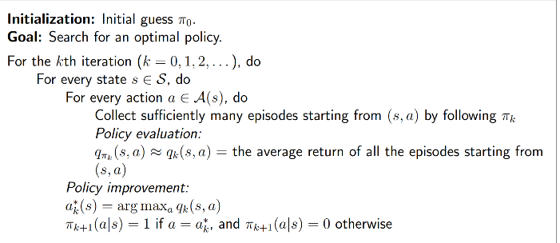
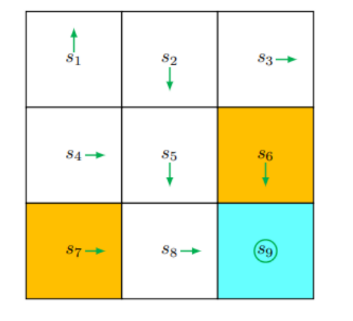
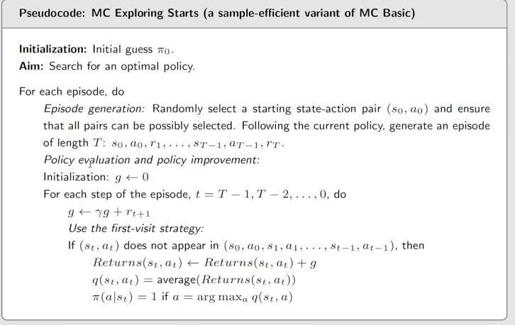
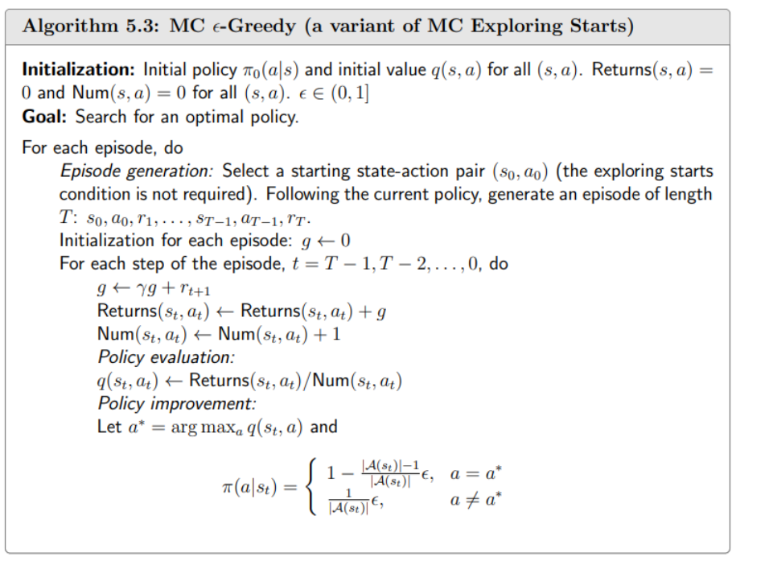

### 蒙特卡洛期望

$$
我们前面学习的基于模型的非常简单,我们需要知道他的概率分布,然后就可以通过定义来计算
\\然而实际当中我们是很难直接知道他的概率分布的
\\所以引出了\text{Model-free}
\\
\\
\\蒙特卡洛期望
\\假设有一个样本序列\{x_1,x_2\}
\\则,可以用平均值来近似期望
\\\mathbb{E}[X]\approx \bar{x}=\frac{1}{N}\sum_{j=1}^Nx_j
\\这就是蒙特卡洛期望.
$$

#### 大数定律(Law of Large Numbers)

$$
有一个随机变量 X,假设\{x_j\}^N_{j=1}是一个iid(独立同分布,从X采样)的样本,令
\\\bar{x}=\frac{1}{N}\sum_{j=1}^N x_j为样本的平均值.则:
\\\mathbb{E}[\bar{x}]=\mathbb{E}[X]
\\\text{Var}[\bar{x}]=\frac{1}{N}\text{Var}[X]
\\当N\to \infty时,\text{Var}[\bar{x}]\to0,因为N\to\infty时\bar{x}\to \mu
\\Var:方差
\\\\
\\证明如下
\\1.\mathbb{E}[\bar{x}]=\mathbb{E}[\frac{\sum_{i=1}^nx_i}{n}]=\frac{\sum_{i=1}^n\mathbb{E}[x_i]}{n}=\mathbb{E}[X]
\\因为x_i是从X中随机采样得到的,所以\mathbb{E}[x_i]=\mathbb{E}[X]
\\2.
\\\text{Var}[\bar{x}]
=\text{Var}[\frac{\sum_{i=1}^n x_i}{n}]
=\frac{\sum_{i=1}^n\text{Var}[x_i]}{n^2}
=\frac{n\cdot\text{Var}[X]}{n^2}
=\frac{\text{Var}[X]}{n}
\\
\\用到了方差的齐次性
\\\text{Var}{[ax]}=\mathbb{E}[(ax-\mathbb{E}[ax])^2]
\\=\mathbb{E}[(ax-a\mathbb{E}(x))^2]
\\=\mathbb{E}[a^2(x-\mathbb{E}(x))^2]
\\=a^2\mathbb{E}[(x-\mathbb{E}(x))^2]
\\a^2\text{Var}[x]=\text{Var}[ax]
$$

$$
由于所有样本x_i都服从相同的分布,所以他们的方差相等,即:
\\\text{Var}[x_1]=\text{Var}[x_2]=\cdots=\text{Var}[x_n]=\text{Var}[X]
\\因此\text{Var}[\sum_{i=1}^{n}x_i]=n\cdot\text{Var}[X]
$$

### MC Basic

$$
存在两种方法计算\text{action value}
\\1.需要模型的:
\\q_{\pi_k}(s,a)=\sum_r p(r|s,a)r+\gamma\sum_{s'}p(s'|s,a)v_{\pi_k}(s')
\\2.不需要模型的:
\\q_{\pi_k}(s,a)=\mathbb{E}[G_t|S_t=s,A_t=a]
\\
\\
\\蒙特卡洛算法
\\1.从任意的(s,a)出发,得到策略\pi_k,然后获得一个\text{episode}(表示一次完整的交互过程)
\\2.根据\text{episode}计算出g(s,a)
\\3.g(s,a)是G_t的一个采样:
\\q_{\pi_k}(s,a)=\mathbb{E}[G_t|S_t=s,A_t=a]
\\4.如果我们有足够多的G_t的采样\{g^{(j)(s,a)}\}.则:
\\q_{\pi_k}(s,a)=\mathbb{E}[G_t|S_t=s,A_t=a]\approx\frac{1}{N}\sum_{i=1}^Ng^{(i)}(s,a)
\\总的来说,如果没有模型我们就需要有数据(经验)
$$

#### 伪代码

#### 示例

$$
r_{boundary}=r_{forbidden}=-1,r_{target}=1,\gamma=0.9
\\这里有9个status和5个action,所以一共需要计算45个q_{\pi_k}.
\\但我们这里就只计算s_1的5个action
\\假如从(s_1,a_1)出发,我们是要找N条轨迹的,然后对\text{return}求平均
\\但是这个认为中状态和策略都是确定的,所以只需要求一条轨迹就行了
$$

$$
\text{policy evluation}:
\\(s_1,a_1),\text{the episode is }s_1\stackrel{a_1}{\rightarrow}s_1\stackrel{a_1}{\rightarrow}s_1\stackrel{a_1}{\rightarrow}\cdots
\\q_{\pi_0}(s_1,a_1)=-1+\gamma(-1)+\gamma^2(-1)+\cdots\\
\\(s_1,a_2),\text{the spisode is }s_1\stackrel{a_2}{\rightarrow}s_2\stackrel{a_3}{\rightarrow}s_5\stackrel{a_3}{\rightarrow}\cdots
\\q_{\pi_0}(s_1,a_2)=0+\gamma 0+\gamma^20+\gamma^3(1)+\gamma^4(1)+\cdots\\
\\(s_1,a_3),\text{the spisode is }s_1\stackrel{a_3}{\rightarrow}s_4\stackrel{a_2}{\rightarrow}s_5\stackrel{a_3}{\rightarrow}+\cdots
\\q_{\pi_0}(s_1,a_3)=0+\gamma0+\gamma^20+\gamma^3(1)+\gamma^4(1)+\cdots\\
\\(s_1,a_4)\text{the spisode is }s_1\stackrel{a_4}{\rightarrow}s_1\stackrel{a_1}{\rightarrow}s_1\stackrel{a_1}{\rightarrow}\cdots
\\q_{\pi_0}(s_1,a_4)=-1+\gamma(-1)+\gamma^2(-1)+\cdots\\
\\(s_1,a_5),\text{the spisode is }s_1\stackrel{a_5}{\rightarrow}s_1\stackrel{a_1}{\rightarrow}s_1\stackrel{a_1}{\rightarrow}\cdots
\\q_{\pi_0}(s_1,a_5)=0+\gamma(-1)+\gamma^2(-1)+\cdots
$$

$$
\text{policy imporvenment}:
\\最后得出最大\text{action value}:
\\q_{\pi_0}(s_1,a_2)=q_{\pi_0}(s_1,a_3)
\\根据\text{action value}更新策略:
\\\pi_1(a_2|s_1)=1\text{ or }\pi_1(a_3|s_1)=1
$$

### MC Exploring starts(蒙特卡洛探索起始)

$$
\text{MC Basic }算法存在计算复杂度高的问题,导致实际上不能直接使用,因此引出了了\text{MC Exploring starts},
\\\text{MC Exploring starts}是对\text{MC Basic }的一个优化
$$

#### 高效更新数据

$$
例如:
\\在网格世界中,我们有下面这个轨迹
\\s_1\stackrel{a_2}{\rightarrow}s_2\stackrel{a_4}{\rightarrow}s_1\stackrel{a_2}{\rightarrow}s_2\stackrel{a_3}{\rightarrow}s_5\stackrel{a_1}{\rightarrow}\cdots
\\\text{Visit}:每当一个状态-动作对出现在某个回合中，我们称之为该状态-动作对的一次访问。
\\\text{MC Basic }则是:\text{Initaial-visit method}
\\假如他要求q_{\pi}(s_1,a_2)他会把上面轨迹的所有\text{visit}全部相加求平均,这么做会导致大量的数据没充分利用
\\比如(s_2,a_4)之后的轨迹完全可以当做s_2的q_{\pi}(s_2,a_4)
$$

$$
具体如下
\\\begin{matrix}
s_1\stackrel{a_2}{\rightarrow}s_2\stackrel{a_4}{\rightarrow}s_1\stackrel{a_2}{\rightarrow}s_2\stackrel{a_3}{\rightarrow}s_5\stackrel{a_1}{\rightarrow}\cdots & [原来的\text{episode}] \\
s_2\stackrel{a_4}{\rightarrow}s_1\stackrel{a_2}{\rightarrow}s_2\stackrel{a_3}{\rightarrow}s_5\stackrel{a_1}{\rightarrow}\cdots
 & [从(s_2,a_4)开始的\text{episode}] \\
 s_1\stackrel{a_2}{\rightarrow}s_2\stackrel{a_3}{\rightarrow}s_5\stackrel{a_1}{\rightarrow}\cdots & [从(s_1,a_2)开始的\text{episode}] \\
 s_2\stackrel{a_3}{\rightarrow}s_5\stackrel{a_1}{\rightarrow}\cdots & [从(s_2,a_3)开始的\text{episode}] \\
s_5\stackrel{a_1}{\rightarrow}\cdots & [从(s_5,a_1)开始的\text{episode}]
\end{matrix}
\\
\\还有两种使数据利用更高效的方法
\\\text{first-visit method}
\\\text{every-visit method}
\\第一种方法是第一次访问(s_1,a_2)那么后面再次访问到了(s_1,a_2)之后的轨迹则不会参与到估计
\\第二种方法是即使第一次访问了(s_1,a_2),后面再次访问(s_1,a_2)之后的轨迹也会参与到估计
$$

#### 高效更新策略

$$
\text{MC Basic}使用的是从一个\text{state action pair}出发然后收集N个\text{episodes}最终取平均,来估计\text{action value}
\\但是这么做需要等全部\text{episode}返回
\\\\
\\另外一种则是获取到一个\text{episode}之后直接更新策略
\\虽然可能不会太精准
\\和\text{截断式的策略迭代思想一样},虽然不精准,但是最终还是没有问题的
$$

#### GPI(Generalized policy iteration)

- 这不是一个算法
- 它指的是在策略评估和策略改进之间切换的总体思想或框架
- 许多基于模型和无模型的强化学习算法都要归入这一框架

#### 伪代码

$$
这里有一个小技巧,
\\伪代码里面是从后开始往前遍历\text{episode}的,
\\通常我们是(s_1,a_1)\rightarrow(s_2,a_2)\cdots这么计算他的\text{return}
\\起始我们可以先计算最后一个,假设最后一个为g
\\那么第二个就是r_{T-2}+\gamma g
$$

### MC ε-greedy

$$
什么是\epsilon-\text{greedy policy}
\\\pi(a|s)=
\begin{cases}1-\frac{\epsilon}{|A(s)|}(|A(s)|-1) & \text{for the greedy action}\\ 
\frac{\epsilon}{|A(s)|} & \text{for the other } |A(s)|-1 \text{ action}
\end{cases}
\\\epsilon \in [0,1],|A(s)|是\text{在当前状态s下的 action }个数
\\这个表达式说明他不只会选择\text{action value}最大的action还会给其他的action选择的可能性
\\\\\epsilon-greedy能够平衡\text{exploitation and exploration}(充分利用和探索)
\\当\epsilon=0时就会变成\text{greedy action}
\\当\epsilon=1是会导致对每个\text{action}选择的概率会相同,此时注重探索
\\所以训练时应该在开始时\epsilon大些,到最后应该减小
$$

#### 将MC的思想与ε-greedy结合

$$
\pi_{k+1}(s) = \text{arg max}_{\pi\in \Pi_\epsilon}\sum_a \pi(a|s)q_{\pi_k}(s,a)
\\\Pi_\epsilon表示\epsilon-greedy选取的策略,因为不一定会选择到所有的策略,所以只能从
\\\epsilon-greedy选择过的策略中进行选取
\\
\\\pi_{k+1}(a|s)=
\begin{cases}
1-\frac{|A(s)|-1}{|A(s)|}\epsilon, & a=a^*_k\\
\frac{1}{|A(s)|}\epsilon, & a\neq a^*_k
\end{cases}
\\
\\其余部分和\text{MC Exploring starts }一样,主要区别在于\text{MC Exploring starts }
\\使用的是greed而这个使用的是\epsilon\text{-greedy}的策略
$$

#### 伪代码

