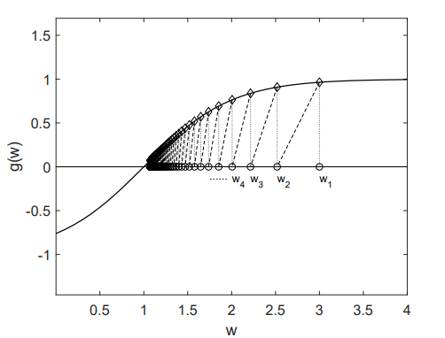
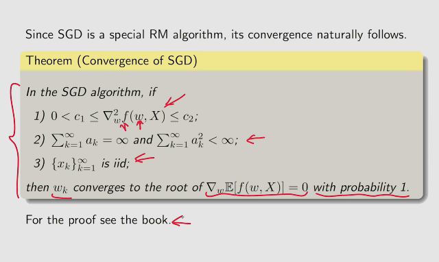
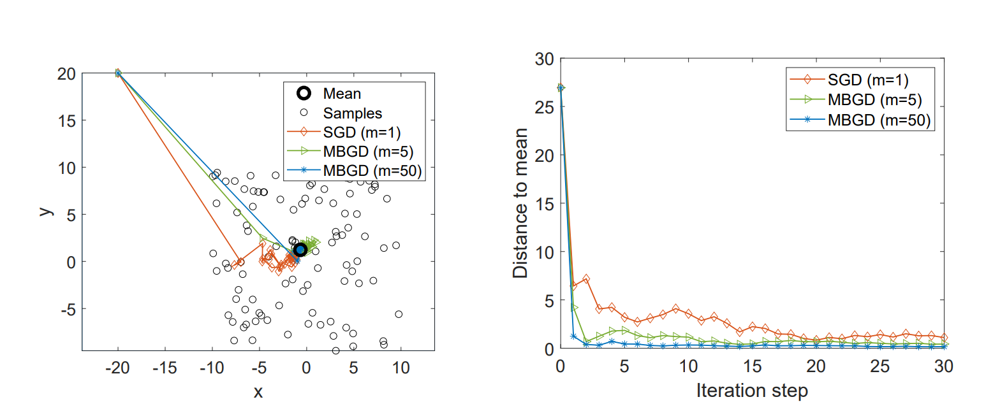

### 随机近似 (SA)

$$
SA(\text{Stochastic approximation})是一种随机的迭代的算法(随机指的是对随机变量的采样)
\\SA特指的是这些算法是要进行方程的求解或是优化问题 
\\SA不需要知道方程的表达式,深度学习的梯度下降是需要知道表达式的(梯度下降有多种方式)
$$

#### Robbins-Monro(RM)

$$
随机梯度下降法就是RM算法的一种特殊情况,包括之前的平均期望算法也是
$$

$$
RM算法可以解决下面这个问题:
\\w_{k+1}=w_k-a_k\tilde{g}(w_k,\eta_k),k=1,2,3,\cdots
\\求解g(w)=0,最优解为w^*
\\\tilde{g}是一个观察值他带有一个噪音,a_k则是一个系数
\\\tilde{g}(w_k,\eta_k)=g(w_k)+\eta_k,\eta_k是个噪音
\\
\\
\\我们一般会知道\{w_k\},然后求出\{\tilde{g}(w_k,\eta_k)\},大致流程如下
\\\{w_k\}\rightarrow g(w)\stackrel{y}{\rightarrow}+\eta\rightarrow \{\tilde{g_k}\}
$$

####  RM算法示例

$$
g(w)=\tanh(w-1)
\\目标值是g(w)=0,w^*=1
\\w_1=3,a_k=\frac{1}{k},\eta_k=0
\\\text{The RM algorithm in this case is}
\\w_{k+1}=w_k-a_kg(w_k)
\\因为n_k=0，所以\tilde{g}(w_k,\eta_k)=g(w_k)
$$

$$
在这个函数中w_k最终会收敛
\\\text{When } w_k>w^*\text{,we have }g(w_k)>0.\text{Then}.
\\w_{k+1}=w_k-a_kg(w_k)<w_k\text{ and hence }w_{k+1}\text{ is closer to }w^*\text{ than }w_k
\\\text{When }w_k<w^*,\text{we have } g(w_k) < 0.\text{Then}.
\\w_{k+1}=w_k-a_kg(w_k)>w_k\text{ and }w_{k+1}\text{ is closer to }w^* \text{ than }w_k
$$

#### 平均估计

$$
求均值有多种方式,我们之前比较常用的是通过获取所有数据相加然后除以数据个数来求均值
\\然而这种方法需要等所有的数据到齐,而且更新均值时又要重新累加,导致计算量大增
\\为此引出了迭代式的求均值方式
$$

$$
假如:
w_{k+1}=\frac{1}{k}\sum_{i=1}^{k}x_i,k=1,2,\cdots
\\因此:w_k=\frac{1}{k-1}\sum_{i=1}^{k-1}x_i,k=2,3,\cdots
\\则可以得到下面表达式:
\\w_k=\frac{1}{k-1}\sum_{i=1}^{k-1}x_i
\\w_{k+1}=\frac{1}{k}\sum_{i=1}^kx_i=\frac{1}{k}\bigg(\sum_{i=1}^{k-1}x_i+x_k\bigg)
\\=\frac{1}{k}((k-1)w_k+x_k)=w_k-\frac{1}{k}(w_k-x_k)
\\最终得:w_{k+1}=w_k-\frac{1}{k}(w_k-x_k)
$$

##### 示例

$$
\begin{matrix}
w_1=x_1\\
w_2=w_1-\frac{1}{1}(w_1-x_1)=x_1\\
w_3=w_2-\frac{1}{2}(w_2-x_2)=\frac{1}{2}(x_1+x_2)\\
w_4=w_3-\frac{1}{3}(w_3-x_3)=\frac{1}{3}(x_1+x_2+x_3)\\
\vdots\\
w_{k+1}=\frac{1}{k}\sum_{i=1}^kx_i
\end{matrix}
$$

#### RM算法的收敛条件

$$
1.0<c_1\leq\nabla_wg(w)\leq c_2,\text{for all }w;
\\2.\sum_{k=1}^\infty a_k=\infty\text{ and }\sum_{k=1}^{\infty} a_k^2<\infty
\\3.\mathbb{E}[\eta_k|\mathcal{H}_k]=0\text{ and }\mathbb{E}[\eta^2_k|\mathcal{H}_k]<\infty;
\\\text{where }\mathcal{H}_k=\{w_k,w_{k-1},\cdots\},\text{ then }w_k\text{ converges with probability 1}
\\\text{(w.p.1) to the root } w^* \text{ staifying }g(w^*)=0
$$

$$
第一条件说明,g(w)的导数是个正数,意味着g(w)是递增的
\\c_1的作用是限制\nabla_wg(w)大于一个常数，防止\nabla_wg(w)趋于0(一个趋于 0 的量不是常数，它是一个变量的极限趋势。)
\\这意味着g(w)必定交与x轴
\\并且他的导数还小于一个常数c_2，意味着\nabla_wg(w)是有界的
\\\\\\
\sum_{k=0}^{\infty}a_k^2<\infty这个限制表示a_k最终会收敛到0。如果a_k是个常数比如说0.00001经过无穷次累加后最终会等于无穷，则不满足
\\为什么这个是重要的呢
\\w_{k+1}-w_k=-a_k\tilde{g}(w_k,\eta_k)
\\\text{if }a_k\to 0,\text{then }a_k\tilde{g}(w_k,\eta_k)\to 0\text{ and hence }w_{k+1}-w_k\to 0
\\\text{We need the fact that } w_{k+1}-w_k\to 0 \text{ if }w_k\text{ converges eventually }.
\\\\\sum_{k=1}^{\infty}a_k=\infty这个限制a_k不会收敛的太快
\\为什么这个重要呢
\\w_2=w_1-a_1\tilde{g}(w_1,\eta_1),w_3=w_2-a_2\tilde{g}(w_2,\eta_2),\cdots,
\\w_{k+1}=w_k-a_k\tilde{g}(w_k,\eta_k)
\\w_{k+1}-w_{k}-w_{k-1}-\cdots -w_1=w_k-a_k\tilde{g}(w_k,\eta_k)-w_{k-1}-a_{k-1}\tilde{g}(w_{k-1},\eta_{k-1})-\cdots
\\w_{\infty}-w_1=-\sum_{k=1}^{\infty}a_k\tilde{g}(w_k,\eta_k)
\\w_1-w_\infty=\sum_{k=1}^{\infty}a_k\tilde{g}(w_k,\eta_k)
\\\text{Suppose }w_\infty = w^*.\text{ If }\sum_{k=1}^{\infty} a_k<\infty, \text{then }\sum_{k=1}^{\infty}a_k\tilde{g}(w_k,\eta_k)\text{ may be bounde}.
\\这意味着w_1-w_\infty是有界的，这会让我们无法随意的选取w_1
$$

$$
\\\\\\
条件三说明\eta_{k}的均值是等于0的而且他的方差是有界的
$$

#### 为什么说平均估计是一种RM算法

$$
考虑到有一个函数 :
\\g(w)\overset w-\mathbb{E}[X],当g(w)=0时,w^*=\mathbb{E}[X]。此时我们则求出了他的均值
\\然而实际上我们是不知道\mathbb{E}[X]的，但是我们知道他的采样x
\\\tilde{g}(w,x)=w-x
\\\tilde{g}(w,\eta)=w-x+\mathbb{E}[X]-\mathbb{E}[X]
\\=(w-\mathbb{E}[X])+(\mathbb{E}[X]-x)=g(w)+\eta
\\得:
\\w_{k+1}=w_k-a_k\tilde{g}(w_k,\eta_k)=w_k-\alpha_k(w_k-x_k) 
$$

   

#### SGD解决的问题

$$
\text{argmin }J(w)=\mathbb{E}[f(w,X)]
\\我们要优化w使得J(w)达到最小
\\X是随机变量
$$

#### gradient descent(GD)

$$
使用GD进行优化：
\\w_{k+1}=w_k-\alpha_k\nabla_w\mathbb{E}[f(w_k,X)]=w_k-\alpha_k\mathbb{E}[\nabla_wf(w_k,X)]
\\\alpha_k是步长
\\\\然而在实际中我们是不知道期望的,只能用数据进行近似.于是就有了BGD
$$

#### batch gradient desent(BGD)

$$
\mathbb{E}[\nabla_wf(w_k,X)]\approx\frac{1}{n}\sum_{i=1}^n\nabla_kf(w_k,x_i)
\\w_{k+1}=w_k-\alpha_k\frac{1}{n}\sum_{i=1}^{n}\nabla_wf(w_k,x_i)
\\\\但是还是存在一个问题。在实际中我们要去更新w_k每次都需要采样n次 ，并计算梯度
$$

#### stochastic gradient descent(SGD)

$$
w_{k+1}=w_k-\alpha_k\nabla_wf(w_k,x_k)
\\x_k是X的一个采样
\\
\\把SGD和GD、BGD进行对比
\\与GD相比，因为我们不知道\mathbb{E}[\nabla_kf(w_k,X)]，所以使用\nabla_wf(w_k,x_k)进行代替
\\与BGD相比，实际上就是使得n=1
$$

#### 示例

$$
我们有这样这一示例
\\\min_w J(w)=\mathbb{E}[f(w,X)]=\mathbb{E}\bigg[\frac{1}{2}||w-X||^2\bigg]
\\\text{where}:
\\f(w,X)=\frac{||w-X||^2}{2}
\\\nabla_wf(w,X)
\\=\frac{\vartheta f(w,X)}{\vartheta w}
\\=\bigg(\frac{||w-X||^2}{2}\bigg)'
\\=\bigg(\frac{\sqrt{(w-X)^2}^2}{2}\bigg)'
\\=\frac{\sqrt{2(w-X)}^2}{2}=w-X
\\练习:
\\练习1:证明w^*=\mathbb{E}[X]
\\\nabla_wJ(w)=0\rightarrow\mathbb{E}[\nabla_wf(w,X)]=0\rightarrow\mathbb{E}[w-X]=0
\\因为w是常数,所以\mathbb{E}[w]=w
\\w=\mathbb{E}[X]
$$

$$
\\练习2:使用GD算法来解上面这个问题
\\w_{k+1}=w_k-\alpha_k\nabla_wJ(w_k)
\\=w_k-\alpha_k\mathbb{E}[\nabla_wf(w_k,X)]
\\=w_k-\alpha_k\mathbb{E}[w_k-X]
$$

$$
练习3:使用SGD解决上面这个问题
\\w_{k+1}=w_k-\alpha_k\nabla_wJ(w)
\\=w_k-\alpha_k\nabla_wf(w_k,x_k)
\\=w_k-\alpha_k(w_k-x_k)
\\这个算式实际上就是我们开始的平均估计,所以平均估计实际上是一种特殊的SGD
$$

#### SGD算法的收敛性

$$
\\GD\rightarrow SGD
\\w_{k+1}=w_k-\alpha_k\underbrace{\mathbb{E}[\nabla_wf(w_k,X)]}_{\text{true gradient}}\rightarrow w_{k+1}=w_k-\alpha_k\underbrace{\nabla_wf(w_k,x_k)}_{\text{stochastic gradient}}
\\我们使用\text{stochastic gradient}去近似\text{true gradient}
\\所以肯定存在一个误差,于是可以写成下式
\\\nabla_wf(w_k,x_k)=\mathbb{E}[\nabla_wf(x,X)]+\underbrace{\nabla_wf(w_k,x_k)-\mathbb{E}[\nabla_wf(w,X)]}_\eta
$$

$$
如何证明SGD一定能找到w^*呢?
\\我们只需要证明SGD是一个特殊的RM算法就可以
\\SGD解决的是最小化J(w)=\mathbb{E}[f(w,X)]
\\我们可以把上式转化为求解一个方程的问题:\nabla_wJ(w)=\mathbb{E}[\nabla_wf(w,X)]=0
\\让g(w)=\nabla_wJ(w)=\mathbb{E}[\nabla_wf(w,X)]
\\最后转化为了求解g(w)=0这个问题
\\我们可以使用RM算法来求解
\\\tilde{g}(w,\eta)=\nabla_wf(w,x)
\\=\underbrace{\mathbb{E}[\nabla_wf(w,X)]}_{g(w)}+\underbrace{\nabla_wf(w,x)-\mathbb{E}[\nabla_wf(w,X)]}_\eta
\\则,求解这个RM算法g(w)=0:
\\w_{k+1}=w_k-\alpha_k\tilde{g}(w_k,\eta_k)=w_k-\alpha_k\underbrace{\nabla_wf(w_k,x_k)}_{SGD}
\\所以SGD算法是特殊的RM算法
$$

$$
w,X如果是个向量那么c_1、c_2也得是个向量
$$

#### SGD收敛中的一些行为

$$
由于SGD中使用的是\text{stochastic gradient},但是\text{stochastic gradient}是具有随机性的
\\会不会导致在收敛过程中的随机性比较大呢?
\\比如说会朝着相反的方向进行绕路再收敛到w^*.
\\\\实际上是不会的,SGD在开始是会大致朝目标快速迭代
\\只有在快收敛到w^*时他的随机性会比较大.下面进行说明
\\
\\我们通过\text{relative error}(相对误差)这个工具来进行分析,相对误差我们使用\delta_k表示
\\\delta_k=\frac{|\nabla_wf(w_k,x_k)-\mathbb{E}[\nabla_wf(w_k,X)]|}{|\mathbb{E}[\nabla_wf(w_k,X)]|}
\\分子是\text{stochastic gradient和true gradient的差的绝对值}(表示绝对误差)
\\分母是\text{true gradient}的绝对值
\\这里定义了\text{stochastic gradient和true gradient的相对误差}
\\
\\基于\text{relative error}我们可以得到下面这个表达式
\\因为\mathbb{E}[\nabla_wf(w^*,X)]=0,所以我们可以得到下式:
\\\delta_k=\frac{|\nabla_wf(w_k,x_k)-\mathbb{E}[\nabla_wf(w_k,X)]|}{|\mathbb{E}[\nabla_wf(w_k,X)]-\mathbb{E}[\nabla_wf(w^*,X)]|}
\\根据拉格朗日中值定理:f'(\xi)=\frac{f(b)-f(a)}{b-a}\rightarrow f(b)-f(a)=f'(\xi)(b-a)
\\\delta_k=\frac{|\nabla_wf(w_k,x_k)-\mathbb{E}[\nabla_wf(w_k,X)]|}{|\mathbb{E}[\nabla_w^2f(\tilde{w}_k,X)](w_k-w^*)|}
\\假设\nabla_w^2f\geq c>0,代回到分母中:
\\|\mathbb{E}[\nabla_w^2f(\tilde{w}_k,X)](w_k-w^*)|=|\mathbb{E}[\nabla^2_wf(\tilde{w}_k,X)]|\cdot|w_k-w^*|\geq c|w_k-w^*|
\\得到:
\\\delta_k\leq\frac{|\nabla_wf(w_k,x_k)-\mathbb{E}[\nabla_wf(w_k,X)]|}{c|w_k-w^*|}
$$

$$
通过这个式子我们可以观察到,当w_k离w^*很远时c|w_k-w^*|将变大则\delta_k减小
\\当w_k离w^*很近时\delta_k将增大
\\|w_k-w^*|很大时,收敛方向和GD算法是大致相同的
\\
\\tips:w_k是我们的参数,w^*时g(w)=0.X是iid的所以他是在一个范围内进行抽样得出x_k，使得x_k从相对位置来看离\mathbb{E}[X]不会太远
$$

