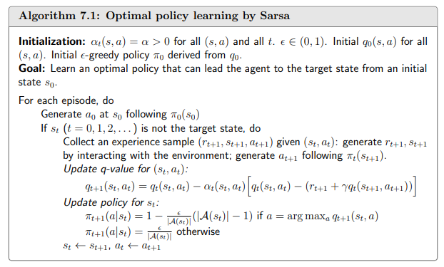
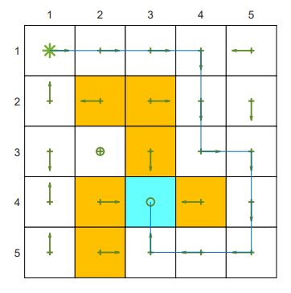
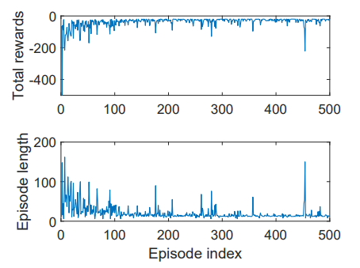
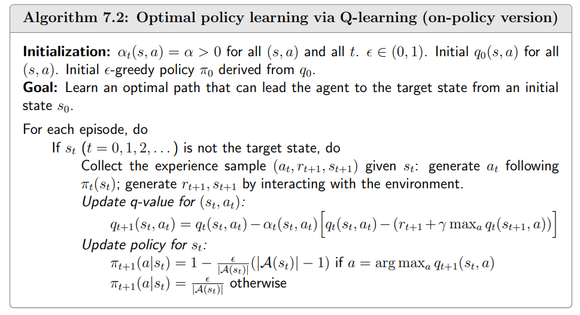
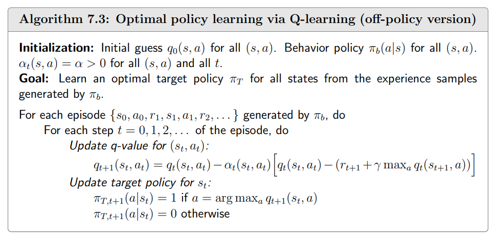
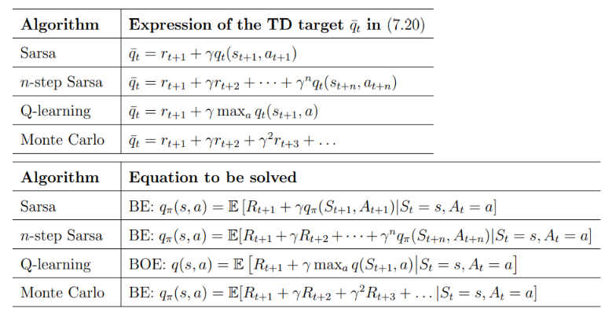

   

### 时序差分

#### 最经典的TD算法

$$
v_{t+1}(s_t)=v_t(s_t)-\alpha_t(s_t)[v_t(s_t)-[r_{t+1}+\gamma v_t(s_{t+1})]]
\\v_{t+1}(s)=v_t(s),\forall s\neq s_t
\\
\\TD算法依赖一组数据(s_o,r_1s_1,\cdots,s_t,r_{t+1},s_{t+1},\cdots)或者\{(s_t,r_{t+1},s_{t+1})\}_t
\\这组数据由给定的策略\pi产生
\\s是一个\text{state space},v(s)表示任何一个状态都要有v
\\v(s)是用来近似v_\pi(s),v_t(s)表示在t时刻的估计值
\\s_t表示在这组数据中,在t时刻访问的s就是s_t,一个智能体在一个时刻只能访问一个s
\\v_{t+1}(s)=v_t(s),\forall s\neq s_t表示在t时刻没被访问的状态它的v是不变的
$$

$$
接下来详细介绍第一个表达式
\\\underbrace{v_{t+1}(s_t)}_{\text{new estimate}}=\underbrace{v_t(s_t)}_{\text{current estimate}}-\alpha_t(s_t)[\overbrace{v_t(s_t)-[\underbrace{r_{t+1}+\gamma v_t(s_{t+1})}_{\text{TD targe }\bar{v}_t}}^{\text{TD error }\delta_t}]]
\\v_{t+1}(s)=v_t(s),\forall s\neq s_t
\\\\\bar{v}_t \overset{\cdot}{=}r_{t+1}+\gamma v(s_{t+1})这个被称为\text{TD target}
\\\bar{v}_t可以理解为，此时又进来一个数据然后我们可以知道他的激励和v_t(s_{t+1})也就是在s_{t+1}的状态值
\\希望v_t能朝\text{TD target}修改
\\\delta_t\overset{\cdot}{=}v(s_t)-[r_{t+1}+\gamma v(s_{t+1})]=v(s_t)-\bar{v}_t
\\表示现在的value和targetzhi'jian存在一个误差\delta_t,称为\text{TD error}
\\\\\\在 TD(0) 中，我们用当前策略（例如随机探索策略）与环境交互，每走一步就用即时奖励和下一状态的当前估
\\计来更新当前状态价值。随着时间推移，只要行为策略能够充分访问各状态，TD(0) 会收敛到该策略下的真实状态价值。
\\\textcolor{red}{(注意:在这个TD算法中是不知道action的)}(如果td算法看不懂请回去看一下贝尔曼方程的V是怎么计算的)
$$

##### TD target 和 TD error

$$
v(s_t)会朝着\bar{v}_t改进,所以称为\text{TD target}.下面来证明
\\v_{t+1}(s_t)=v_t(s_t)-\alpha_t(s_t)[v_t(s_t)-\bar{v}_t]
\\\rightarrow v_{t+1}(s_t)\textcolor{blue}{-\bar{v}_t}=v_t(s_t)\textcolor{blue}{-\bar{v}_t}-\alpha_t(s_t)[v_t(s_t)-\bar{v}_t]
\\\rightarrow v_{t+1}(s_t)\textcolor{blue}{-\bar{v}_t}=[1-\alpha_t(s_t)][v_t(s_t)\textcolor{blue}{-\bar{v}_t}]
\\\rightarrow |v_{t+1}(s_t)\textcolor{blue}{-\bar{v}_t}|=|1-\alpha_t(s_t)||v_t(s_t)\textcolor{blue}{-\bar{v}_t}|
\\\because \alpha_t(s_t)\text{is a small positive number}
\\\therefore 0 < 1-\alpha_t(s_t) <1
\\\therefore |v_{t+1}(s_t)\textcolor{blue}{-\bar{v}_t}|\leq|v_t(s_t)\textcolor{blue}{-\bar{v}_t}|
\\这就说明了在下一个时刻v_{t+1}(s_t)是最少要比v_t(s_t)要离\text{TD target}近的
$$

$$
什么是\text{TD error}呢?
\\\delta_t=v(s_t)-[r_{t+1}+\gamma v(s_{t+1})]
\\首先他是一个误差,这两个量不在同一个时刻上,所以被称为时序差分
\\\text{TD error}不仅仅描述了这两个量的误差,还描述了v_\pi和v_t的误差
\\下面进行说明.我们希望v能够收敛到v_\pi,现在来看看当v=v_\pi时会发生什么
\\\delta_{\pi,t}\stackrel{\cdot}{=}v_\pi(s_t)-[r_{t+1}+\gamma v_\pi(s_{t+1})]
\\\mathbb{E}[\delta_{\pi,t}|S_t=s_t]=v_\pi(s_t)-\mathbb{E}[R_{t+1}+\gamma v_\pi(S_{t+1})|S_t=s_t]=0
\\根据贝尔曼方程我们可以知道v_\pi(s_t)=\mathbb{E}[R_{t+1}+\gamma v_\pi(S_{t+1})|S_t=s_t]
\\所以我们能够知道当v_t=v_\pi时,则\delta_t=0
\\因此也可以知道当\delta_t不等于0时,v_t不等于v_\pi
$$

##### 总结

$$
我们这个TD算法只是在估计\text{state value }是在做\text{policy evaluation}
\\不能用来估计\text{action values}
\\不能用来寻找最优策略
\\TD算法就是使用RM来快速迭代状态
$$

#### TD算法解决的数学问题

$$
\\实际上是在求解一个给定策略的贝尔曼公式.TD算法是在没有模型(不知道转移概率)的情况下求解贝尔曼公式
\\
\\我们引入一个新的贝尔曼公式
\\v_\pi(s)=\mathbb{E}[R+\gamma G_{t+1}|S=s],s\in S
\\\mathbb{E}[R+\gamma G_{t+1}|S=s]可以拆成\mathbb{E}[R|S=s]+\gamma\mathbb{E}[G_{t+1}|S=s]
\\\\\mathbb{E}[G_{t+1}|S=s]可以写成下式:
\\\mathbb{E}[G_{t+1}|S=s]=\sum_a\pi(a|s)\sum_{s'}p(s'|s,a)v_\pi(s')=\mathbb{E}[v_\pi(S')|S=s]
\\推导:根据\text{state value}的定义
\\\mathbb{E}[G_{t+1}|S_{t+1}=s']=v_\pi(s')
\\代入全期望公式:
\\\mathbb{E}[G_{t+1}|S_t=s]=\sum_{s'}P(s'|s)\cdot v_\pi(s')
\\其中P(s'|s)是从状态s转移到s'的概率(需要按策略\pi对动作积分):
\\P(s'|s)=\sum_a\pi(a|s)\cdot P(s'|s,a)
\\最终等式:
\\\mathbb{E}[G_{t+1}|S_t=s]=\mathbb{E}[v_\pi(S_{t+1})|S_t=s]
\\
\\直观解释:
\\从状态s转移到s'的概率乘上s'的\text{state value}
\\
\\接着我们定义的v_\pi(s)可以写成下式:
\\\textcolor{blue}{v_\pi(s)=\mathbb{E}[R+\gamma v_\pi(S')|S=s],s\in S.}
\\这个公式有时候被称为贝尔曼期望公式
$$

##### 求解

$$
我们使用RM的方式来进行求解
\\g(v(s))=v(s)-\mathbb{E}[R+\gamma v_\pi(S')|s]
\\求解g(v(s))=0.使得v(s)=\mathbb{E}[R+\gamma v_\pi(S')|s]
\\\tilde{g}(v(s))=v(s)-[r+\gamma v_\pi(s')]
\\=\underbrace{v(s)-\mathbb{E}[R+\gamma v_\pi(S')|s]}_{g(v(s))}+\underbrace{\mathbb{E}[R+\gamma v_\pi(S')|s]-[r+\gamma v_\pi(s')]}_{\eta}
\\r和s'分别是R、S'的采样
\\写成RM算法形式
\\v_{k+1}(s)=v_k(s)-\alpha_k\tilde{g}(v_k(s))
\\=v_k(s)-\alpha_k(v_k(s)-[r_k+\gamma v_\pi(s'_k)]),k=1,2,3,\cdots
$$

#### sarsa

$$
需要一组数据/经验\{(s_t,a_t,r_{t+1},s_{t+1},a_{t+1})\}_t,所以写成sarsa,这个算法和我们刚才的TD算法没什么不同
\\我们只是把v替换成了q
\\\textcolor{red}{q_{t+1}(s_t,a_t)=q_t(s_t,a_t)-\alpha_t(s_t,a_t)\bigg[q_t(s_t,a_t)-(r_{t+1}+\gamma q_{t}(s_{t+1},q_{t+1}))\bigg]}
\\\textcolor{red}{q_{t+1}(s,a)=q_t(s,a),\forall(s,a)\neq(s_t,a_t)}\epsilon
$$

##### 解决的数学问题

$$
q_{\pi}(s,a)=\mathbb{E}[R+\gamma q_{\pi}(S',A')|s,a],\forall s,a
\\其实跟TD算法解决的问题一样，是在求解一个贝尔曼方程
\\不过形式有些不同,使用的是q来进行计算的
$$

##### 伪代码

##### 示例

$$
这和我们之前的案例不同，不是一个寻找最优路径的任务,所以没有遍历每一个状态
\\所以实际上是有可能不是最优的路径的
\\MC用一个 episode 的总回报来更新回合里所有被访问过的状态或动作值
\\SARSA 在每一步利用即时奖励 + 下一状态所选动作的当前 Q 估计来更新当前 Q(S, A)。它只看 这一条转移 的局部信息，而不是把周围多个 Q 值综合起来。
$$

 

#### n-step sarsa

$$
蒙特卡洛和Sarsa的折中
\\q_\pi(s,a)=\mathbb{E}[G_t|S_t=s,A_t=a]
\\\begin{matrix}
Sarsa \leftarrow G_t^{(1)}=R_{t+1}+\gamma q_\pi(S_{t+1},A_{t+1})\\
G_t^{(2)}=R_{t+1}+\gamma R_{t+2}+\gamma^2q_\pi(S_{t+2},A_{t+2}) \\
\vdots \\
\text{n-step Sarsa}\leftarrow G_t^{(n)}=R_{t+1}+\gamma R_{t+2}+\cdots+\gamma^nq_\pi(S_{t+n},A_{t+n})\\
\vdots\\
MC\leftarrow G_t^{(\infty)}=R_{t+1}+\gamma R_{t+2}+\gamma^2R_{t+3}+\cdots
\end{matrix}
$$

##### 小结

$$
\text{Sarsa}用q来近似\text{"未来尾巴"};这正是自举
\\\text{Sarsa (1-step)}:偏差大/方差小/更新快
\\\text{n-step Sarsa}: 前n步用真奖励,尾部自举;n越大越接近MC
\\\text{MC}:无自举、无偏但高方差、收敛慢
$$

##### 解决的数学问题

$$
\text{Sarsa}
\\q_\pi(s,a)=\mathbb{E}[G_t^{(1)}|s,a]=\mathbb{E}[R_{t+1}+\gamma q_\pi(S_{t+1},A_{t+1})|s,a]
\\\text{MC}
\\q_\pi(s,a)=\mathbb{E}[G_t^{(\infty)}|s,a]=\mathbb{E}[R_{t+1}+\gamma R_{t+2}+\gamma^2 R_{t+3}+\cdots|s,a]
\\\text{s-step Sarsa}
\\q_\pi(s,a)=\mathbb{E}[G_t^{(n)}|s,a]=\mathbb{E}[R_{t+1}+\gamma R_{t+2}+\cdots+\gamma^n q_\pi(S_{t+n},A_{t+n})|s,a]
\\求解：
\\q_{t+1}(s_t,a_t)=q_t(s_t,a_t)-\alpha_t(s_t,a_t)\bigg[q_t(s_t,a_t)-[r_{t+1}+\gamma_{t+2}+\cdots+\gamma^n q_t(s_{t+n},a_{t+n})]\bigg]
\\当n=1时则为Sarsa,当n=\infty,\alpha_t=1时则是MC
$$

##### 具备的性质

$$
\text{n-step Sarsa}需要的数据(s_t,a_t,r_{t+1},s_{t+1},a_{t+1},\cdots,r_{t+n},s_{t+n},a_{t+n})
\\所以这个算法还是需要等待episode结束才能进行更新他介于offline和online之间
\\当n比较大时，性质接近MC算法。有较大的方差和较小的偏差
\\当n比较小时，性质接近Sarsa算法。有较大的偏差和较小的方差
$$

#### Q-learning

$$
\textcolor{red}{q_{t+1}(s_t,a_t)=q_t(s_t,a_t)-\alpha_t(s_t,a_t)\bigg[q_t(s_t,a_t)-[r_{t+1}+\gamma\max_{a\in A}q_t(s_{t+1},a)]\bigg]}
\\\textcolor{red}{q_{t+1}(s,a)=q_t(s,a),\forall(s,a)\neq(s_t,a_t)}
\\和Sarsa算法唯一的区别就是\text{TD target是}r_{t+1}+\gamma\max_{a\in A}q_t(s_{t+1},a)
\\\\\\
\text{Q-learning}解决了这样的一个数学问题
\\q(s,a)=\mathbb{E}\bigg[R_{t+1}+\gamma\max_{a}q(S_{t+1},a)\bigg|S_t=s,A_t=a\bigg],\forall s,a
\\这是一个贝尔曼最优方程
\\贝尔曼方程回答的是在当前策略\pi下，状态s的价值是多少。而贝尔曼最优方程回答的是在所有策略中，状态s能达到的最大价值是多少
\\前者求期望，后者求最大，使得贝尔曼最优方程的解直接给出了最优策略，而贝尔曼期望方程的解需要配合策略改进才能达到最优
$$

##### On-policy和off-policy

$$
判断是\text{On-policy还是off-policy有}(他们其实是两种策略)
\\第一个是判断\text{behavior policy和target policy}是否相同
\\\text{behavior policy}和环境进行交互获得\text{experience}
\\\text{target policy}就是我们已知在更新，想要达到最优的那个策略
\\如果是\text{off-policy}意味着
\\\text{behavior policy 和 target policy}不相同,此时\text{behavior policy}可以是探索性比较强的策略
\\\text{tartget policy}根据\text{behavior policy}探索得到的经验进行最优策略的更新
$$

##### Q-learning伪代码

$$
这个是\text{on-policy}版本,使用\pi_{t}来获取数据，并且在\pi_{t}上进行更新
$$

$$
使用\pi_b来获取一组数据，通常\pi_b的探索性要比较强
\\获取到数据后对\pi_t进行更新
$$

#### 总结

