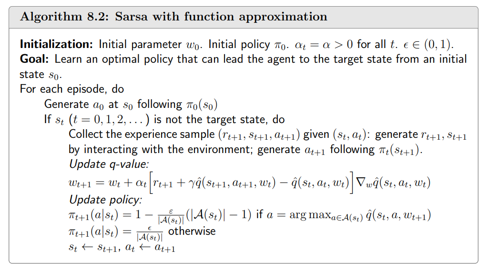

### 值函数近似

$$
直到目前我们所学习的内容都是都是使用表格来表示出来。如下:
$$

v-table

$$
使用表格的好处是是我们能够比较容易的进行分析
\\坏处就是当\text{state space或者 action space}非常大或者为连续时我们很难进行处理
\\主要存在两个问题:1.存储问题,2.泛化能力问题
$$

#### 例子

$$
现在我们有这样一个例子
\\状态有s_1\cdots,s_{|S|},|S|=n
\\状态值有v_\pi(s_1),\cdots,v_{\pi}(s_{|S|}),\pi为特定的策略
\\如果我将他存储下来则需要非常大的内存
\\是否存在一种可能我们能够使用一条曲线将这些点串起来或者说是用曲线来代表这个\text{state space 、state value space }
\\当然是可以的,我们先讨论最简单的情况,使用一条直线来拟合这些点
$$

$$
\hat{v}(s,w)=as+b=\underbrace{\begin{bmatrix}s,1\end{bmatrix}}_{\phi^T(s)}\underbrace{\begin{bmatrix}a\\b\end{bmatrix}}_{w}=\phi^T(s)w
\\s\text{ is state}
\\\text{w is the parameter vector}
\\\phi(s)\text{ the feature vector of s}
\\\hat{v}(s,w)\text{ is linear in w}
\\
\\使用这种方式的好处
\\现在我们只需要存在两个值a和b
\\缺点就是使用这种方法估计的值可能不是那么的精确
$$
我们可以使用高阶曲线来进行拟合
$$
这里考虑一个二阶曲线
\\\hat{v}(s,w)=as^2+bs+c=\underbrace{[s^2,s,1]}_{\phi^T(s)}\underbrace{\begin{bmatrix}a\\b\\c\end{bmatrix}}_{w}=\phi^T(s)w
$$

### Objective function 

$$
v_\pi(s)是关于s的实际值,\hat{v}_\pi(s,w)是关于s的预测值
\\我们的目标是使得预测值去接近真实值
\\当\hat{v}(s,w)的结构确定时,我们可以调的就是w
\\我们要找到一个最优的w使得预测值去接近真实值
\\
$$

#### 如何找到最优的w

$$
1.定义目标函数
\\J(w)=\mathbb{E}[(v_\pi(S)-\hat{v}(S,w))^2](均方误差),w是我们要优化的参数
\\值得注意的是,这里的S是一个随机变量,而随机变量肯定有一个概率分布
\\两种分布方式
\\\text{uniform distribution 平局分布}
\\J(w)=\mathbb{E}[(v_\pi(S)-\hat{v}(S,w))^2]=\frac{1}{|S|}\sum_{s\in S}(v_\pi(s)-\hat{v}(s,w))^2
\\所有的状态估计的误差的平方和然后求平均 
\\显然这里假设了所有的状态转移概率都是相等的,然而实际上可能并不是
\\
\\\text{stationary distribution}
\\\text{long-run behavior}:从某一个状态出发然后按照一个策略采取action
\\不断的和环境进行交互,并且一直采取这个策略,之后就能够达到一个平稳的状态
\\我们能够知道\text{agent}出现在每个状态的概率
\\我们使用d_\pi(s)来表示s的概率,\forall d_\pi(s)\geq0 \text{ and }\sum_{s\in S}d_\pi(s)=1
\\目标函数可以写成
\\J(w)=\mathbb{E}[(v_\pi(S)-\hat{v}(S,w))^2]=\sum_{s\in S}d_\pi(s)(v_\pi(s)-\hat{v}(s,w))^2
\\这里的d_\pi(s)就扮演的权重
\\\\\
进一步理解\text{stationary distribution}
\\\text{Distribution:}是一个状态的概率分布(状态的权重)
\\\text{Stationary:}是平稳的.从一个状态出发,然后跑了很多步得到的一个概率分布
\\\text{stationary distribution}又被称为\text{ limiting distribution}
\\d_\pi(s)可以使用\frac{n_\pi(s)}{\sum_{s'\in S}n_\pi(s')}来近似.n_\pi(s)表示访问状态s的次数
$$

$$
我们也可以通过另一种方式知道d_\pi(s)
\\d_\pi(s)满足下面这个式子,P_\pi是状态转移矩阵
\\d_\pi^T P_\pi=d_\pi^T(Ax=\lambda x)
\\通过这个式子我们可以知道d_\pi^T是P_\pi对应特征值\lambda=1的特征向量
\\
\\具体到这个例子,我们已知状态转移矩阵P_\pi
\\P_\pi=\begin{bmatrix}
0.3 & 0.1 & 0.6 & 0 \\
0.1 & 0.3 & 0 & 0.6 \\
0.1 & 0 & 0.3 & 0.6 \\
0 & 0.1 & 0.1 & 0.8
\end{bmatrix}
\\已知矩阵P_\pi和特征值\lambda=1,求特征向量d_\pi^T
\\P_\pi^T = \begin{bmatrix}
0.3 & 0.1 & 0.1 & 0 \\
0.1 & 0.3 & 0 & 0.1 \\
0.6 & 0 & 0.3 & 0.1 \\
0 & 0.6 & 0.6 & 0.8
\end{bmatrix}
\\需要注意这里原始矩阵和特征向量的位置和我们线性代数中常见题型的位置有点不同,所以我们进行转置
\\P_\pi^Td_\pi=d_\pi
\\|P_\pi^T-E|=\begin{bmatrix}
-0.7 & 0.1 & 0.1 & 0 \\
0.1 & -0.7 & 0 & 0.1 \\
0.6 & 0 & -0.7 & 0.1 \\
0 & 0.6 & 0.6 & -0.2
\end{bmatrix}\xrightarrow{\times10}\begin{bmatrix}
-7 & 1 & 1 & 0 \\
1 & -7 & 0 & 1 \\
6 & 0 & -7 & 1 \\
0 & 6 & 6 & -2
\end{bmatrix}\xrightarrow{r_2\leftrightarrow r_1}\begin{bmatrix}
1 & -7 & 0 & 1 \\
-7 & 1 & 1 & 0 \\
6 & 0 & -7 & 1 \\
0 & 6 & 6 & -2
\end{bmatrix}\\\xrightarrow{r_2+ 7r_1}\begin{bmatrix}
1 & -7 & 0 & 1 \\
0 & -48 & 1 & 7 \\
6 & 0 & -7 & 1 \\
0 & 6 & 6 & -2
\end{bmatrix}\xrightarrow{r_3 - 6r_1}\begin{bmatrix}
1 & -7 & 0 & 1 \\
0 & -48 & 1 & 7 \\
0 & 42 & -7 & -5 \\
0 & 6 & 6 & -2
\end{bmatrix}\xrightarrow{r_4\leftrightarrow r_2}\begin{bmatrix}
1 & -7 & 0 & 1 \\
0 & 6 & 6 & -2 \\
0 & 42 & -7 & -5 \\
0 & -48 & 1 & 7 \\
\end{bmatrix}\\\xrightarrow{r_3 - 7r_2}\begin{bmatrix}
1 & -7 & 0 & 1 \\
0 & 6 & 6 & -2 \\
0 & 0 & -49 & 9 \\
0 & -48 & 1 & 7 \\
\end{bmatrix}\xrightarrow{r_4 + 8r_2}\begin{bmatrix}
1 & -7 & 0 & 1 \\
0 & 6 & 6 & -2 \\
0 & 0 & -49 & 9 \\
0 & 0 & 49 & -9 \\
\end{bmatrix}\xrightarrow{r_4 + r_3}\begin{bmatrix}
1 & -7 & 0 & 1 \\
0 & 6 & 6 & -2 \\
0 & 0 & -49 & 9 \\
0 & 0 & 0 & 0 \\
\end{bmatrix}
\\求得同解方程组:\begin{cases}
x_1-7x_2=-x_4 \\
6x_2+6x_3=2x_4 \\
49x_3=9x_4
\end{cases},x_4为自由未知数,令x_4=1,得:\begin{bmatrix}
\frac{1}{21}\\
\frac{22}{147}\\
\frac{9}{49}\\
1\\
\end{bmatrix}
\\归一化得:d_\pi=\begin{bmatrix}
0.0345 \\ 
0.1084 \\
0.1330 \\
0.7241
\end{bmatrix}
$$

#### 优化Objective function

$$
\\2.优化目标函数J(w)=\mathbb{E}[(v_\pi(S)-\hat{v}(S,w))^2]
\\提到优化方法那么一般都会使用梯度上升或者梯度下降
\\w_{k+1}=w_k-\alpha_k\nabla_wJ(w_k)
\\\begin{align}
 \nabla_wJ(w) &=\nabla_w\mathbb{E}[(v_\pi(S)-\hat{v}(S,w))^2] \\
 &= \mathbb{E}[(v_\pi(S)-\hat{v}(S,w))\cdot(-\nabla_w\hat{v}(S,w))] \\
  &= -2  \mathbb{E}[(v_\pi(S)-\hat{v}(S,w))\cdot(\nabla_w\hat{v}(S,w))]
\end{align}
\\而这个需要计算一个期望,为了避免期望,我们采用随机梯度下降
\\于是可以得到w_{t+1}=w_t+\alpha(v_\pi(s_t)-\hat{v}(s_t,w_t)))\cdot(\nabla_w\hat{v}(s_t,w_t))
\\这个表达式去掉的期望,并且把随机变量用采样进行代替
$$

$$
\\
\\另外这个算法涉及到了v_\pi(s_t),这个我们实际上是不知道到的,v_\pi(s_t)是我们要求的数.所以暂时还不能使用
\\但是我们可以用其他的量来代替v_\pi(s_t)
\\
\\我们之前学习了两种方法
\\第一种方法就是蒙特卡洛的方法,使用一个\text{episode}的来代替v_\pi(s_t)
\\\text{MC Exploring starts}
\\w_{t+1}=w_t+\alpha_t(g_t-\hat{v}(s_t,w_t))\nabla_w\hat{v}(s_t,w_t)
\\另外一种是\text{TD learning和function approximation相结合}
\\使用r_{t+1}+\gamma \hat{v}(s_{t+1,w_t})来代替v_\pi(s)
\\w_{t+1}=w_t+\alpha_t[r_{t+1}+\gamma\hat{v}(s_{t+1},w_t)-\hat{v}(s_t,w_t)]\nabla_w\hat{v}(s_t,w_t)
\\
\\大家可能会对r_{t+1}+\gamma\hat{v}(s_{t+1},w_t)-\hat{v}(s_t,w_t)这部分有些疑问
\\r_{t+1}+\gamma\hat{v}(s_{t+1},w_t)-\hat{v}(s_t,w_t)真的合理吗?
\\\hat{v}是我们要训练的模型使用它来对我们的权重进行更新不会不合理吗?
\\实际上我们不需要盯着每一步\delta_t是否合理,它确实是有偏的(用了\hat{v}(s_{t+1},w_t)作自举)
\\但是不用担心,随着更新会收敛到w^*,这部分我们在TD算法中也有学习过(\text{tabular+on policy})
$$

##### 什么是自举(bootstrapping)

在 **TD 学习/动态规划** 中，**用当前估计去近似未来的真值**，再拿这个“近似真值”回过头来更新当前估计，这个过程就叫 **自举**。

##### 伪代码

 

##### 如何选择$\hat{v}(s,w)$函数

**第一种：线性函数**
$$
\hat{v}(s,w)=\phi^T(s)w
\\\hat{v}(s,w)是w的一个线性函数,\phi^T(s)可以认为是组合系数
\\\phi(s)是特征向量,但是特征向量又需要人为的选取
\\选取的方法可以通过特征多项式等等,这里不详细将,因为现在基本上使用神经网络
$$
**第二种：使用神经网络逼近**
$$
s\rightarrow \text{model}\rightarrow \hat{v}(s,w)
\\神经网络是关于w的非线性函数
$$
回到线性的情况
$$
如果\hat{v}(s,w)=\phi^T(s)w,则有
\\\nabla_w\hat{v}(s,w)=\phi(s)
\\把这个梯度代入TD算法
\\w_{t+1}=w_t+\alpha_t[r_{t}+\gamma\hat{v}(s_{t+1},w_{t})-\hat{v}(s_t,w_t)]\nabla_w\hat{v}(s_t,w_t)
\\\text{yields}:
\\w_{t+1}=w_t+\alpha_t[r_t+\gamma\phi^T(s_{t+1})w_t-\phi^T(s_t)w_t]\phi(s_t)
\\这个算法被称为\text{TD-Linear}
$$
**TD-Linear的优劣势**

- 劣势
  - 特征向量需要人工选择合适的特征向量，但是这个往往很难选择，即使对这个任务有很好的了解
- 优势
  - 理论性质比较好分析，神经网络很难分析
  - 虽然不能实现所有的函数，但是还是有比较好的表征能力的

##### 为什么说tabular是Linear的特殊情况

- 首先，我们在状态s时选取一个特殊的特征向量
  $$
  \phi(s)=e_s\in\mathbb{R}^{|S|}
  $$
  $e^s$是一个向量，里面全都是0，除了对应位置s的量为1
  
- 把这个代入到$\hat{v}(s,w)$中：
  $$
  \hat{v}(s,w)=e^T_s w=w(s)
  \\w(s)是向量w对应s位置的量
  \\也就是说每个位置都只会对应一个权重,那么就是一个表格
  $$
  

$$
再进一步
\\我们把这个代入到\text{TD-Linear}算法
\\w_{t+1}=w_t+\alpha[r_{t}+\gamma\phi^T(s_{t+1})w_t-\phi^T(s_t)w_t]\phi(s)
\\代入之后等于:
\\w_{t+1}=w_t+\alpha[r_t+\gamma e_{s+1}w_t-e_sw_t]e_s
\\w_{t+1}(s_t)=w_t(s_t)+\alpha[r_t+w_t(s_{t+1})-w_t(s)]
\\这个就是\text{tabular的TD算法},跟之前一模一样,包括之会对当前状态s_t更新
$$

#### 贝尔曼投影

$$
\\w_{t+1}=w_t+\alpha_t[r_{t}+\gamma\hat{v}(s_{t+1},w_{t})-\hat{v}(s_t,w_t)]\nabla_w\hat{v}(s_t,w_t)
$$

- 实际上我们之前的算法并不是在最小化$J(w)=\mathbb{E}[(v_\pi(S)-\hat{v}(S,w))^2]$

##### 多种的objective function

1. True value error
   $$
   J(w)=\mathbb{E}[(v_\pi(S)-\hat{v}(S,w))^2]=\|\hat{v}(w)-v_\pi\|_D^2
   $$

2. Bellman Error
   $$
   J_{BE}(w)=\|\hat{v}(w)-(r_\pi+\gamma P_\pi\hat{v}(w))\|_D^2\stackrel{\cdot}{=}\|\hat{v}(w)-T_\pi(\hat{v}(w))\|^2_D
   \\
   \\为什么写成这个呢?
   \\我们希望\hat{v}去逼近v_\pi,而v_\pi满足v_\pi=r_\pi+\gamma p_\pi v_\pi
   \\当\hat{v}=v_\pi时肯定是满足\hat{v}=r_\pi+\gamma p_\pi \hat{v}
   \\简写成\hat{v}=T_\pi(\hat{v})
   \\然而实际中可能不相等,所以就去最小化\|\hat{v}=r_\pi+\gamma p_\pi \hat{v}\|^2
   $$

3. Projected Bellman error
   $$
   这个算法就是我们刚刚在最小化的\text{error}
   \\J_{PBE}(w)=\|\hat{v}(w)-MT_\pi(\hat{v}(w))\|^2_D
   \\M是一个投影矩阵
   \\因为\|\hat{v}(w)-T_\pi(\hat{v}(w))\|^2_D的误差可能永远都不会为0
   \\所以需要一个投影矩阵,投影到一个空间上去,使得误差为零
   $$
   

### Sarsa值函数近似

$$
w_{t+1}=w_t+\alpha_t[r_{t+1}+\gamma\hat{q}(s_{t+1},a_{t+1},w_t)-\hat{q}(s_t,a_t,w_t)]\nabla_w\hat{q}(s_t,a_t,w_t)
$$

#### 伪代码

### Q-learning值函数近似

$$
w_{t+1}=w_t+\alpha_t\bigg[r_{t+1}+\gamma\max_{a\in \mathcal{A}(s_{t+1})}\hat{q}(s_{t+1},a,w_t)-\hat{q}(s_t,a_t,w_t)\bigg]\nabla_w\hat{q}(s_t,a_t,w_t)
$$

#### 伪代码

### DQN

$$
J(w)=\mathbb{E}\bigg[\bigg(R+\gamma\max_{a\in\mathcal{A}(S')}\hat{q}(S',a,w)-\hat{q}(S,A,w)\bigg)^2\bigg]
\\R+\gamma\max_{a\in\mathcal{A}(S')}\hat{q}(S',a,w)-\hat{q}(S,A,w)就是\text{TD error}
\\所以我们就是在最小化误差
\\这实际上是\text{Bellman optimality error }因为
\\q(s,a)=\mathbb{E}\bigg[R_{t+1}+\gamma\max_{a\in\mathcal{A}(S_{t+1})}q(S_{t+1},a)|S_t=s,A_t=a\bigg],\forall s,a
\\所以在期望的意义上R+\gamma\max_{a\in\mathcal{A}(S')}\hat{q}(S',a,w)-\hat{q}(S,A,w),如果\hat{q}达到最优应该是等于0的
$$

#### 半梯度

$$
最小化J(w)=\mathbb{E}\bigg[\bigg(R+\gamma\max_{a\in\mathcal{A}(S')}\hat{q}(S',a,w)-\hat{q}(S,A,w)\bigg)^2\bigg]时,需要进行求导
\\最小化w就是对w求导
\\但是这里对w求导需要对\max_{a\in\mathcal{A}(S')}\hat{q}(S',a,w)求导和\hat{q}(S,A,w)求导
\\但是对\max_{a\in\mathcal{A}(S')}\hat{q}(S',a,w)求导会比较困难,这也成为使用半梯度的原因之一
\\y\stackrel{\cdot}=R+\gamma\max_{a\in\mathcal{A}(S')}\hat{q}(S',a,w)
\\把这个定义为一个常数不对它求导
$$

#### 两个网络

- 一个主网络$\hat{q}(s,a,w)$
- 一个目标网络$\hat{q}(S',a,w_T)$

$$
J=\mathbb{E}\bigg[\bigg(R+\gamma\max_{a\in\mathcal{A}(S')}\textcolor{red}{\hat{q}(S',a,w_T)}-\textcolor{blue}{\hat{q}(S,A,w)}\bigg)^2\bigg]
\\主网络每一次迭代都会更新
\\目标网络每n次迭代会把主网络的参数拷贝给自己
$$

基于这个objective function我们计算梯度得到
$$
\nabla_w J(w)=\mathbb{E}\bigg[\bigg(R+\gamma\max_{a\in\mathcal{A}(S')}\textcolor{red}{\hat{q}(S',a,w_T)}-\textcolor{blue}{\hat{q}(S,A,w)}\bigg)\nabla_w\hat{q}(S,A,w)\bigg]
\\这里为了整洁省略了-2
$$

#### 经验回放

收集n个episode的数据$\mathcal{B}\stackrel{\cdot}{=}\{(s,a,r,s')\}$，里面有n个4元组，从里面随机抽取数据来训练神经网络
不一定要按照采集数据的顺序，随机抽取时一定要服从均匀分布

**为什么要使用经验回放**

**为什么采样的时候要使用均匀分布**
$$
先回到算法
\\J(w)=\mathbb{E}\bigg[\bigg(R+\gamma\max_{a\in\mathcal{A}(S')}\hat{q}(S',a,w)-\hat{q}(S,A,w)\bigg)^2\bigg]
\\这里有R、S'、S、A4个随机变量,我们要求J(w)就必须知道他们的概率分布
\\(S,A)\sim d:我们这里把(S,A)当成一个索引,当成一个随机变量(二维随机变量)
\\假设有n个状态,每个状态有5个\text{action},每个\text{action}就可以通过(s,a)进行索引
\\R\sim p(R|S,A),S'\sim p(S'|S,A),当S,A给定时R、S'需要服从系统的模型
\\我们要求(S,A)是均匀分布的
\\如果使用高斯分布,需要我们有先验知识需要知道哪些状态和动作重要哪些不重要
\\如果没有则需要一视同仁遵循采集到的数据,然后进行随机抽样
\\
\\\text{tips:}这里说的对(S,A)均匀抽样是指从缓冲区均匀抽样
$$
**对已有经验随机抽样，是为了用数据的经验分布来近似目标中的期望，并获得近似 IID 的小批量，使 SGD 的梯度估计无偏而方差可控，从而在未知环境下也能稳定地优化，另外也能提高样本的利用效率**

为什么能提高利用效率呢

因为之前的算法可以理解为采集一个数据就丢掉一个数据，大量数据被浪费

#### 和表格对比

- **在tabular中没有经验回放的，为什么没有呢？**
  - 因为之前没有涉及到状态S，A的分布
  - 分布的引入是因为要定义一个标量的目标函数
- **为什么DQN就会涉及到S，A的分布呢，tabular就没有呢**
  - 因为value function approximation有一个objective function需要优化，而objective function是一个期望，所以有了分布
- 经验回放对于tabular Q-learning不是必须的，但是也是可以用的
  - 因为tabular Q-learning也是off policy的方法

#### 伪代码

$Y_T$表示目标值

**提问**

- 为什么没有policy update呢?	

  - 因为off policy的，所以不需要对行为进行更新，即使更新了也不会对采样策略产生影响。
  - 所以只需要收敛之后，再更新一次就可以了

- 这个代码中输入输出和原论文是不一样的，这么做没问题吗？
  $$
  这里的神经网络:\begin{cases}
  s \\
  a\\
  \end{cases} \stackrel{w}{\rightarrow}\hat{q}(s,a)
  \\
  \\这个神经网络会比较低效,假设有5个状态每个状态5个行为
  \\需要25次循环,再去求哪个最大
  \\原文中的神经网络:s\stackrel{w}{\rightarrow} \begin{cases}
  \hat{q}(a_1) \\
  \vdots\\
  \hat{q}(a_n)
  \end{cases}
  \\原文中输入s直接预测出q,看哪个是最大的

  $$
  

#### 例子

- 这里只有1个spisode
- 这个episode是由一个探索性策略得到的，选择每个action的概率相同
- 这个episode只有1000步，之前tabular Q-learning的时候是100000步
- 这里是一个浅层的神经网络，隐藏层有100个神经元
