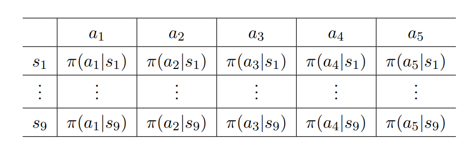
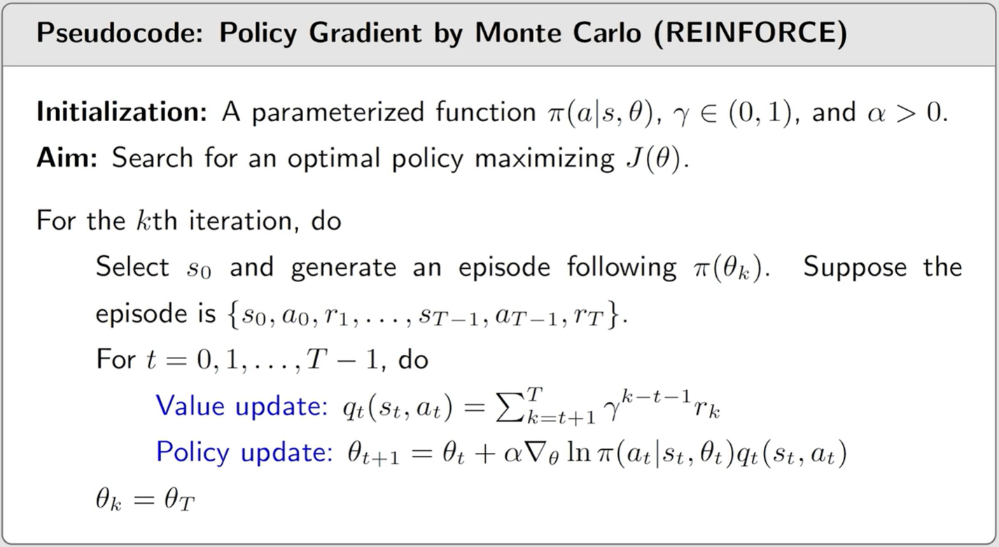

## 策略梯度方法

### 基本思路

目前为止我们所有的策略都是使用表格来表示的

状态空间非常大时，甚至状态时为连续时，表格就需要存储非常多的数据

并且泛化能力不足

我们把表格改成函数写作$\pi(s|s,\theta)或者\pi_\theta(a|s),\pi_\theta(a,s)$，$\theta表示\pi函数里面的参数$

目前最广泛使用的函数是神经网络
$$
s\stackrel{\theta}{\rightarrow}\begin{cases}
\pi(a_1|s,\theta) \\
\vdots\\
\pi(a_n|s,\theta)
\end{cases}
$$

### 表格和函数的区别

1. 怎么样去定义最优策略

   - 表格：$最优策略\pi^*定义:\exist \pi^*使得V_{\pi^*}(s)\geq v_\pi(S),\forall \pi$
   - 函数：定义了一个目标函数，最大化这个目标函数

2. 如何获取action的概率分布

   - 表格：直接去查表

   - 函数：不能直接查表，输入一个状态，通过一个函数给出当前状态每个action的概率
     $$
     s\stackrel{\theta}{\rightarrow}\begin{cases}
     \pi(a_1|s,\theta) \\
     \vdots\\
     \pi(a_n|s,\theta)
     \end{cases}
     $$
     

3. 如何去更新一个策略

   - 表格：直接去$\pi(a|s)$更改，直接更改在状态s下执行a的概率
   - 函数：只能去改变$\theta$

### 通过指标定义最优策略

#### 第一个指标

**第一个指标**是average state value 或者说是 average value，这个指标定义为：
$$
\bar{v}_\pi=\sum_{s\in S}d(s)v_\pi(s)
$$
$d(s)$表示在每个状态对应的权重，权重是大于等于0，且所有权重之和等于1

我们可以优化$\pi$使得$\bar{v}_\pi$最大

$d(s)$也可以理解为一个概率分布，代表状态s被选中的概率，那么这个目标函数就可以写成
$$
\bar{v}_\pi = \mathbb{E}[v_\pi(S)]
$$
**矩阵形式**
$$
\bar{v}_\pi=\sum_{s\in S}d(s)v_\pi(s)=d^{\top}v_\pi
\\ v_\pi = [\cdots, v_\pi(s),\cdots]^{\top}\in \mathbb{R}^{|S|}
\\ d = [\cdots, d(s),\cdots]^{\top}\in \mathbb{R}^{|S|}
\\ |S|:状态的个数
$$

#### 如何选择d

存在两种情况，$d$是独立于策略$\pi$的，另外一种是$d$依赖于策略$\pi$

当$d$独立于$\pi$时我们可以把$d写成d_0$，$\bar{v}_\pi写成\bar{v}_\pi^0$

当我们对$\nabla_\pi\bar{v}_\pi$求梯度时，因为他们相互独立，所以只需要求$v_\pi$的梯度，但是$d$依赖于$\pi$的时候我们就还需要对$d$求梯度

**如何选择d**

1. 每个状态我所给它的权重或者概率都相同$d_0=\frac{1}{|S|}$

2. 我们可能会偏袒某个状态，比如从游戏开始我们会偏袒$s_0$更加关注初始状态的$v_\pi(s_0)$

   $最大化v_\pi(s_0),d_0(s_0)=1,\bar{v}_\pi=v_\pi(s_0)$

**$d$依赖于$\pi$时**

这时候我们选择$d$为$d_\pi(s)$,$d_\pi(s)$是一个 。stationary distribution简单来说我有一个策略，然后使用这个策略进行采样，采样很多次之后就可以预测在某一个状态的概率，我们可以通过下面这个式字计算出概率
$$
d_\pi^{\top}P_\pi=d_\pi^{\top}
\\ P_\pi是状态转移矩阵
$$
通过这个式子我们知道了哪些状态访问多哪些访问少，访问多的状态权重大，访问少的状态权重自然就少一点

#### 第二个指标

**第二个指标**average one-step reward 或者说average reward 
$$
\bar{r}_\pi\stackrel{\cdot}{=}\sum_{s\in S}d_\pi(s)r_\pi(s)=\mathbb{E}[r_\pi(S)]
\\S\sim d_\pi,r_\pi(s)\stackrel{\cdot}{=}\sum_{a\in \mathcal{A}}\pi(a|s)r_\pi(s,a)
\\r_\pi(s,a)\stackrel{\cdot}{=}\mathbb{E}[R|s,a]=\sum_{r}rp(r|s,a)
$$
这里面$d_\pi$是一个稳态分布。

average reward 第二种形式

$$
给定策略\pi生成一个\text{trajectory}然后根据这个\text{trajectory}获得一组\text{reward}(R_{t+1},R_{t+2},\cdots)
\\\lim_{n\to \infty}\frac{1}{n}\mathbb{E}\bigg[R_{t+1}+R_{t+2}+\cdots+R_{t+n}|S_t=s_0\bigg]
\\=\lim_{n\to\infty}\frac{1}{n}\mathbb{E}\bigg[\sum_{k=1}^nR_{t+k}|S_t=s_0\bigg]
\\s_0是这个轨迹的起始状态
\\上式又可以等于:
\\\lim_{n\to\infty}\frac{1}{n}\mathbb{E}\bigg[\sum_{k=1}^nR_{t+k}|S_t=s_0\bigg]=\lim_{n\to\infty}\frac{1}{n}\mathbb{E}\bigg[\sum_{k=1}^nR_{t+k}\bigg]
\\=\sum_sd_\pi(s)r_\pi(s)
\\=\bar{r}_\pi
\\因为当走了无穷多步后从哪里开始已经不重要了
$$

#### 关于这两个指标

- 这两个指标都是$\pi$的函数
- $\pi$是一个函数，他的参数是$\theta$，所以这两个指标都是$\theta$的函数
- 不同的$\theta$对应不同的指标值
- 我们希望对$\theta$进行优化找到一个最优$\theta$最大化这些指标

- 我们目前讨论的都是存在衰减因子的$\gamma \in [0,1)$ ,这两个指标在没有衰减因子时当然也是成立的($\gamma = 1$)
- $\bar{r}_\pi$和$\bar{v}_\pi$他们最直观的区别就在于$\bar{r}_\pi$更加的短视,当他们其实是等价的,当我们对$\bar{r}_\pi$进行优化的时其实也是对$\bar{v}_\pi$优化

$$
\bar{r}_\pi=(1-\gamma)\bar{v}_\pi
$$

- 关于$\bar{v}_\pi$的另一种写法

$$
J(\theta)=\mathbb{E}\bigg[\sum_{t=0}^\infty\gamma^tR_{t+1}\bigg]=\sum_{s\in S}d(s)\underbrace{\mathbb{E}\bigg[\underbrace{\sum_{t=0}^\infty\gamma^tR_{t+1}}_{G_t}\bigg|S_0=s\bigg]}_{v_\pi(s)}
\\=\sum_{s\in S}d(s)v_\pi(s)
\\=\bar{v}_\pi
$$

###  计算两个指标的梯度

给出一个梯度:
$$
\nabla_\theta J(\theta)=\sum_{s\in \mathcal{S}}\eta(s)\sum_{a\in \mathcal{A}}\nabla_\theta \pi(a|s,\theta)q(s,a)
$$
$J(\theta)$可以是$\bar{v}_\pi,\bar{r}_\pi,\bar{v}_\pi^0$($\bar{v}_\pi^0$初始时刻的平均状态价值)

$\eta$在不同的目标函数的情况下会呈现出不同的分布

将这个梯度写为期望形式:
$$
\begin{align}
\\\nabla_\theta J(\theta)&=\sum_{s\in \mathcal{S}}\eta(s)\sum_{a\in\mathcal{A}}\nabla_\theta\pi(a|s,\theta)q(s,a)
\\&=\mathbb{E}[\nabla_\theta\ln \pi(A|S,\theta)q_\pi(S,A)]
\end{align}
$$
其中$S\sim\eta$,$A\sim\pi(A|S,\theta)$

为什么需要这个式子呢?因为我们需要通过采样才能知道大致的分布,所以写成了期望的形式

需要注意式子中有个$\ln$,$\ln$是怎么来的呢?
$$
\nabla_\theta\ln\pi(a|s,\theta)=\frac{\nabla_\theta\pi(a|s,\theta)}{\pi(a|s,\theta)}
\\\nabla_\theta\pi(a|s,\theta)=\pi(a|s,\theta)\nabla_\theta\ln\pi(a|s,\theta)
$$
则,我们有
$$
\begin{align}
\nabla_\theta J&=\sum_sd(s)\sum_a\textcolor{blue}{\nabla_\theta\pi(a|s,\theta)}q_\pi(s,a)
\\&=\sum_sd(s)\sum_a\textcolor{blue}{\pi(a|s,\theta)\nabla_\theta\ln\pi(a|s,\theta)}q_\pi(s,a)
\\&=\mathbb{E}_{S\sim d}\bigg[\sum_{a}\textcolor{blue}{\pi(a|S,\theta)\nabla_\theta\ln\pi(a|S,\theta)}q_\pi(S,a)\bigg]
\\&=\mathbb{E}_{S\sim d,A\sim \pi}[\nabla_\theta\ln\pi(A|S,\theta)q_\pi(S,A)]
\\&=\mathbb{E}[\nabla_\theta\ln\pi(A|S,\theta)q_\pi(S,A)]
\end{align}
$$
对于$\ln \pi(a|s,\theta)$,已知$\ln$函数定义域为$(0,+\infty)$,而$\pi(a|s,\theta)$去的取值范围$[0,1]$,为了确保所有的$\pi(a|s,\theta)$都满足:
$$
\pi(a|s,\theta)>0
$$
我们可以通过softmax函数把$(-\infty,+\infty)的数归一化到(0,1)$

具体来说,我们有一个向量$x=[x_1,\cdots,x_n]^T$
$$
z_i=\frac{e^{x_i}}{\sum_{j=1}^ne^{x_j}}
$$
$z_i$满足$z_i\in(0,1)$和$\sum_{i=1}^nz_i=1$

则,我们的策略函数$\pi$可以写成:
$$
\pi(a|s,\theta)=\frac{e^{h(s,a,\theta)}}{\sum_{a'\in\mathcal{A}}e^{h(s,a',\theta)}}
$$
$h(s,a,\theta)$是一个函数,一般是个神经网络,这个可以类比CNN网络的输出层经过一个softmax

### 梯度上升算法

梯度上升算法就是最大化$J(\theta)$
$$
\begin{align}
\theta_{t+1}&=\theta_t+\alpha\nabla_\theta J(\theta)
\\&=\theta_t+\alpha\mathbb{E}\bigg[\nabla_\theta\ln\pi(A|S,\theta_t)q_\pi(S,A)\bigg]
\end{align}
$$
因为涉及到期望，我们使用随机梯度来代替真实梯度
$$
\theta_{t+1}=\theta_t+\alpha\nabla_\theta\ln \pi(a_t|s_t,\theta_t)q_\pi(s_t,a_t)
$$
但是$q_\pi$还是需要求期望（$q_\pi(s_t, a_t)$ 代表的是：在状态 $s_t$ 执行动作 $a_t$ 后，未来所有可能发生的轨迹所能带来的**累积回报的数学期望**）

所以我们是用$q_t$进行近似

$$
\theta_{t+1}=\theta_t+\alpha\nabla_\theta\ln\pi(a_t|s_t,\theta_t)\textcolor{blue}{q_t(s_t,a_t)}
$$
我们可以使用多种方法对$q_\pi(s_t,a_t)$进行近似

- 基于蒙特卡洛方法的REINFORCE
- 还可以使用TD方法进行近似和其他更多的方法

**问题1: 如何进行采样？**
$$
\mathbb{E}_{S\sim d,A\sim \pi}\bigg[\nabla_\theta\ln\pi(A|S,\theta_t)q_\pi(S,A)\bigg]\rightarrow\nabla_\theta\ln\pi(a|s,\theta_t)q_\pi(s,a)
$$

- 如何对$S$进行采样?
  - $S\sim d$, $d$需要通过行为策略$\pi$进行采样，但是实际上我们不会这么做，因为数据本身已经很难得了，更别说使用策略$\pi$进行大量的采
- 如何对$A$进行采样?
  - $A\sim \pi(A|S,\theta)$,$a_t$应满足$\pi(\theta_t)$进去采样得到$s_t$
  - 所以，所以这个梯度上升方法是$\text{on-policy}$的

**问题2: 如何解释这个算法？**

我们已知
$$
\nabla_\theta\ln\pi(a_t|s_t,\theta_t)=\frac{\nabla_\theta\pi(a_t|s_t,\theta_t)}{\pi(a_t|s_t,\theta_t)}
$$
所以这个算法可以重写为
$$
\begin{align}
\theta_{t+1}&=\theta_t+\alpha\nabla_\theta\ln \pi(a_t|s_t,\theta_t)q_t(s_t,a_t)
\\&=\theta_t+\alpha\underbrace{\bigg(\frac{q_t(s_t,a_t)}{\pi(a_t|s_t,\theta_t)}\bigg)}_{\beta_t}\nabla_\theta\pi(a_t|s_t,\theta_t)
\end{align}
$$
所以这个算法可以写成
$$
\textcolor{blue}{\theta_{t+1}=\theta_t+\alpha}\textcolor{red}{\beta_t}\textcolor{blue}{\nabla_\theta\pi(a_t|s_t,\theta_t)}
$$
这个梯度上升算法是在最大化$\pi(a_t|s_t,\theta)$

从直觉来看$\alpha\beta_t$是一个很小的数，避免收敛时振荡

- 如果$\beta_t > 0$，这选择$(a_t,a_t)$概率增加，$\beta_t$越大增加的越多

$$
\pi(a_t|s_t,\theta_{t+1})>\pi(a_t|s_t,\theta_t)
$$

- 如果$\beta_t<0$

$$
\pi(a_t|s_t,\theta_{t+1})<\pi(a_t|s_t,\theta_t)
$$

**数学解释**
$$
\begin{align}
\pi(a_t|s_t,\theta_{t+1})&\approx \pi(a_t|s_t,\theta_t)+(\nabla_\theta\pi(a_t|s_t,\theta_t))^\top(\textcolor{blue}{\theta_{t+1}-\theta_t})
\\&把\textcolor{blue}{\theta_{t+1}=\theta_t+\alpha}\textcolor{red}{\beta_t}\textcolor{blue}{\nabla_\theta\pi(a_t|s_t,\theta_t)}代入
\\&=\pi(a_t|s_t,\theta_t)+(\nabla_\theta\pi(a_t|s_t,\theta_t))^\top(\textcolor{blue}{\alpha\beta_t\nabla_\theta\pi(a_t|s_t,\theta_t)+\theta_t-\theta_t})
\\&=\pi(a_t|s_t,\theta_t)+\alpha\beta_t(\nabla_\theta\pi(a_t|s_t,\theta_t))^\top(\textcolor{blue}{\nabla_\theta\pi(a_t|s_t,\theta_t)})
\\&=\pi(a_t|s_t,\theta_t)+\alpha\beta_t\underbrace{\|\nabla_\theta\pi(a_t|s_t,\theta_t)\|^2}_{\geq0}
\end{align}
$$

通过这个表达式我们就更直观的理解收敛方向是受$\beta_t$影响的

- 如果$\beta_t>0$

$$
\pi(a_t|s_t,\theta_{t})+\alpha\beta_t\|\nabla_\theta\pi(a_t|s_t,\theta_t)\|^2>\pi(a_t|s_t,\theta_{t})
$$

- 如果$\beta_t<0$

$$
\pi(a_t|s_t,\theta_{t})+\alpha\beta_t\|\nabla_\theta\pi(a_t|s_t,\theta_t)\|^2<\pi(a_t|s_t,\theta_{t})
$$

**$\beta_t$是在平衡探索与利用**
$$
\theta_t+\alpha\underbrace{\bigg(\frac{q_t(s_t,a_t)}{\pi(a_t|s_t,\theta_t)}\bigg)}_{\beta_t}\nabla_\theta\pi(a_t|s_t,\theta_t)
$$

- $\beta_t$与$q_t(s_t,a_t)$成正比
  - 当$q_t(s_t,a_t)$增加时，$\beta_t$也会增加，那么下一时刻$\pi(a_t|s_t,\theta_t)$(或者说$\pi(a_t|s_t,\theta_{t+1})$)也会增加
  - 也就是说当$q_t(s_t,a_t)$增加时，选择$a_t$的概率也会增加，这里是在利用
- $\beta_t$与$\pi(a_t|s_t,\theta_t)$成反比
  - 当$\pi(a_t|s_t,\theta_t)$减小时，$\beta_t$增加，那么下一时刻$\pi(a_t|s_t,\theta_t)$$也会增加(\pi(a_t|s_t,\theta_t)越小,\pi(a_t|s_t,\theta_t)越大?$)
  - 也就是说当$\pi(a_t|s_t,\theta_t)$偏小时，选择该动作的概率会增大，这里是在探索

### REINFORCE

$\theta_{t+1}=\theta_t+\alpha\nabla_\theta\ln \pi(a_t|s_t,\theta_t)q_\pi(s_t,a_t)$已经被我们替换成了$\theta_{t+1}=\theta_t+\alpha\nabla_\theta\ln \pi(a_t|s_t,\theta_t)q_t(s_t,a_t)$。因为我们使用$q_t(s_t,a_t)$来替换掉需要期望的$q_\pi(s_t,a_t)$

- 如果$q_\pi(s_,a_t)$是通过蒙特卡洛估计进行近似的话，则这个算法被称为$\textcolor{blue}{REINFORCE}$
- REINFORCE是最简单的策略梯度算法

#### 伪代码

