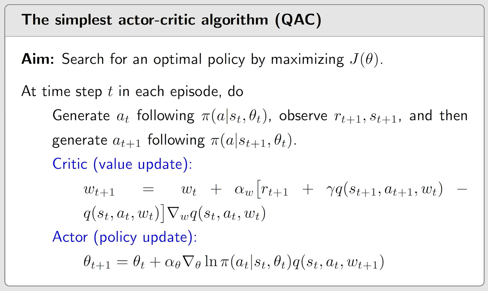
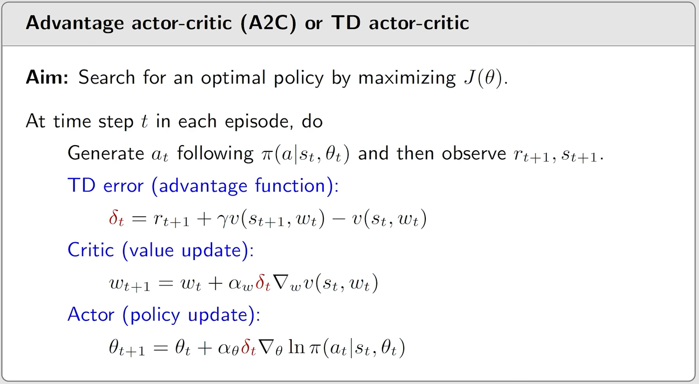

### 什么是AC算法

A对应actor，C对应的是critic

- 其中actor对应的是执行策略的模型
- critic对应的是评估策略的模型，我们通过估计action value 和 state value来判断策略的好坏

 AC算法本质上其实是policy gradient的算法，下面是一个最简单的AC算法
$$
\underbrace{\theta_{\theta+1}=\theta_t\alpha\nabla_\theta\ln\pi(a_t|s_t,\theta_t)\underbrace{\textcolor{blue}{q_t(s_t,a_t)}}_{\text{critic}}}_{\text{actor}}
$$
$q_t$怎么来的呢？

目前我们已经学习了两中

- 第一种是蒙特卡洛方法。我们使用一个episode来近似$q_t(s_t,a_t)$，如果使用MC方法那么这个就是REINFORCE或者称Monte Carlo policy gradient
- 第二种是时序差分的方法。如果使用TD算法来估计那么这个就被称为actor-critic

### 最简单的AC算法

- 这里critic对应的就是Sarsa+value function approximation
- actor就是对应的policy update 的算法
- 需要特别强调这个算法是on policy的
  - 为什么这么说呢？因为$\nabla_\theta J(\theta)=\mathbb{E}_{S\sim \eta,A\sim \pi}[*]$，这个算法需要按照$\pi$的分布对A进行采样，所以$\pi$就是我们的行为策略，然后又是我们需要不断改进的策略（目标策略）
- 这个算法是最简单AC方法之一，有时候被称为QAC（Q:action value）

### A2C(Advantage actor-critic)

首先我们需要明确，我们推导的策略梯度是不会受到引入新的偏置的影响的
$$
\begin{align}
\nabla_\theta J(\theta)&=\mathbb{E}_{S\sim \eta,A\sim \pi}\bigg[\nabla_\theta\ln \pi(A|S,\theta)q_\pi(S,A)\bigg]
\\&=\mathbb{E}_{S\sim\eta,A\sim\pi}\bigg[\nabla_\theta\ln\pi(A|S,\theta)(q_\pi(S,A)-b(S))\bigg]
\end{align}
$$
这里$b(S)$是关于S的一个标量的函数

#### 为什么引入一个偏置之后他们的梯度还是相同的？

要证明$\mathbb{E}_{S\sim\eta,A\sim\pi}\bigg[\nabla_\theta\ln\pi(A|S,\theta)(q_\pi(S,A)-b(S))\bigg]=\mathbb{E}_{S\sim \eta,A\sim \pi}\bigg[\nabla_\theta\ln \pi(A|S,\theta)q_\pi(S,A)\bigg]$显然就是要证明
$$
\mathbb{E}_{S\sim\eta,A\sim \pi}\bigg[\nabla_\theta\ln\pi(A|S,\theta)b(S)\bigg]=0
$$
把这个式子展开
$$
\begin{align}
\mathbb{E}_{S\sim\eta,A\sim \pi}\bigg[\nabla_\theta\ln\pi(A|S,\theta)b(S)\bigg]&=\sum_{s\in S}\eta(s)\sum_{a\in A}\pi(a|s,\theta_t)\nabla_\theta\ln\pi(a|s,\theta_t)b(s)
\\ &=\sum_{s\in S}\eta(s)\sum_{a\in A}\nabla_\theta\pi(a|s,\theta_t)b(s)
\\因为b(s)只是s&的函数,与a无关,所以可以提到前面.如果与a有关还提到前面,就好改变这个期望
\\&=\sum_{s\in S}\eta(s)b(s)\sum_{a\in A}\nabla_\theta\pi(a|s,\theta_t)
\\&=\sum_{s\in S}\eta(s)b(s)\nabla_\theta\sum_{a\in A}\pi(a|s,\theta_t)
\\&\because \sum_{a\in A}\pi(a|s,\theta_t)=1,则\nabla_\theta\sum_{a\in A}\pi(a|s,\theta_t)=0
\\&=\sum_{s\in S}\eta(s)b(s)\nabla_\theta1 =0
\end{align}
$$

#### 为什么要引入这个偏置？

- **降低方差**：使梯度估计更稳定，训练更高效；
- **保持无偏**：不改变梯度的期望，不影响最终收敛解；
- **直观解释**：减去状态的平均水平，突出动作的相对好坏；
- **实际应用**：通常选择 v(s)作为baseline，得到优势函数形式的策略梯度。

首先我们先定义$\nabla_\theta J(\theta)=\mathbb{E}[X]$
$$
X(S,A)\stackrel{\cdot}{=}\nabla_\theta\ln\pi(A|S,\theta_t)[q(S,A)-b(S)]
$$

- 我们已经证明了$\mathbb{E}[X]与b(S)$无关

- $\text{Var}(X)与b(S)有关的$

  - 为什么呢？

  - 因为  $\text{Var}(X)=\mathbb{E}[X^\top X]-\bar{x}^\top\bar{x}$
    $$
    \begin{align}
    &证明:\\
    &\text{Var}[X]=\mathbb{E}[(X-\bar{x})^2] \\
    &=\mathbb{E}[X^2-2\bar{x} X-\bar{x}^2]\\
    &=\mathbb{E}[X^2]-2\bar{x} \mathbb{E}[X]+\bar{x}^2\\
    &=\mathbb{E}[X^2]-2\bar{x}^2+\bar{x}^2 \\
    &=\mathbb{E}[X^2]-\bar{x}^2\\
    \end{align}
    $$

  - 很明显偏置并不会对均值产生影响，所以我们只需要计算$\mathbb{E}[X^\top X]$
    $$
    \begin{align}
    \mathbb{E}[X^\top X]&=\mathbb{E}[(\nabla_\theta\ln \pi)^\top(\nabla_\theta\ln\pi)(q(S,A)-b(S))^2]
    \\&=\mathbb{E}[\|\nabla_\theta\ln\pi\|^2(q(S,A)-b(S))^2]
    \end{align}
    $$

  - 显然当b(S)等于0和等于10000时$\mathbb{E}[X^\top X]$的值是不同的

##### 如何选择baseline

如何选择一个最优baseline使得var(X)达到最小呢

为什么要var(X)达到最小呢？为了在采样时我们的误差达到最小

我们之前的REINFORCE和QAC都没有b(S)，或者说b(S)等于0。但这不是最好的b(S)

**最优的baseline满足$s\in S$ var(X)最小**
$$
X(S,A)\stackrel{\cdot}{=}\nabla_\theta\ln\pi(A|S,\theta_t)[q(S,A)-b(S)]
\\\text{Var}(X)=\mathbb{E}[X^\top X]-\bar{x}^\top\bar{x}
\\因为我们已经知道\text{baseline}不会对\bar{x}^\top\bar{x}产生影响,所以我们只需要最小化\mathbb{E}[X^\top X]
\\\mathbb{E}[X^\top X]=\mathbb{E}[\|\nabla_\theta\ln\pi(A|s,\theta_t)\|^2(q(s,A)-b(s))^2]
\\=\mathbb{E}[\|\nabla_\theta\ln\pi(A|s,\theta_t)\|^2(q(s,A)^2-2q(s,A)b(s)+b(s)^2)]
\\=\mathbb{E}[\|\nabla_\theta\ln\pi(A|s,\theta_t)\|^2q(s,A)^2-2\|\nabla_\theta\ln\pi(A|s,\theta_t)\|^2q(s,A)b(s)+\|\nabla_\theta\ln\pi(A|s,\theta_t)\|^2b(s)^2]
\\然后再求b(s)为0时的导函数
\\\frac{d\ \mathbb{E}[X^\top X]}{d\ b(s)}=\mathbb{E}_{A\sim \pi(\cdot|s)}[-2\|\nabla_\theta\ln\pi(A|s,\theta_t)\|^2q(s,A)+2\|\nabla_\theta\ln\pi(A|s,\theta_t)\|^2b(s)]=0
\\整理一下得:
\\b(s)=\frac{\mathbb{E}_{A\sim \pi(\cdot|s)}[\|\nabla_\theta\ln\pi(A|s,\theta_t)\|^2q(s,A)]}{[\mathbb{E}_{A\sim \pi(\cdot|s)}\|\nabla_\theta\ln\pi(A|s,\theta_t)\|^2]}
$$

- 但是在实际当中这个最优的baseline太复杂了，我们通常会把$\|\nabla_\theta\ln\pi(A|s,\theta_t)\|^2$去掉，只保留
- $b(s)=\mathbb{E}_{A\sim\pi(\cdot|s)}[q(s,A)]$而这个就是$v_\pi(s)$

把$v_\pi(s)$带入回到梯度上升算法
$$
\begin{align}
\theta_{t+1}&=\theta_t+\alpha\mathbb{E}\bigg[\nabla_\theta\ln\pi(A|S,\theta_t[\textcolor{blue}{q_\pi(S,A)-v_\pi(S)}])\bigg]
\\&\stackrel{\cdot}{=}\theta_t+\alpha\mathbb{E}\bigg[\nabla_\theta\ln\pi(A|S,\theta_t[\textcolor{blue}{\delta_\pi(S,A)}])\bigg]

\end{align}
$$

$$
\\\textcolor{blue}{\delta_\pi(S,A)\stackrel{\cdot}{=}q_\pi(S,A)-v_\pi(S)}
$$

这个就被称为advantage function

为什么被称为优势呢？

因为$v_\pi(S)$是在某一状态s下$q_\pi(s,a)$的平均值，反应的是在当前状态下这个action是否优于平均的action 

**随机版本**
$$
\begin{align}
\theta_{t+1}&=\theta_t+\alpha\nabla_\theta\ln\pi(a_t|s_t,\theta_t)[q_t(s_t,a_t)-v_\pi(s_t)]
\\&=\theta_t+\alpha\nabla_\theta\ln\pi(a_t|s_t,\theta_t)\delta_t(s_t,a_t)
\\&我们再重写一下
\\\theta_{t+1}&=\theta_t+\alpha\nabla_\theta\ln\pi(a_t|s_t,\theta_t)\delta_t(s_t,a_t)
\\&=\theta_t+\alpha\frac{\nabla_\theta\pi(a_t|s_t,\theta_t)}{\pi(a_t|s_t,\theta_t)}\delta_t(s_t,a_t)
\\&=\theta_t+\alpha\bigg(\frac{\delta_t(s_t,a_t)}{\pi(a_t|s_t,\theta_t)}\bigg)\nabla_\theta\pi(a_t|s_t,\theta_t)

\end{align}
$$
这个可以平衡探索与利用 

这个advantage function又可以替换为TD error的形式
$$
\delta_t=q_t(s_t,a_t)-v_t(s_t)\rightarrow r_{t+1}+\gamma v_t(s_{t+1})-v_t(s_t)
$$

- 替换的好处是什么呢？
  - 之前我们需要一个神经网络去估计$q_t$还需要另外一个来近似$v_t$，而现在就可以用一个神经网络来近似$v_t$

#### 伪代码

### 重要性采样

刚刚介绍的几个算法都是on policy的

为什么呢？因为$\nabla_\theta J(\theta)=\mathbb{E}_{S\sim\eta,A\sim \pi}[*]$这里的A需要服从$\pi$的分布，这个$\pi$就是我们的行为策略。同时也是我们要更新的策略，所以也是我们的目标策略

能不能改成off policy的呢？

答案是可以的，只需要使用**重要性采样**（为什么需要转成off policy呢？为了复用之前的数据）

首先来看一个简单的例子

有一个随机变量$X\in \mathcal{X}=\{+1,-1\}$。

$X$的概率分布为$p_0$
$$
p_0(X=+1)=0.5,p_1(X=-1)=0.1
$$
那么$X$的期望为
$$
\mathbb{E}_{X\sim p_0}=1\times0.5+(-1)\times0.5=0
$$
如果$\mathbb{E}[X]$不好求或者没法求呢？那么我们就需要通过采样的方式来近似$\mathbb{E}[X]$

情况1：当我们能够通过对$p_0$进行采样得到$\{x_i\}$，这个情况下比较简单

- 因为$\{x_i\}$是从真实的分布采样的

$$
\mathbb{E}[x_i]=\mathbb{E}[X],\ \ \ \ \text{var}[x_i]=\text{var}[X]
$$

- 所以我们可以通过平均值来进行这个期望

$$
\bar{x}=\frac{1}{n}\sum_{i=1}^nx_i\rightarrow\mathbb{E}[X],\ \ \ \ \text{当}\ n\rightarrow \infty
$$

因为
$$
\mathbb{E}[\bar{x}]=\mathbb{E}[X],\ \ \ \ \text{var}[\bar{x}]=\frac{1}{n}\text{var}[X]
$$

情况2:当我们的不是在$p_0$这个分布下采样的，而是在$p_1$下采样的
$$
比如p_1(X=+1)=0.8,\ \ \ \ p_1(X=-1)=0.2
$$
在这个分布下的期望为:
$$
\mathbb{E}_{X\sim p_1}[X]=(+1)\times0.8+(-1)\times0.2=0.6
$$
如果我们求采样的平均则:
$$
\bar{x}=\sum_{i=1}^n\frac{1}{n}x_i\rightarrow\mathbb{E}_{X\sim p_1}[X]=0.6\neq\mathbb{E}_{X\sim p_0}[X]
$$
**问题:我们有$\{x_i\}\sim p_1$如何估计$\mathbb{E}_{X\sim p_0}[X]$?**

- 为什么我们要做这个？
  - 因为我们要实现off policy，off policy有个behavior policy $\beta$
    - behavior policy $\beta$对应的是$p_1$
    - 我们要估计的$\mathbb{E}_{A\sim \pi}[*]$中的$\pi$对应的是$p_0$
- 怎么做呢？
  - 我们需要用重要性采样

通过重要性采样可以实现如下

**重要性采样**

我们最终的目标是求$\mathbb{E}_{X\sim p_0}[X]$
$$
\textcolor{red}{\mathbb{E}_{X\sim p_0}[X]}=\sum_{x}p_0(x)x=\sum_{x}\textcolor{blue}{p_1(x)}\underbrace{\frac{p_0(x)}{\textcolor{blue}{p_1(x)}}x}_{f(x)}=\textcolor{red}{\mathbb{E}_{X\sim p_1}[f(X)]}
$$
这个式子的想法就是我们既然能够知道分布$p_1$，那么我们就使用$p_1$去近似$p_0$

那么$\mathbb{E}_{X\sim p_1}[f(X)]$怎么求呢？
$$
\bar{f}\stackrel{\cdot}{=}\frac{1}{n}\sum_{i=1}^nf(x_i),\ \ \ \ 其中x_i\sim p_1
$$
则
$$
\mathbb{E}_{X\sim p_1}[\bar{f}]=\mathbb{E}_{X\sim p_1}[f(X)]
\\\text{var}_{X\sim p_1}[\bar{f}]=\frac{1}{n}\text{var}_{X\sim p_1}[f(X)]
$$
所以$\bar{f}$可以很好的去近似$\mathbb{E}_{X\sim p_1}[f(X)]=\mathbb{E}_{X\sim p_0}[X]$
$$
\textcolor{red}{\mathbb{E}_{X\sim p_0}[X]} \approx \bar{f}=\frac{1}{n}\sum_{i=1}^nf(x_i)=\frac{1}{n}\sum_{i=1}^n\frac{p_0(x_i)}{p_1(x_i)}x_i
$$
可能会有关于这样的一个疑问：为什么没有乘$p_1(x_i)$呢？因为$\sum_xp_1(x)f(x)$这个显然是在求$f(x)$的期望，而我们通过大数定律通过采样去求了

- $\frac{p_0(x_i)}{p_1(x_i)}$被称为重要性权重(importance weight)
  - 如果$p_1(x_i)=p_0(x_i)$那么$\bar{f}和\bar{x}就没区别了$
  - 如果$p_0(x_i)\geq p_1(x_i)$，那么这个权重就是大于1的，就好认为这个采样更加重要  

更直观的解释：

当你从篮球队$p_1$里抽到一个身高 2 米的人时，你不能把他当成“1个普通人”来看待，你要打个折扣。折扣比例就是：

$$\text{权重} = \frac{\text{全国出现 2 米的概率 } p_0(x)}{\text{篮球队出现 2 米的概率 } p_1(x)}$$

因为 $p_0(x)$ 极小，$q_1(x)$ 极大，所以这个权重可能只有 $0.01$。这就意味着，在计算中，抽到这个篮球队员只算“0.01 个人”。

反过来，如果你在计算中需要放大那些被少算的人，权重就会大于 1。通过乘上 $\frac{p_0(x)}{p_1(x)}$，我们就完美地“修正了两个分布的差异”。

 

你可能还会有一个疑问：我们求
$$
\bar{f}=\frac{1}{n}\sum_{i=1}^n\frac{p_0(x_i)}{p_1(x_i)}x_i
$$
时，这里面明明有 $p_0(x_i)$，我们既然能够得到 $p_0(x_i)$，为什么不直接去求它的期望呢？

答案是：如果我们能够直接计算
$$
\mathbb{E}_{p_0}[X]
=
\int x p_0(x)\,dx,
$$
那么自然就不需要使用重要性采样了。正是因为这个期望通常很难直接计算，我们才需要使用重要性采样。

也就是说，虽然给定一个具体的 $x$，我们能够计算出 $p_0(x)$，但这并不意味着我们能够直接计算关于 $p_0$ 的期望，因为求期望还需要对整个定义域进行积分。

在一些机器学习场景中，$p_0$ 可能由神经网络参数化。我们可以通过神经网络计算给定 $x$ 时的 $p_0(x)$，但通常很难对整个高维空间进行积分，从而直接得到
$$
\mathbb{E}_{p_0}[X].
$$
**总结**
$$
\bar{x}=\frac{1}{n}\sum_{i=1}^nx_i\rightarrow\mathbb{E}_{X\sim p_1}[X]
\\\bar{f}=\frac{1}{n}\sum_{i=1}^n\frac{p_0(x_i)}{p_1(x_i)}x_i\rightarrow\mathbb{E}_{X\sim p_0}[X]
$$

### 将重要性采样带入到策略梯度算法中

假设$\beta$是一个行为策略，用来生成很多个经验采样

我们的目标是优化$J(\theta)$，$\theta$是目标策略 $\pi$的函数
$$
J(\theta)=\sum_{s\in\mathcal{S}}d_\beta(s)v_\pi(s)=\mathbb{E}_{S\sim d_\beta}[v_\pi(S)]
$$
$d_\beta(s)$是策略$\beta$的一个稳态分布

off policy 算法
$$
\begin{align}
\nabla_\theta J(\theta)
&= \sum_{s\in\mathcal S} d_\beta(s)\nabla_\theta v_\pi(s) \\
%
&= \sum_{s\in\mathcal S}
d_\beta(s)
\sum_{s'\in\mathcal S}
\Pr_\pi(s'|s)
\sum_{a\in\mathcal A}
\nabla_\theta \pi(a|s',\theta)q_\pi(s',a)
\\
&= \sum_{s'\in\mathcal S}
\left(
\sum_{s\in\mathcal S}
d_\beta(s)\Pr_\pi(s'|s)
\right)
\sum_{a\in\mathcal A}
\nabla_\theta \pi(a|s',\theta)q_\pi(s',a)
\\
&= \sum_{s'\in\mathcal S}
\rho(s')
\sum_{a\in\mathcal A}
\nabla_\theta \pi(a|s',\theta)q_\pi(s',a)
\\
&= \sum_{s\in\mathcal S}
\rho(s)
\sum_{a\in\mathcal A}
\nabla_\theta \pi(a|s,\theta)q_\pi(s,a)
\qquad \text{（将 $s'$ 重新命名为 $s$）}
\\
&= \mathbb E_{S\sim\rho}
\left[
\sum_{a\in\mathcal A}
\nabla_\theta \pi(a|S,\theta)q_\pi(S,a)
\right].
\end{align}
$$

其中：

$$
\rho(s')
=
\sum_{s\in\mathcal S}
d_\beta(s)\Pr_\pi(s'|s)
$$

表示从初始状态分布 $d_\beta$ 出发，在策略 $\pi$ 下到达状态 $s'$ 的（折扣）累计访问概率。

第三步到第四步只是将括号中的部分记为 $\rho(s')$。

第四步到第五步仅仅是将求和变量 $s'$ 改名为 $s$，数值并没有发生变化。

最后利用期望的定义：

$$
\mathbb E_{S\sim\rho}[f(S)]
=
\sum_{s\in\mathcal S}\rho(s)f(s)
$$

将求和形式改写成期望形式。

#### 核心思路

原式：

$$
\mathbb{E}_{S\sim\rho}
\left[
\sum_a \nabla_\theta\pi(a|S,\theta)q_\pi(S,a)
\right]
$$

通过凑出

$$
\beta(a|S)\frac{1}{\beta(a|S)}=1
$$

得到：

$$
\begin{align}
&\mathbb{E}_{S\sim\rho}
\left[
\sum_a \nabla_\theta\pi(a|S,\theta)q_\pi(S,a)
\right]\\
&=
\mathbb{E}_{S\sim\rho}
\left[
\sum_a
\beta(a|S)
\frac{\pi(a|S,\theta)}{\beta(a|S)}
\nabla_\theta\ln\pi(a|S,\theta)
q_\pi(S,a)
\right]\\
&=
\mathbb{E}_{S\sim\rho,A\sim\beta}
\left[
\frac{\pi(A|S,\theta)}{\beta(A|S)}
\nabla_\theta\ln\pi(A|S,\theta)
q_\pi(S,A)
\right].
\end{align}
$$

本质就是：

$$
\boxed{
\text{凑出 }\beta(a|S)
\rightarrow
\text{把求和变成期望}
\rightarrow
A\sim\beta\text{ 进行采样}
}
$$

其中 $\frac{\pi}{\beta}$ 是重要性采样权重。

#### 带入策略梯度

- 我们可以加入baseline$b(s)$
  $$
  \nabla_\theta J(\theta)=\mathbb{E}_{S\sim\rho,A\sim\beta}
  \left[
  \frac{\pi(A|S,\theta)}{\beta(A|S)}
  \nabla_\theta\ln\pi(A|S,\theta)
  (q_\pi(S,A)-\textcolor{blue}{b(S)})
  \right]
  $$

- 也可以用$v_\pi(S)$代替$b(s)$
  $$
  \nabla_\theta J(\theta)=\mathbb{E}_{S\sim\rho,A\sim\beta}
  \left[
  \frac{\pi(A|S,\theta)}{\beta(A|S)}
  \nabla_\theta\ln\pi(A|S,\theta)
  (q_\pi(S,A)-\textcolor{blue}{v_\pi(S)})
  \right]
  $$

- 变成随机梯度上升
  $$
  \theta_{t+1}=\theta_t+\alpha_\theta\frac{\pi(a_t|s_t,\theta_t)}{\beta(a_t,s_t)}\nabla_\theta\ln \pi(a_t|s_t,\theta)(q_t(s_t,a_t)-v_t(s_t))
  $$

- 写成TD形式
  $$
  q_t(s_t,a_t)-v_t(s_t)\approx r_{t+1}+\gamma v_t(s_{t+1})-v_t(s_t)\stackrel{\cdot}{=}\delta_t(s_t,a_t)
  $$

- 得到
  $$
  \theta_{t+1}=\theta_t+\alpha_\theta\frac{\pi(a_t|s_t,\theta_t)}{\beta(a_t,s_t)}\nabla_\theta\ln \pi(a_t|s_t,\theta)\delta_t(s_t,a_t)
  $$

- 展开$\nabla_t\theta\ln\pi(a_t|s_t,\theta_t)$
  $$
  \theta_{t+1}=\theta_t+\alpha_\theta\frac{\pi(a_t|s_t,\theta_t)}{\beta(a_t,s_t)}\pi(a_t|s_t,\theta_t)\delta_t(s_t,a_t)\nabla_\theta\pi(a_t|s_t,\theta_t)
  \\=\theta_t+\alpha_\theta\frac{\delta_t(s_t,a_t)}{\beta(a_t,s_t)}\nabla_\theta\pi(a_t|s_t,\theta_t)
  $$

  - 我们观察可以发现这里$\beta$已经不可变了，所以没办法做到平衡，就只剩利用了

#### 伪代码

